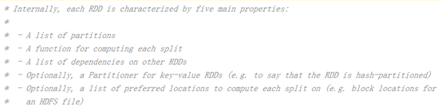
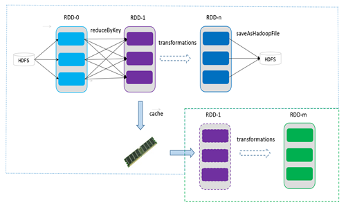
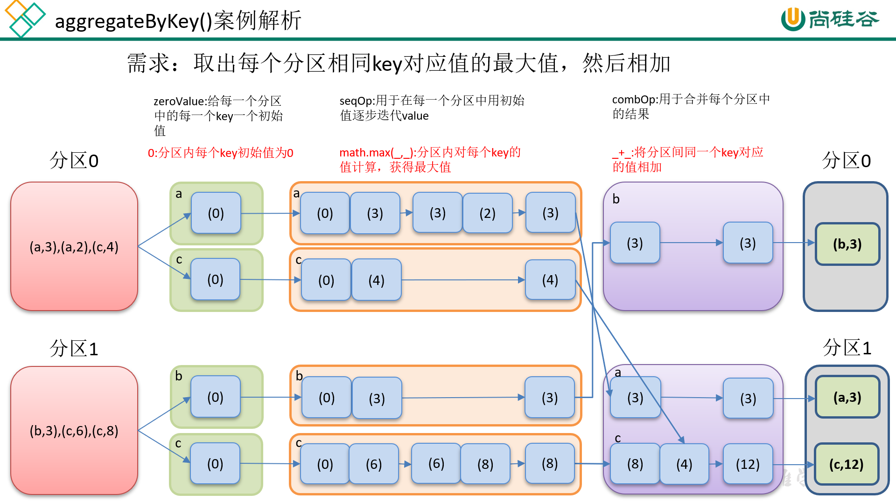
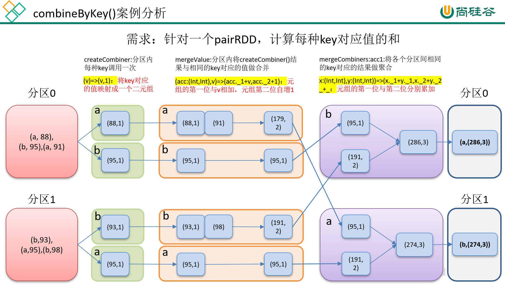
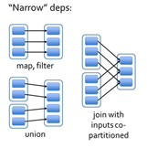
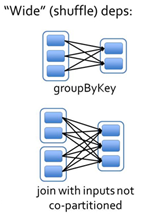

# 第1章 RDD概述

## 1.1 什么是RDD

​		RDD（Resilient Distributed Dataset）叫做弹性分布式数据集，是Spark中最基本的数据抽象。代码中是一个抽象类，它代表一个不可变、可分区、里面的元素可并行计算的集合。

## 1.2 RDD的属性

​                               

1. 一组分区（Partition），即数据集的基本组成单位;

2. 一个计算每个分区的函数;

3. RDD之间的依赖关系;

4. 一个Partitioner，即RDD的分片函数;

5. 一个列表，存储存取每个Partition的优先位置（preferred location）。

## 1.3 RDD特点

​		RDD表示只读的分区的数据集，对RDD进行改动，只能通过RDD的转换操作，由一个RDD得到一个新的RDD，新的RDD包含了从其他RDD衍生所必需的信息。RDDs之间存在依赖，RDD的执行是按照血缘关系延时计算的。如果血缘关系较长，可以通过持久化RDD来切断血缘关系。

### 1.3.1 弹性

​		存储的弹性：内存与磁盘的自动切换；

​		容错的弹性：数据丢失可以自动恢复；

​		计算的弹性：计算出错重试机制；

​		分片的弹性：可根据需要重新分片。

### 1.3.2 分区

​		RDD逻辑上是分区的，每个分区的数据是抽象存在的，计算的时候会通过一个compute函数得到每个分区的数据。如果RDD是通过已有的文件系统构建，则compute函数是读取指定文件系统中的数据，如果RDD是通过其他RDD转换而来，则compute函数是执行转换逻辑将其他RDD的数据进行转换。

### 1.3.3 只读

​		RDD是只读的，要想改变RDD中的数据，只能在现有的RDD基础上创建新的RDD。

​		由一个RDD转换到另一个RDD，可以通过丰富的操作算子实现，不再像MapReduce那样只能写map和reduce了。

​		RDD的操作算子包括两类，一类叫做**transformations**，它是用来将RDD进行转化，构建RDD的血缘关系；另一类叫做**actions**，它是用来触发RDD的计算，得到RDD的相关计算结果或者将RDD保存的文件系统中。

### 1.3.4 依赖

​		RDDs通过操作算子进行转换，转换得到的新RDD包含了从其他RDDs衍生所必需的信息，RDDs之间维护着这种血缘关系，也称之为依赖。如下图所示，依赖包括两种，一种是窄依赖，RDDs之间分区是一一对应的，另一种是宽依赖，下游RDD的每个分区与上游RDD(也称之为父RDD)的每个分区都有关，是多对多的关系。


### 1.3.5 缓存

​		如果在应用程序中多次使用同一个RDD，可以将该RDD缓存起来，该RDD只有在第一次计算的时候会根据血缘关系得到分区的数据，在后续其他地方用到该RDD的时候，会直接从缓存处取而不用再根据血缘关系计算，这样就加速后期的重用。如下图所示，RDD-1经过一系列的转换后得到RDD-n并保存到hdfs，RDD-1在这一过程中会有个中间结果，如果将其缓存到内存，那么在随后的RDD-1转换到RDD-m这一过程中，就不会计算其之前的RDD-0了。

​								 

### 1.3.6 CheckPoint

​		虽然RDD的血缘关系天然地可以实现容错，当RDD的某个分区数据失败或丢失，可以通过血缘关系重建。但是对于长时间迭代型应用来说，随着迭代的进行，RDDs之间的血缘关系会越来越长，一旦在后续迭代过程中出错，则需要通过非常长的血缘关系去重建，势必影响性能。为此，RDD支持checkpoint将数据保存到持久化的存储中，这样就可以切断之前的血缘关系，因为checkpoint后的RDD不需要知道它的父RDDs了，它可以从checkpoint处拿到数据。

# 第2章 RDD编程

## 2.1 编程模型

​		在Spark中，RDD被表示为对象，通过对象上的方法调用来对RDD进行转换。经过一系列的transformations定义RDD之后，就可以调用actions触发RDD的计算，action可以是向应用程序返回结果(count, collect等)，或者是向存储系统保存数据(saveAsTextFile等)。在Spark中，只有遇到action，才会执行RDD的计算(即延迟计算)，这样在运行时可以通过管道的方式传输多个转换。

​		要使用Spark，开发者需要编写一个Driver程序，它被提交到集群以调度运行Worker。Driver中定义了一个或多个RDD，并调用RDD上的action，Worker则执行RDD分区计算任务。

## 2.2 RDD的创建

​		在Spark中创建RDD的创建方式可以分为三种：**从集合中创建RDD**；**从外部存储创建RDD**；**从其他RDD创建**。

### 2.2.1 从集合中创建

​		从集合中创建RDD，Spark主要提供了两种函数：parallelize和makeRDD

1. 使用parallelize()从集合创建

```scala
scala>val rdd = sc.parallelize(Array(1,2,3,4,5,6,7,8))
rdd: org.apache.spark.rdd.RDD[Int] = ParallelCollectionRDD[0] at parallelize at <console>:24
```

2）使用makeRDD()从集合创建

```scala
scala> val rdd1 = sc.makeRDD(Array(1,2,3,4,5,6,7,8))
rdd1: org.apache.spark.rdd.RDD[Int] = ParallelCollectionRDD[1] at makeRDD at <console>:24
```

### 2.2.2 由外部存储系统的数据集创建

​		包括本地的文件系统，还有所有Hadoop支持的数据集，比如HDFS、Cassandra、HBase等，我们会在第4章详细介绍。

```scala
scala> val rdd2= sc.textFile("hdfs://hadoop102:9000/RELEASE")
rdd2: org.apache.spark.rdd.RDD[String] = hdfs:// hadoop102:9000/RELEASE MapPartitionsRDD[4] at textFile at <console>:24
```

### 2.2.3 从其他RDD创建

​		**详见2.3节**

## 2.3 RDD的转换（面试开发重点）

​		RDD整体上分为Value类型和Key-Value类型

### 2.3.1 Value类型

#### 1. map(func)案例

1. 作用：返回一个新的RDD，该RDD由每一个输入元素经过func函数转换后组成

2. 需求：创建一个1-10数组的RDD，将所有元素*2形成新的RDD

（1）创建

```scala
scala> var source = sc.parallelize(1 to 10)
source: org.apache.spark.rdd.RDD[Int] = ParallelCollectionRDD[8] at parallelize at <console>:24
```

（2）打印

```scala
scala> source.collect()
res7: Array[Int] = Array(1, 2, 3, 4, 5, 6, 7, 8, 9, 10)
```

（3）将所有元素*2

```scala
scala> val mapadd = source.map(_ * 2)
mapadd: org.apache.spark.rdd.RDD[Int] = MapPartitionsRDD[9] at map at <console>:26
```

（4）打印最终结果

```scala
scala> mapadd.collect()
res8: Array[Int] = Array(2, 4, 6, 8, 10, 12, 14, 16, 18, 20)
```

#### 2. mapPartitions(func) 案例

1. 作用：类似于map，但独立地在RDD的每一个分片上运行，因此在类型为T的RDD上运行时，func的函数类型必须是Iterator[T] => Iterator[U]。假设有N个元素，有M个分区，那么map的函数的将被调用N次,而mapPartitions被调用M次,一个函数一次处理所有分区。

2. 需求：创建一个RDD，使每个元素*2组成新的RDD

（1）创建一个RDD

```scala
scala> val rdd = sc.parallelize(Array(1,2,3,4))
rdd: org.apache.spark.rdd.RDD[Int] = ParallelCollectionRDD[4] at parallelize at <console>:24
```

（2）使每个元素*2组成新的RDD

```scala
scala> rdd.mapPartitions(x=>x.map(_*2))
res3: org.apache.spark.rdd.RDD[Int] = MapPartitionsRDD[6] at mapPartitions at <console>:27
```

（3）打印新的RDD

```scala
scala> res3.collect
res4: Array[Int] = Array(2, 4, 6, 8)
```

#### 3. mapPartitionsWithIndex(func) 案例

1. 作用：类似于mapPartitions，但func带有一个整数参数表示分片的索引值，因此在类型为T的RDD上运行时，func的函数类型必须是(Int, Interator[T]) => Iterator[U]；

2. 需求：创建一个RDD，使每个元素跟所在分区形成一个元组组成一个新的RDD

（1）创建一个RDD

```scala
scala> val rdd = sc.parallelize(Array(1,2,3,4))
rdd: org.apache.spark.rdd.RDD[Int] = ParallelCollectionRDD[4] at parallelize at <console>:24
```

（2）使每个元素跟所在分区形成一个元组组成一个新的RDD

```scala
scala> val indexRdd = rdd3.mapPartitionsWithIndex((index,items)=>(items.map((index,_))))
indexRdd: org.apache.spark.rdd.RDD[(Int, Int)] = MapPartitionsRDD[5] at mapPartitionsWithIndex at <console>:26
```

（3）打印新的RDD

```scala
scala> indexRdd.collect
res2: Array[(Int, Int)] = Array((0,1), (0,2), (1,3), (1,4))
```

#### 4. flatMap(func) 案例

1. 作用：类似于map，但是每一个输入元素可以被映射为0或多个输出元素（所以func应该返回一个序列，而不是单一元素）

2. 需求：创建一个元素为1-5的RDD，运用flatMap创建一个新的RDD，新的RDD为原RDD的每个元素的2倍（2，4，6，8，10）

（1）创建

```scala
scala> val sourceFlat = sc.parallelize(1 to 5)
sourceFlat: org.apache.spark.rdd.RDD[Int] = ParallelCollectionRDD[12] at parallelize at <console>:24
```

（2）打印

```scala
scala> sourceFlat.collect()
res11: Array[Int] = Array(1, 2, 3, 4, 5)
```

（3）根据原RDD创建新RDD（1->1,2->1,2……5->1,2,3,4,5）

```scala
scala> val flatMap = sourceFlat.flatMap(1 to _)
flatMap: org.apache.spark.rdd.RDD[Int] = MapPartitionsRDD[13] at flatMap at <console>:26
```

（4）打印新RDD

```scala
scala> flatMap.collect()
res12: Array[Int] = Array(1, 1, 2, 1, 2, 3, 1, 2, 3, 4, 1, 2, 3, 4, 5)
```

#### 5. map()和mapPartition()的区别

1. map()：每次处理一条数据。

2. mapPartition()：每次处理一个分区的数据，这个分区的数据处理完后，原RDD中分区的数据才能释放，可能导致OOM。

3. 开发指导：**当内存空间较大的时候建议使用mapPartition()，以提高处理效率。**

#### 6. glom案例

1. 作用：将每一个分区形成一个数组，形成新的RDD类型时RDD[Array[T]]

2. 需求：创建一个4个分区的RDD，并将每个分区的数据放到一个数组

（1）创建

```scala
scala> val rdd = sc.parallelize(1 to 16,4)
rdd: org.apache.spark.rdd.RDD[Int] = ParallelCollectionRDD[65] at parallelize at <console>:24
```

（2）将每个分区的数据放到一个数组并收集到Driver端打印

```scala
scala> rdd.glom().collect()
res25: Array[Array[Int]] = Array(Array(1, 2, 3, 4), Array(5, 6, 7, 8), Array(9, 10, 11, 12), Array(13, 14, 15, 16))
```

#### 7. groupBy(func)案例

1. 作用：分组，按照传入函数的返回值进行分组。将相同的key对应的值放入一个迭代器。

2. 需求：创建一个RDD，按照元素模以2的值进行分组。

（1）创建

```scala
scala> val rdd = sc.parallelize(1 to 4)
rdd: org.apache.spark.rdd.RDD[Int] = ParallelCollectionRDD[65] at parallelize at <console>:24
```

（2）按照元素模以2的值进行分组

```scala
scala> val group = rdd.groupBy(_%2)
group: org.apache.spark.rdd.RDD[(Int, Iterable[Int])] = ShuffledRDD[2] at groupBy at <console>:26
```

（3）打印结果

```scala
scala> group.collect
res0: Array[(Int, Iterable[Int])] = Array((0,CompactBuffer(2, 4)), (1,CompactBuffer(1, 3)))
```

#### 8. filter(func) 案例

1. 作用：过滤。返回一个新的RDD，该RDD由经过func函数计算后返回值为true的输入元素组成。

2. 需求：创建一个RDD（由字符串组成），过滤出一个新RDD（包含”xiao”子串）

（1）创建

```scala
scala> var sourceFilter = sc.parallelize(Array("xiaoming","xiaojiang","xiaohe","dazhi"))
sourceFilter: org.apache.spark.rdd.RDD[String] = ParallelCollectionRDD[10] at parallelize at <console>:24
```

（2）打印

```scala
scala> sourceFilter.collect()
res9: Array[String] = Array(xiaoming, xiaojiang, xiaohe, dazhi)
```

（3）过滤出含” xiao”子串的形成一个新的RDD

```scala
scala> val filter = sourceFilter.filter(_.contains("xiao"))
filter: org.apache.spark.rdd.RDD[String] = MapPartitionsRDD[11] at filter at <console>:26
```

（4）打印新RDD

```scala
scala> filter.collect()
res10: Array[String] = Array(xiaoming, xiaojiang, xiaohe)
```

#### 9. sample(withReplacement, fraction, seed) 案例

1. 作用：以指定的随机种子随机抽样出数量为fraction的数据，withReplacement表示是抽出的数据是否放回，true为有放回的抽样，false为无放回的抽样，seed用于指定随机数生成器种子。

2. 需求：创建一个RDD（1-10），从中选择放回和不放回抽样

（1）创建RDD

```scala
scala> val rdd = sc.parallelize(1 to 10)
rdd: org.apache.spark.rdd.RDD[Int] = ParallelCollectionRDD[20] at parallelize at <console>:24
```

（2）打印

```scala
scala> rdd.collect()
res15: Array[Int] = Array(1, 2, 3, 4, 5, 6, 7, 8, 9, 10)
```

（3）放回抽样

```scala
scala> var sample1 = rdd.sample(true,0.4,2)
sample1: org.apache.spark.rdd.RDD[Int] = PartitionwiseSampledRDD[21] at sample at <console>:26
```

（4）打印放回抽样结果

```scala
scala> sample1.collect()
res16: Array[Int] = Array(1, 2, 2, 7, 7, 8, 9)
```

（5）不放回抽样

```scala
scala> var sample2 = rdd.sample(false,0.2,3)
sample2: org.apache.spark.rdd.RDD[Int] = PartitionwiseSampledRDD[22] at sample at <console>:26
```

（6）打印不放回抽样结果

```scala
scala> sample2.collect()
res17: Array[Int] = Array(1, 9)
```

#### 10. distinct([numTasks])) 案例

1. 作用：对源RDD进行去重后返回一个新的RDD。默认情况下，只有8个并行任务来操作，但是可以传入一个可选的numTasks参数改变它。

2. 需求：创建一个RDD，使用distinct()对其去重。

（1）创建一个RDD

```scala
scala> val distinctRdd = sc.parallelize(List(1,2,1,5,2,9,6,1))
distinctRdd: org.apache.spark.rdd.RDD[Int] = ParallelCollectionRDD[34] at parallelize at <console>:24
```

（2）对RDD进行去重（不指定并行度）

```scala
scala> val unionRDD = distinctRdd.distinct()
unionRDD: org.apache.spark.rdd.RDD[Int] = MapPartitionsRDD[37] at distinct at <console>:26
```

（3）打印去重后生成的新RDD

```scala
scala> unionRDD.collect()
res20: Array[Int] = Array(1, 9, 5, 6, 2)
```

（4）对RDD（指定并行度为2）

```scala
scala> val unionRDD = distinctRdd.distinct(2)
unionRDD: org.apache.spark.rdd.RDD[Int] = MapPartitionsRDD[40] at distinct at <console>:26
```

（5）打印去重后生成的新RDD

```scala
scala> unionRDD.collect()
res21: Array[Int] = Array(6, 2, 1, 9, 5)
```

#### 11. coalesce(numPartitions) 案例

1. 作用：缩减分区数，用于大数据集过滤后，提高小数据集的执行效率。

2. 需求：创建一个4个分区的RDD，对其缩减分区

（1）创建一个RDD

```scala
scala> val rdd = sc.parallelize(1 to 16,4)
rdd: org.apache.spark.rdd.RDD[Int] = ParallelCollectionRDD[54] at parallelize at <console>:24
```

（2）查看RDD的分区数

```scala
scala> rdd.partitions.size
res20: Int = 4
```

（3）对RDD重新分区

```scala
scala> val coalesceRDD = rdd.coalesce(3)
coalesceRDD: org.apache.spark.rdd.RDD[Int] = CoalescedRDD[55] at coalesce at <console>:26
```

（4）查看新RDD的分区数

```scala
scala> coalesceRDD.partitions.size
res21: Int = 3
```

#### 12. repartition(numPartitions) 案例

1. 作用：根据分区数，重新通过网络随机洗牌所有数据。

2. 需求：创建一个4个分区的RDD，对其重新分区

（1）创建一个RDD

```scala
scala> val rdd = sc.parallelize(1 to 16,4)
rdd: org.apache.spark.rdd.RDD[Int] = ParallelCollectionRDD[56] at parallelize at <console>:24
```

（2）查看RDD的分区数

```scala
scala> rdd.partitions.size
res22: Int = 4
```

（3）对RDD重新分区

```scala
scala> val rerdd = rdd.repartition(2)
rerdd: org.apache.spark.rdd.RDD[Int] = MapPartitionsRDD[60] at repartition at <console>:26
```

（4）查看新RDD的分区数

```scala
scala> rerdd.partitions.size
res23: Int = 2
```

#### 13. coalesce和repartition的区别

1. coalesce重新分区，可以选择是否进行shuffle过程。由参数shuffle: Boolean = false/true决定。

2. repartition实际上是调用的coalesce，默认是进行shuffle的。源码如下：

```scala
def repartition(numPartitions: Int)(implicit ord: Ordering[T] = null): RDD[T] = withScope {
  coalesce(numPartitions, shuffle = true)
 }
```

#### 14. sortBy(func,[ascending], [numTasks]) 案例

1. 作用；使用func先对数据进行处理，按照处理后的数据比较结果排序，默认为正序。

2. 需求：创建一个RDD，按照不同的规则进行排序

（1）创建一个RDD

```scala
scala> val rdd = sc.parallelize(List(2,1,3,4))
rdd: org.apache.spark.rdd.RDD[Int] = ParallelCollectionRDD[21] at parallelize at <console>:24
```

（2）按照自身大小排序

```scala
scala> rdd.sortBy(x => x).collect()
res11: Array[Int] = Array(1, 2, 3, 4)
```

（3）按照与3余数的大小排序

```scala
scala> rdd.sortBy(x => x%3).collect()
res12: Array[Int] = Array(3, 4, 1, 2)
```

#### 15. pipe(command, [envVars]) 案例

1. 作用：管道，针对每个分区，都执行一个shell脚本，返回输出的RDD。

	注意：脚本需要放在Worker节点可以访问到的位置

2. 需求：编写一个脚本，使用管道将脚本作用于RDD上。

（1）编写一个脚本

```shell
Shell脚本
\#!/bin/sh
echo "AA"
while read LINE; do
  echo ">>>"${LINE}
done
```

（2）创建一个只有一个分区的RDD

```scala
scala> val rdd = sc.parallelize(List("hi","Hello","how","are","you"),1)
rdd: org.apache.spark.rdd.RDD[String] = ParallelCollectionRDD[50] at parallelize at <console>:24
```

（3）将脚本作用该RDD并打印

```scala
scala> rdd.pipe("/opt/module/spark/pipe.sh").collect()
res18: Array[String] = Array(AA, >>>hi, >>>Hello, >>>how, >>>are, >>>you)
```

（4）创建一个有两个分区的RDD

```scala
scala> val rdd = sc.parallelize(List("hi","Hello","how","are","you"),2)
rdd: org.apache.spark.rdd.RDD[String] = ParallelCollectionRDD[52] at parallelize at <console>:24
```

（5）将脚本作用该RDD并打印

```scala
scala> rdd.pipe("/opt/module/spark/pipe.sh").collect()
res19: Array[String] = Array(AA, >>>hi, >>>Hello, AA, >>>how, >>>are, >>>you)
```

### 2.3.2 双Value类型交互

#### 1. union(otherDataset) 案例

1. 作用：对源RDD和参数RDD求并集后返回一个新的RDD

2. 需求：创建两个RDD，求并集

（1）创建第一个RDD

```scala
scala> val rdd1 = sc.parallelize(1 to 5)
rdd1: org.apache.spark.rdd.RDD[Int] = ParallelCollectionRDD[23] at parallelize at <console>:24
```

（2）创建第二个RDD

```scala
scala> val rdd2 = sc.parallelize(5 to 10)

rdd2: org.apache.spark.rdd.RDD[Int] = ParallelCollectionRDD[24] at parallelize at <console>:24
```

（3）计算两个RDD的并集

```scala
scala> val rdd3 = rdd1.union(rdd2)
rdd3: org.apache.spark.rdd.RDD[Int] = UnionRDD[25] at union at <console>:28
```

（4）打印并集结果

```scala
scala> rdd3.collect()
res18: Array[Int] = Array(1, 2, 3, 4, 5, 5, 6, 7, 8, 9, 10)
```

#### 2. subtract (otherDataset) 案例

1. 作用：计算差的一种函数，去除两个RDD中相同的元素，不同的RDD将保留下来

2. 需求：创建两个RDD，求第一个RDD与第二个RDD的差集

（1）创建第一个RDD

```scala
scala> val rdd = sc.parallelize(3 to 8)
rdd: org.apache.spark.rdd.RDD[Int] = ParallelCollectionRDD[70] at parallelize at <console>:24
```

（2）创建第二个RDD

```scala
scala> val rdd1 = sc.parallelize(1 to 5)
rdd1: org.apache.spark.rdd.RDD[Int] = ParallelCollectionRDD[71] at parallelize at <console>:24
```

（3）计算第一个RDD与第二个RDD的差集并打印

```scala
scala> rdd.subtract(rdd1).collect()
res27: Array[Int] = Array(8, 6, 7)
```

#### 3. intersection(otherDataset) 案例

1. 作用：对源RDD和参数RDD求交集后返回一个新的RDD

2. 需求：创建两个RDD，求两个RDD的交集

（1）创建第一个RDD

```scala
scala> val rdd1 = sc.parallelize(1 to 7)
rdd1: org.apache.spark.rdd.RDD[Int] = ParallelCollectionRDD[26] at parallelize at <console>:24
```

（2）创建第二个RDD

```scala
scala> val rdd2 = sc.parallelize(5 to 10)
rdd2: org.apache.spark.rdd.RDD[Int] = ParallelCollectionRDD[27] at parallelize at <console>:24
```

（3）计算两个RDD的交集

```scala
scala> val rdd3 = rdd1.intersection(rdd2)
rdd3: org.apache.spark.rdd.RDD[Int] = MapPartitionsRDD[33] at intersection at <console>:28
```

（4）打印计算结果

```scala
scala> rdd3.collect()
res19: Array[Int] = Array(5, 6, 7)
```

#### 4. cartesian(otherDataset) 案例

1. 作用：笛卡尔积（尽量避免使用）

2. 需求：创建两个RDD，计算两个RDD的笛卡尔积

（1）创建第一个RDD

```scala
scala> val rdd1 = sc.parallelize(1 to 3)
rdd1: org.apache.spark.rdd.RDD[Int] = ParallelCollectionRDD[47] at parallelize at <console>:24
```

（2）创建第二个RDD

```scala
scala> val rdd2 = sc.parallelize(2 to 5)
rdd2: org.apache.spark.rdd.RDD[Int] = ParallelCollectionRDD[48] at parallelize at <console>:24
```

（3）计算两个RDD的笛卡尔积并打印

```scala
scala> rdd1.cartesian(rdd2).collect()
res17: Array[(Int, Int)] = Array((1,2), (1,3), (1,4), (1,5), (2,2), (2,3), (2,4), (2,5), (3,2), (3,3), (3,4), (3,5))
```

#### 5. zip(otherDataset)案例

1. 作用：将两个RDD组合成Key/Value形式的RDD,这里默认两个RDD的partition数量以及元素数量都相同，否则会抛出异常。

2. 需求：创建两个RDD，并将两个RDD组合到一起形成一个(k,v)RDD

（1）创建第一个RDD

```scala
scala> val rdd1 = sc.parallelize(Array(1,2,3),3)
rdd1: org.apache.spark.rdd.RDD[Int] = ParallelCollectionRDD[1] at parallelize at <console>:24
```

（2）创建第二个RDD（与1分区数相同）

```scala
scala> val rdd2 = sc.parallelize(Array("a","b","c"),3)
rdd2: org.apache.spark.rdd.RDD[String] = ParallelCollectionRDD[2] at parallelize at <console>:24
```

（3）第一个RDD组合第二个RDD并打印

```scala
scala> rdd1.zip(rdd2).collect
res1: Array[(Int, String)] = Array((1,a), (2,b), (3,c))
```

（4）第二个RDD组合第一个RDD并打印

```scala
scala> rdd2.zip(rdd1).collect
res2: Array[(String, Int)] = Array((a,1), (b,2), (c,3))
```

（5）创建第三个RDD（与1,2分区数不同）

```scala
scala> val rdd3 = sc.parallelize(Array("a","b","c"),2)
rdd3: org.apache.spark.rdd.RDD[String] = ParallelCollectionRDD[5] at parallelize at <console>:24
```

（6）第一个RDD组合第三个RDD并打印

```scala
scala> rdd1.zip(rdd3).collect
java.lang.IllegalArgumentException: Can't zip RDDs with unequal numbers of partitions: List(3, 2)
 at org.apache.spark.rdd.ZippedPartitionsBaseRDD.getPartitions(ZippedPartitionsRDD.scala:57)
 at org.apache.spark.rdd.RDD$$anonfun$partitions$2.apply(RDD.scala:252)
 at org.apache.spark.rdd.RDD$$anonfun$partitions$2.apply(RDD.scala:250)
 at scala.Option.getOrElse(Option.scala:121)
 at org.apache.spark.rdd.RDD.partitions(RDD.scala:250)
 at org.apache.spark.SparkContext.runJob(SparkContext.scala:1965)
 at org.apache.spark.rdd.RDD$$anonfun$collect$1.apply(RDD.scala:936)
 at org.apache.spark.rdd.RDDOperationScope$.withScope(RDDOperationScope.scala:151
 at org.apache.spark.rdd.RDDOperationScope$.withScope(RDDOperationScope.scala:112)
 at org.apache.spark.rdd.RDD.withScope(RDD.scala:362)
 at org.apache.spark.rdd.RDD.collect(RDD.scala:935)
 ... 48 elided
```

### 2.3.3 Key-Value类型

#### 1. partitionBy案例

1. 作用：对pairRDD进行分区操作，如果原有的partionRDD和现有的partionRDD是一致的话就不进行分区， 否则会生成ShuffleRDD，即会产生shuffle过程。

2. 需求：创建一个4个分区的RDD，对其重新分区

（1）创建一个RDD

```scala
scala> val rdd = sc.parallelize(Array((1,"aaa"),(2,"bbb"),(3,"ccc"),(4,"ddd")),4)
rdd: org.apache.spark.rdd.RDD[(Int, String)] = ParallelCollectionRDD[44] at parallelize at <console>:24
```

（2）查看RDD的分区数

```scala
scala> rdd.partitions.size
res24: Int = 4
```

（3）对RDD重新分区

```scala
scala> var rdd2 = rdd.partitionBy(new org.apache.spark.HashPartitioner(2))
rdd2: org.apache.spark.rdd.RDD[(Int, String)] = ShuffledRDD[45] at partitionBy at <console>:26
```

（4）查看新RDD的分区数

```scala
scala> rdd2.partitions.size
res25: Int = 2
```

#### 2. groupByKey案例

1. 作用：groupByKey也是对每个key进行操作，但只生成一个sequence。

2. 需求：创建一个pairRDD，将相同key对应值聚合到一个sequence中，并计算相同key对应值的相加结果。

（1）创建一个pairRDD

```scala
scala> val words = Array("one", "two", "two", "three", "three", "three")
words: Array[String] = Array(one, two, two, three, three, three)
scala> val wordPairsRDD = sc.parallelize(words).map(word => (word, 1))
wordPairsRDD: org.apache.spark.rdd.RDD[(String, Int)] = MapPartitionsRDD[4] at map at <console>:26
```

（2）将相同key对应值聚合到一个sequence中

```scala
scala> val group = wordPairsRDD.groupByKey()
group: org.apache.spark.rdd.RDD[(String, Iterable[Int])] = ShuffledRDD[5] at groupByKey at <console>:28
```

（3）打印结果

```scala
scala> group.collect()
res1: Array[(String, Iterable[Int])] = Array((two,CompactBuffer(1, 1)), (one,CompactBuffer(1)), (three,CompactBuffer(1, 1, 1)))
```

（4）计算相同key对应值的相加结果

```scala
scala> group.map(t => (t._1, t._2.sum))
res2: org.apache.spark.rdd.RDD[(String, Int)] = MapPartitionsRDD[6] at map at <console>:31
```

（5）打印结果

```scala
scala> res2.collect()
res3: Array[(String, Int)] = Array((two,2), (one,1), (three,3))
```

#### 3. reduceByKey(func, [numTasks]) 案例

1. 在一个(K,V)的RDD上调用，返回一个(K,V)的RDD，使用指定的reduce函数，将相同key的值聚合到一起，reduce任务的个数可以通过第二个可选的参数来设置。

2. 需求：创建一个pairRDD，计算相同key对应值的相加结果

（1）创建一个pairRDD

```scala
scala> val rdd = sc.parallelize(List(("female",1),("male",5),("female",5),("male",2)))
rdd: org.apache.spark.rdd.RDD[(String, Int)] = ParallelCollectionRDD[46] at parallelize at <console>:24
```

（2）计算相同key对应值的相加结果

```scala
scala> val reduce = rdd.reduceByKey((x,y) => x+y)
reduce: org.apache.spark.rdd.RDD[(String, Int)] = ShuffledRDD[47] at reduceByKey at <console>:26
```

（3）打印结果

```scala
scala> reduce.collect()
res29: Array[(String, Int)] = Array((female,6), (male,7))
```

#### 4. reduceByKey和groupByKey的区别

1. reduceByKey：按照key进行聚合，在shuffle之前有combine（预聚合）操作，返回结果是RDD[k,v].

2. groupByKey：按照key进行分组，直接进行shuffle。

3. 开发指导：reduceByKey比groupByKey，建议使用。但是需要注意是否会影响业务逻辑。

#### 5. aggregateByKey案例

​		参数：(zeroValue:U,[partitioner: Partitioner]) (seqOp: (U, V) => U,combOp: (U, U) => U)

1. 作用：在kv对的RDD中，按key将value进行分组合并，合并时，将每个value和初始值作为seq函数的参数，进行计算，返回的结果作为一个新的kv对，然后再将结果按照key进行合并，最后将每个分组的value传递给combine函数进行计算（先将前两个value进行计算，将返回结果和下一个value传给combine函数，以此类推），将key与计算结果作为一个新的kv对输出。

2. 参数描述：

	（1）zeroValue：给每一个分区中的每一个key一个初始值；

	（2）seqOp：函数用于在每一个分区中用初始值逐步迭代value；

	（3）combOp：函数用于合并每个分区中的结果。

3. 需求：创建一个pairRDD，取出每个分区相同key对应值的最大值，然后相加

4. 需求分析



（1）创建一个pairRDD

```scala
scala> val rdd = sc.parallelize(List(("a",3),("a",2),("c",4),("b",3),("c",6),("c",8)),2)
rdd: org.apache.spark.rdd.RDD[(String, Int)] = ParallelCollectionRDD[0] at parallelize at <console>:24
```

（2）取出每个分区相同key对应值的最大值，然后相加

```scala
scala> val agg = rdd.aggregateByKey(0)(math.max(_,_),_+_)
agg: org.apache.spark.rdd.RDD[(String, Int)] = ShuffledRDD[1] at aggregateByKey at <console>:26
```

（3）打印结果

```scala
scala> agg.collect()
res0: Array[(String, Int)] = Array((b,3), (a,3), (c,12))
```

#### 6. foldByKey案例

​		参数：(zeroValue: V)(func: (V, V) => V): RDD[(K, V)]

1. 作用：aggregateByKey的简化操作，seqop和combop相同

2. 需求：创建一个pairRDD，计算相同key对应值的相加结果

（1）创建一个pairRDD

```scala
scala> val rdd = sc.parallelize(List((1,3),(1,2),(1,4),(2,3),(3,6),(3,8)),3)
rdd: org.apache.spark.rdd.RDD[(Int, Int)] = ParallelCollectionRDD[91] at parallelize at <console>:24
```

（2）计算相同key对应值的相加结果

```scala
scala> val agg = rdd.foldByKey(0)(_+_)
agg: org.apache.spark.rdd.RDD[(Int, Int)] = ShuffledRDD[92] at foldByKey at <console>:26
```

（3）打印结果

```scala
scala> agg.collect()
res61: Array[(Int, Int)] = Array((3,14), (1,9), (2,3))
```

#### 7. combineByKey[C] 案例

​		参数：(createCombiner: V => C, mergeValue: (C, V) => C, mergeCombiners: (C, C) => C)

1. 作用：对相同K，把V合并成一个集合。

2. 参数描述：

	（1）createCombiner: combineByKey() 会遍历分区中的所有元素，因此每个元素的键要么还没有遇到过，要么就和之前的某个元素的键相同。如果这是一个新的元素,combineByKey()会使用一个叫作createCombiner()的函数来创建那个键对应的累加器的初始值

	（2）mergeValue: 如果这是一个在处理当前分区之前已经遇到的键，它会使用mergeValue()方法将该键的累加器对应的当前值与这个新的值进行合并

	（3）mergeCombiners: 由于每个分区都是独立处理的， 因此对于同一个键可以有多个累加器。如果有两个或者更多的分区都有对应同一个键的累加器， 就需要使用用户提供的 mergeCombiners() 方法将各个分区的结果进行合并。

3. 需求：创建一个pairRDD，根据key计算每种key的均值。（先计算每个key出现的次数以及可以对应值的总和，再相除得到结果）

4. 需求分析：



（1）创建一个pairRDD

```scala
scala> val input = sc.parallelize(Array(("a", 88), ("b", 95), ("a", 91), ("b", 93), ("a", 95), ("b", 98)),2)
input: org.apache.spark.rdd.RDD[(String, Int)] = ParallelCollectionRDD[52] at parallelize at <console>:26
```

（2）将相同key对应的值相加，同时记录该key出现的次数，放入一个二元组

```scala
scala> val combine = input.combineByKey((_,1),(acc:(Int,Int),v)=>(acc._1+v,acc._2+1),(acc1:(Int,Int),acc2:(Int,Int))=>(acc1._1+acc2._1,acc1._2+acc2._2))
combine: org.apache.spark.rdd.RDD[(String, (Int, Int))] = ShuffledRDD[5] at combineByKey at <console>:28
```

（3）打印合并后的结果

```scala
scala> combine.collect
res5: Array[(String, (Int, Int))] = Array((b,(286,3)), (a,(274,3)))
```

（4）计算平均值

```scala
scala> val result = combine.map{case (key,value) => (key,value._1/value._2.toDouble)}
result: org.apache.spark.rdd.RDD[(String, Double)] = MapPartitionsRDD[54] at map at <console>:30
```

（5）打印结果

```scala
scala> result.collect()
res33: Array[(String, Double)] = Array((b,95.33333333333333), (a,91.33333333333333))
```

#### 8. sortByKey([ascending], [numTasks]) 案例

1. 作用：在一个(K,V)的RDD上调用，K必须实现Ordered接口，返回一个按照key进行排序的(K,V)的RDD

2. 需求：创建一个pairRDD，按照key的正序和倒序进行排序

（1）创建一个pairRDD

```scala
scala> val rdd = sc.parallelize(Array((3,"aa"),(6,"cc"),(2,"bb"),(1,"dd")))
rdd: org.apache.spark.rdd.RDD[(Int, String)] = ParallelCollectionRDD[14] at parallelize at <console>:24
```

（2）按照key的正序

```scala
scala> rdd.sortByKey(true).collect()
res9: Array[(Int, String)] = Array((1,dd), (2,bb), (3,aa), (6,cc))
```

（3）按照key的倒序

```scala
scala> rdd.sortByKey(false).collect()
res10: Array[(Int, String)] = Array((6,cc), (3,aa), (2,bb), (1,dd))
```

#### 9. mapValues案例

1. 针对于(K,V)形式的类型只对V进行操作

2. 需求：创建一个pairRDD，并将value添加字符串"|||"

（1）创建一个pairRDD

```scala
scala> val rdd3 = sc.parallelize(Array((1,"a"),(1,"d"),(2,"b"),(3,"c")))
rdd3: org.apache.spark.rdd.RDD[(Int, String)] = ParallelCollectionRDD[67] at parallelize at <console>:24
```

（2）对value添加字符串"|||"

```scala
scala> rdd3.mapValues(_+"|||").collect()
res26: Array[(Int, String)] = Array((1,a|||), (1,d|||), (2,b|||), (3,c|||))
```

#### 10. join(otherDataset, [numTasks]) 案例

1. 作用：在类型为(K,V)和(K,W)的RDD上调用，返回一个相同key对应的所有元素对在一起的(K,(V,W))的RDD

2. 需求：创建两个pairRDD，并将key相同的数据聚合到一个元组。

（1）创建第一个pairRDD

```scala
scala> val rdd = sc.parallelize(Array((1,"a"),(2,"b"),(3,"c")))
rdd: org.apache.spark.rdd.RDD[(Int, String)] = ParallelCollectionRDD[32] at parallelize at <console>:24
```

（2）创建第二个pairRDD

```scala
scala> val rdd1 = sc.parallelize(Array((1,4),(2,5),(3,6)))
rdd1: org.apache.spark.rdd.RDD[(Int, Int)] = ParallelCollectionRDD[33] at parallelize at <console>:24
```

（3）join操作并打印结果

```scala
scala> rdd.join(rdd1).collect()
res13: Array[(Int, (String, Int))] = Array((1,(a,4)), (2,(b,5)), (3,(c,6)))
```

#### 11. cogroup(otherDataset, [numTasks]) 案例

1. 作用：在类型为(K,V)和(K,W)的RDD上调用，返回一个(K,(Iterable<V>,Iterable<W>))类型的RDD

2. 需求：创建两个pairRDD，并将key相同的数据聚合到一个迭代器。

（1）创建第一个pairRDD

```scala
scala> val rdd = sc.parallelize(Array((1,"a"),(2,"b"),(3,"c")))
rdd: org.apache.spark.rdd.RDD[(Int, String)] = ParallelCollectionRDD[37] at parallelize at <console>:24
```

（2）创建第二个pairRDD

```scala
scala> val rdd1 = sc.parallelize(Array((1,4),(2,5),(3,6)))
rdd1: org.apache.spark.rdd.RDD[(Int, Int)] = ParallelCollectionRDD[38] at parallelize at <console>:24
```

（3）cogroup两个RDD并打印结果

```scala
scala> rdd.cogroup(rdd1).collect()
res14: Array[(Int, (Iterable[String], Iterable[Int]))] = Array((1,(CompactBuffer(a),CompactBuffer(4))), (2,(CompactBuffer(b),CompactBuffer(5))), (3,(CompactBuffer(c),CompactBuffer(6))))
```

### 2.3.4 案例实操

1. 数据结构：时间戳，省份，城市，用户，广告，中间字段使用空格分割。

	样本如下： 

	1516609143867 6 7 64 16

	1516609143869 9 4 75 18

	1516609143869 1 7 87 12

2. 需求：统计出每一个省份广告被点击次数的TOP3

3. 实现过程：

```scala
package com.package.practice


import org.apache.spark.rdd.RDD
import org.apache.spark.{SparkConf, SparkContext}

 

//需求：统计出每一个省份广告被点击次数的TOP3
object Practice {

 def main(args: Array[String]): Unit = {
 

  //1.初始化spark配置信息并建立与spark的连接
  val sparkConf = new SparkConf().setMaster("local[*]").setAppName("Practice")
  val sc = new SparkContext(sparkConf)
 

  //2.读取数据生成RDD：TS，Province，City，User，AD
  val line = sc.textFile("E:\\IDEAWorkSpace\\SparkTest\\src\\main\\resources\\agent.log")

 
  //3.按照最小粒度聚合：((Province,AD),1)
  val provinceAdToOne = line.map { x =>
   val fields: Array[String] = x.split(" ")
   ((fields(1), fields(4)), 1)
  }

 
  //4.计算每个省中每个广告被点击的总数：((Province,AD),sum)
  val provinceAdToSum = provinceAdToOne.reduceByKey(_ + _)

 
  //5.将省份作为key，广告加点击数为value：(Province,(AD,sum))
  val provinceToAdSum = provinceAdToSum.map(x => (x._1._1, (x._1._2, x._2)))
 

  //6.将同一个省份的所有广告进行聚合(Province,List((AD1,sum1),(AD2,sum2)...))
  val provinceGroup = provinceToAdSum.groupByKey()

 

  //7.对同一个省份所有广告的集合进行排序并取前3条，排序规则为广告点击总数
  val provinceAdTop3 = provinceGroup.mapValues { x =>
   x.toList.sortWith((x, y) => x._2 > y._2).take(3)
  } 

  //8.将数据拉取到Driver端并打印
  provinceAdTop3.collect().foreach(println)

 
  //9.关闭与spark的连接
  sc.stop()
 } 
}
```

## 2.4 Action

### 2.4.1 reduce(func)案例

1. 作用：通过func函数聚集RDD中的所有元素，先聚合分区内数据，再聚合分区间数据。

2. 需求：创建一个RDD，将所有元素聚合得到结果。

（1）创建一个RDD[Int]

```scala
scala> val rdd1 = sc.makeRDD(1 to 10,2)
rdd1: org.apache.spark.rdd.RDD[Int] = ParallelCollectionRDD[85] at makeRDD at <console>:24
```

（2）聚合RDD[Int]所有元素

```scala
scala> rdd1.reduce(_+_)
res50: Int = 55
```

（3）创建一个RDD[String]

```scala
scala> val rdd2 = sc.makeRDD(Array(("a",1),("a",3),("c",3),("d",5)))
rdd2: org.apache.spark.rdd.RDD[(String, Int)] = ParallelCollectionRDD[86] at makeRDD at <console>:24
```

（4）聚合RDD[String]所有数据

```scala
scala> rdd2.reduce((x,y)=>(x._1 + y._1,x._2 + y._2))
res51: (String, Int) = (adca,12)
```

### 2.4.2 collect()案例

1. 作用：在驱动程序中，以数组的形式返回数据集的所有元素。

2. 需求：创建一个RDD，并将RDD内容收集到Driver端打印

（1）创建一个RDD

```scala
scala> val rdd = sc.parallelize(1 to 10)
rdd: org.apache.spark.rdd.RDD[Int] = ParallelCollectionRDD[0] at parallelize at <console>:24
```

（2）将结果收集到Driver端

```scala
scala> rdd.collect
res0: Array[Int] = Array(1, 2, 3, 4, 5, 6, 7, 8, 9, 10)  
```

### 2.4.3 count()案例

1. 作用：返回RDD中元素的个数

2. 需求：创建一个RDD，统计该RDD的条数

（1）创建一个RDD

```scala
scala> val rdd = sc.parallelize(1 to 10)
rdd: org.apache.spark.rdd.RDD[Int] = ParallelCollectionRDD[0] at parallelize at <console>:24
```

（2）统计该RDD的条数

```scala
scala> rdd.count
res1: Long = 10
```

### 2.4.4 first()案例

1. 作用：返回RDD中的第一个元素

2. 需求：创建一个RDD，返回该RDD中的第一个元素

（1）创建一个RDD

```scala
scala> val rdd = sc.parallelize(1 to 10)
rdd: org.apache.spark.rdd.RDD[Int] = ParallelCollectionRDD[0] at parallelize at <console>:24
```

（2）统计该RDD的条数

```scala
scala> rdd.first
res2: Int = 1
```

### 2.4.5 take(n)案例

1. 作用：返回一个由RDD的前n个元素组成的数组

2. 需求：创建一个RDD，统计该RDD的条数

（1）创建一个RDD

```scala
scala> val rdd = sc.parallelize(Array(2,5,4,6,8,3))
rdd: org.apache.spark.rdd.RDD[Int] = ParallelCollectionRDD[2] at parallelize at <console>:24
```

（2）统计该RDD的条数

```scala
scala> rdd.take(3)
res10: Array[Int] = Array(2, 5, 4)
```

### 2.4.6 takeOrdered(n)案例

1. 作用：返回该RDD排序后的前n个元素组成的数组

2. 需求：创建一个RDD，统计该RDD的条数

（1）创建一个RDD

```scala
scala> val rdd = sc.parallelize(Array(2,5,4,6,8,3))
rdd: org.apache.spark.rdd.RDD[Int] = ParallelCollectionRDD[2] at parallelize at <console>:24
```

（2）统计该RDD的条数

```scala
scala> rdd.takeOrdered(3)
res18: Array[Int] = Array(2, 3, 4)
```

### 2.4.7 aggregate案例

1. 参数：(zeroValue: U)(seqOp: (U, T) ⇒ U, combOp: (U, U) ⇒ U)

2. 作用：aggregate函数将每个分区里面的元素通过seqOp和初始值进行聚合，然后用combine函数将每个分区的结果和初始值(zeroValue)进行combine操作。这个函数最终返回的类型不需要和RDD中元素类型一致。

3. 需求：创建一个RDD，将所有元素相加得到结果

（1）创建一个RDD

```
scala> var rdd1 = sc.makeRDD(1 to 10,2)
rdd1: org.apache.spark.rdd.RDD[Int] = ParallelCollectionRDD[88] at makeRDD at <console>:24
```

（2）将该RDD所有元素相加得到结果

```scala
scala> rdd.aggregate(0)(_+_,_+_)
res22: Int = 55
```

### 2.4.8 fold(num)(func)案例

1. 作用：折叠操作，aggregate的简化操作，seqop和combop一样。

2. 需求：创建一个RDD，将所有元素相加得到结果

（1）创建一个RDD

```scala
scala> var rdd1 = sc.makeRDD(1 to 10,2)
rdd1: org.apache.spark.rdd.RDD[Int] = ParallelCollectionRDD[88] at makeRDD at <console>:24
```

（2）将该RDD所有元素相加得到结果

```scala
scala> rdd.fold(0)(_+_)
res24: Int = 55
```

### 2.4.9 saveAsTextFile(path)

​		作用：将数据集的元素以textfile的形式保存到HDFS文件系统或者其他支持的文件系统，对于每个元素，Spark将会调用toString方法，将它装换为文件中的文本

### 2.4.10 saveAsSequenceFile(path) 

​		作用：将数据集中的元素以Hadoop sequencefile的格式保存到指定的目录下，可以使HDFS或者其他Hadoop支持的文件系统。

### 2.4.11 saveAsObjectFile(path) 

​		作用：用于将RDD中的元素序列化成对象，存储到文件中。

### 2.4.12 countByKey()案例

1. 作用：针对(K,V)类型的RDD，返回一个(K,Int)的map，表示每一个key对应的元素个数。

2. 需求：创建一个PairRDD，统计每种key的个数

（1）创建一个PairRDD

```scala
scala> val rdd = sc.parallelize(List((1,3),(1,2),(1,4),(2,3),(3,6),(3,8)),3)
rdd: org.apache.spark.rdd.RDD[(Int, Int)] = ParallelCollectionRDD[95] at parallelize at <console>:24
```

（2）统计每种key的个数

```scala
scala> rdd.countByKey
res63: scala.collection.Map[Int,Long] = Map(3 -> 2, 1 -> 3, 2 -> 1)
```

### 2.4.13 foreach(func)案例

1. 作用：在数据集的每一个元素上，运行函数func进行更新。

2. 需求：创建一个RDD，对每个元素进行打印

（1）创建一个RDD

```scala
scala> var rdd = sc.makeRDD(1 to 5,2)
rdd: org.apache.spark.rdd.RDD[Int] = ParallelCollectionRDD[107] at makeRDD at <console>:24
```

（2）对该RDD每个元素进行打印

```scala
scala> rdd.foreach(println(_))
3
4
5
1
2
```

## 2.5 RDD中的函数传递

​		在实际开发中我们往往需要自己定义一些对于RDD的操作，那么此时需要主要的是，初始化工作是在Driver端进行的，而实际运行程序是在Executor端进行的，这就涉及到了跨进程通信，是需要序列化的。下面我们看几个例子：

### 2.5.1 传递一个方法

1．创建一个类

```scala
class Search(s:String){

 

//过滤出包含字符串的数据
 def isMatch(s: String): Boolean = {
  s.contains(query)

 } 

//过滤出包含字符串的RDD
 def getMatch1 (rdd: RDD[String]): RDD[String] = {
  rdd.filter(isMatch)
 }
 
 //过滤出包含字符串的RDD
 def getMatche2(rdd: RDD[String]): RDD[String] = {
  rdd.filter(x => x.contains(query))
 } 
}
```

2．创建Spark主程序

```scala
object SeriTest {
 

 def main(args: Array[String]): Unit = {

  //1.初始化配置信息及SparkContext
  val sparkConf: SparkConf = new SparkConf().setAppName("WordCount").setMaster("local[*]")
  val sc = new SparkContext(sparkConf) 

//2.创建一个RDD
  val rdd: RDD[String] = sc.parallelize(Array("hadoop", "spark", "hive", "atguigu"))

//3.创建一个Search对象
  val search = new Search()


//4.运用第一个过滤函数并打印结果
  val match1: RDD[String] = search.getMatche1(rdd)
  match1.collect().foreach(println)
  }
}
```

3．运行程序

```scala
Exception in thread "main" org.apache.spark.SparkException: Task not serializable
  at org.apache.spark.util.ClosureCleaner$.ensureSerializable(ClosureCleaner.scala:298)
  at org.apache.spark.util.ClosureCleaner$.org$apache$spark$util$ClosureCleaner$$clean(ClosureCleaner.scala:288)
  at org.apache.spark.util.ClosureCleaner$.clean(ClosureCleaner.scala:108)
  at org.apache.spark.SparkContext.clean(SparkContext.scala:2101)
  at org.apache.spark.rdd.RDD$$anonfun$filter$1.apply(RDD.scala:387)
  at org.apache.spark.rdd.RDD$$anonfun$filter$1.apply(RDD.scala:386)
  at org.apache.spark.rdd.RDDOperationScope$.withScope(RDDOperationScope.scala:151)
  at org.apache.spark.rdd.RDDOperationScope$.withScope(RDDOperationScope.scala:112)
  at org.apache.spark.rdd.RDD.withScope(RDD.scala:362)
  at org.apache.spark.rdd.RDD.filter(RDD.scala:386)
  at com.atguigu.Search.getMatche1(SeriTest.scala:39)
  at com.atguigu.SeriTest$.main(SeriTest.scala:18)
  at com.atguigu.SeriTest.main(SeriTest.scala)
Caused by: java.io.NotSerializableException: com.atguigu.Search
```

4．问题说明

```scala
//过滤出包含字符串的RDD
 def getMatch1 (rdd: RDD[String]): RDD[String] = {
  rdd.filter(isMatch)
 }
```

​		在这个方法中所调用的方法isMatch()是定义在Search这个类中的，实际上调用的是this. isMatch()，this表示Search这个类的对象，程序在运行过程中需要将Search对象序列化以后传递到Executor端。

5．解决方案

​		使类继承scala.Serializable即可。

```scala
class Search() extends Serializable{...}
```

### 2.5.2 传递一个属性

1．创建Spark主程序

```scala
object TransmitTest {

 def main(args: Array[String]): Unit = {

  //1.初始化配置信息及SparkContext
  val sparkConf: SparkConf = new SparkConf().setAppName("WordCount").setMaster("local[*]")
  val sc = new SparkContext(sparkConf) 

//2.创建一个RDD
  val rdd: RDD[String] = sc.parallelize(Array("hadoop", "spark", "hive", "atguigu"))
 
//3.创建一个Search对象
  val search = new Search()
 
//4.运用第一个过滤函数并打印结果
  val match1: RDD[String] = search.getMatche2(rdd)
  match1.collect().foreach(println)
  }
}
```

2．运行程序

```scala
Exception in thread "main" org.apache.spark.SparkException: Task not serializable
  at org.apache.spark.util.ClosureCleaner$.ensureSerializable(ClosureCleaner.scala:298)
  at org.apache.spark.util.ClosureCleaner$.org$apache$spark$util$ClosureCleaner$$clean(ClosureCleaner.scala:288)
  at org.apache.spark.util.ClosureCleaner$.clean(ClosureCleaner.scala:108)
  at org.apache.spark.SparkContext.clean(SparkContext.scala:2101)
  at org.apache.spark.rdd.RDD$$anonfun$filter$1.apply(RDD.scala:387)
  at org.apache.spark.rdd.RDD$$anonfun$filter$1.apply(RDD.scala:386)
  at org.apache.spark.rdd.RDDOperationScope$.withScope(RDDOperationScope.scala:151)
  at org.apache.spark.rdd.RDDOperationScope$.withScope(RDDOperationScope.scala:112)
  at org.apache.spark.rdd.RDD.withScope(RDD.scala:362)
  at org.apache.spark.rdd.RDD.filter(RDD.scala:386)
  at com.atguigu.Search.getMatche1(SeriTest.scala:39)
  at com.atguigu.SeriTest$.main(SeriTest.scala:18)
  at com.atguigu.SeriTest.main(SeriTest.scala)
Caused by: java.io.NotSerializableException: com.atguigu.Search
```

3．问题说明

```scala
 //过滤出包含字符串的RDD
 def getMatche2(rdd: RDD[String]): RDD[String] = {
  rdd.filter(x => x.contains(query))
 }
```

​		在这个方法中所调用的方法query是定义在Search这个类中的字段，实际上调用的是this. query，this表示Search这个类的对象，程序在运行过程中需要将Search对象序列化以后传递到Executor端。

4．解决方案

1）使类继承scala.Serializable即可。

```scala
class Search() extends Serializable{...}
```

2）将类变量query赋值给局部变量

修改getMatche2为

```scala
 //过滤出包含字符串的RDD
 def getMatche2(rdd: RDD[String]): RDD[String] = {
  val query_ : String = this.query//将类变量赋值给局部变量
  rdd.filter(x => x.contains(query_))
 }
```

## 2.6 RDD依赖关系

### 2.6.1 Lineage

​		RDD只支持粗粒度转换，即在大量记录上执行的单个操作。将创建RDD的一系列Lineage（血统）记录下来，以便恢复丢失的分区。RDD的Lineage会记录RDD的元数据信息和转换行为，当该RDD的部分分区数据丢失时，它可以根据这些信息来重新运算和恢复丢失的数据分区。

（1）读取一个HDFS文件并将其中内容映射成一个个元组

```scala
scala> val wordAndOne = sc.textFile("/fruit.tsv").flatMap(_.split("\t")).map((_,1))
wordAndOne: org.apache.spark.rdd.RDD[(String, Int)] = MapPartitionsRDD[22] at map at <console>:24
```

（2）统计每一种key对应的个数

```scala
scala> val wordAndCount = wordAndOne.reduceByKey(_+_)
wordAndCount: org.apache.spark.rdd.RDD[(String, Int)] = ShuffledRDD[23] at reduceByKey at <console>:26
```

（3）查看“wordAndOne”的Lineage

```scala
scala> wordAndOne.toDebugString
res5: String =
(2) MapPartitionsRDD[22] at map at <console>:24 []
 | MapPartitionsRDD[21] at flatMap at <console>:24 []
 | /fruit.tsv MapPartitionsRDD[20] at textFile at <console>:24 []
 | /fruit.tsv HadoopRDD[19] at textFile at <console>:24 []
```

（4）查看“wordAndCount”的Lineage

```scala
scala> wordAndCount.toDebugString
res6: String =
(2) ShuffledRDD[23] at reduceByKey at <console>:26 []
 +-(2) MapPartitionsRDD[22] at map at <console>:24 []
  | MapPartitionsRDD[21] at flatMap at <console>:24 []
  | /fruit.tsv MapPartitionsRDD[20] at textFile at <console>:24 []
  | /fruit.tsv HadoopRDD[19] at textFile at <console>:24 []
```

（5）查看“wordAndOne”的依赖类型

```scala
scala> wordAndOne.dependencies
res7: Seq[org.apache.spark.Dependency[_]] = List(org.apache.spark.OneToOneDependency@5d5db92b)
```

（6）查看“wordAndCount”的依赖类型

```scala
scala> wordAndCount.dependencies
res8: Seq[org.apache.spark.Dependency[_]] = List(org.apache.spark.ShuffleDependency@63f3e6a8)
```

​		注意：RDD和它依赖的父RDD（s）的关系有两种不同的类型，即窄依赖（narrow dependency）和宽依赖（wide dependency）。

### 2.6.2 窄依赖               

​		窄依赖指的是每一个父RDD的Partition最多被子RDD的一个Partition使用,窄依赖我们形象的比喻为独生子女

 																		


### 2.6.3 宽依赖

​		宽依赖指的是多个子RDD的Partition会依赖同一个父RDD的Partition，会引起shuffle,总结：宽依赖我们形象的比喻为超生。




### 2.6.4 DAG

​		DAG(Directed Acyclic Graph)叫做有向无环图，原始的RDD通过一系列的转换就就形成了DAG，根据RDD之间的依赖关系的不同将DAG划分成不同的Stage，对于窄依赖，partition的转换处理在Stage中完成计算。对于宽依赖，由于有Shuffle的存在，只能在parent RDD处理完成后，才能开始接下来的计算，因此**宽依赖是划分Stage的依据**。


 

### 2.6.5 任务划分（面试重点）

​		RDD任务切分中间分为：Application、Job、Stage和Task

1. Application：初始化一个SparkContext即生成一个Application

2. Job：一个Action算子就会生成一个Job

3. Stage：根据RDD之间的依赖关系的不同将Job划分成不同的Stage，遇到一个宽依赖则划分一个Stage

4. Task：Stage是一个TaskSet，将Stage划分的结果发送到不同的Executor执行即为一个Task。

**注意：Application->Job->Stage-> Task每一层都是1对n的关系。**

## 2.7 RDD缓存

​		RDD通过persist方法或cache方法可以将前面的计算结果缓存，默认情况下 persist() 会把数据以序列化的形式缓存在 JVM 的堆空间中。 

​		但是并不是这两个方法被调用时立即缓存，而是触发后面的action时，该RDD将会被缓存在计算节点的内存中，并供后面重用。

 

​		通过查看源码发现cache最终也是调用了persist方法，默认的存储级别都是仅在内存存储一份，Spark的存储级别还有好多种，存储级别在object StorageLevel中定义的。

 

​		在存储级别的末尾加上“_2”来把持久化数据存为两份

  

​		缓存有可能丢失，或者存储存储于内存的数据由于内存不足而被删除，RDD的缓存容错机制保证了即使缓存丢失也能保证计算的正确执行。通过基于RDD的一系列转换，丢失的数据会被重算，由于RDD的各个Partition是相对独立的，因此只需要计算丢失的部分即可，并不需要重算全部Partition。

（1）创建一个RDD

```scala
scala> val rdd = sc.makeRDD(Array("atguigu"))
rdd: org.apache.spark.rdd.RDD[String] = ParallelCollectionRDD[19] at makeRDD at <console>:25
```

（2）将RDD转换为携带当前时间戳不做缓存

```scala
scala> val nocache = rdd.map(_.toString+System.currentTimeMillis)
nocache: org.apache.spark.rdd.RDD[String] = MapPartitionsRDD[20] at map at <console>:27
```

（3）多次打印结果

```scala
scala> nocache.collect
res0: Array[String] = Array(atguigu1538978275359)
scala> nocache.collect
res1: Array[String] = Array(atguigu1538978282416)
scala> nocache.collect
res2: Array[String] = Array(atguigu1538978283199)
```

（4）将RDD转换为携带当前时间戳并做缓存

```scala
scala> val cache = rdd.map(_.toString+System.currentTimeMillis).cache
cache: org.apache.spark.rdd.RDD[String] = MapPartitionsRDD[21] at map at <console>:27
```

（5）多次打印做了缓存的结果

```scala
scala> cache.collect
res3: Array[String] = Array(atguigu1538978435705)                  
scala> cache.collect
res4: Array[String] = Array(atguigu1538978435705)
scala> cache.collect
res5: Array[String] = Array(atguigu1538978435705)
```

## 2.8 RDD CheckPoint

​		Spark中对于数据的保存除了持久化操作之外，还提供了一种检查点的机制，检查点（本质是通过将RDD写入Disk做检查点）是为了通过lineage做容错的辅助，lineage过长会造成容错成本过高，这样就不如在中间阶段做检查点容错，如果之后有节点出现问题而丢失分区，从做检查点的RDD开始重做Lineage，就会减少开销。检查点通过将数据写入到HDFS文件系统实现了RDD的检查点功能。

​		为当前RDD设置检查点。该函数将会创建一个二进制的文件，并存储到checkpoint目录中，该目录是用SparkContext.setCheckpointDir()设置的。在checkpoint的过程中，该RDD的所有依赖于父RDD中的信息将全部被移除。对RDD进行checkpoint操作并不会马上被执行，必须执行Action操作才能触发。

​		案例实操：

（1）设置检查点

```scala
scala> sc.setCheckpointDir("hdfs://hadoop102:9000/checkpoint")
```

（2）创建一个RDD

```
scala> val rdd = sc.parallelize(Array("atguigu"))

rdd: org.apache.spark.rdd.RDD[String] = ParallelCollectionRDD[14] at parallelize at <console>:24
```

（3）将RDD转换为携带当前时间戳并做checkpoint

```scala
scala> val ch = rdd.map(_+System.currentTimeMillis)
ch: org.apache.spark.rdd.RDD[String] = MapPartitionsRDD[16] at map at <console>:26 
scala> ch.checkpoint
```

（4）多次打印结果

```scala
scala> ch.collect
res55: Array[String] = Array(atguigu1538981860336)
scala> ch.collect
res56: Array[String] = Array(atguigu1538981860504)
scala> ch.collect
res57: Array[String] = Array(atguigu1538981860504) 
scala> ch.collect
res58: Array[String] = Array(atguigu1538981860504)
```


# 第3章 键值对RDD数据分区器

​		Spark目前支持Hash分区和Range分区，用户也可以自定义分区，Hash分区为当前的默认分区，Spark中分区器直接决定了RDD中分区的个数、RDD中每条数据经过Shuffle过程属于哪个分区和Reduce的个数

​		注意：

1. 只有Key-Value类型的RDD才有分区器的，非Key-Value类型的RDD分区器的值是None
2. 每个RDD的分区ID范围：0~numPartitions-1，决定这个值是属于那个分区的。

## 3.1 获取RDD分区

​		可以通过使用RDD的partitioner 属性来获取 RDD 的分区方式。它会返回一个 scala.Option 对象， 通过get方法获取其中的值。相关源码如下：

```scala
def getPartition(key: Any): Int = key match {
  case null => 0
  case _ => Utils.nonNegativeMod(key.hashCode, numPartitions)
 }

def nonNegativeMod(x: Int, mod: Int): Int = {
  val rawMod = x % mod
  rawMod + (if (rawMod < 0) mod else 0)
 }
```

（1）创建一个pairRDD

```scala
scala> val pairs = sc.parallelize(List((1,1),(2,2),(3,3)))
pairs: org.apache.spark.rdd.RDD[(Int, Int)] = ParallelCollectionRDD[3] at parallelize at <console>:24
```

（2）查看RDD的分区器

```scala
scala> pairs.partitioner
res1: Option[org.apache.spark.Partitioner] = None
```

（3）导入HashPartitioner类

```scala
scala> import org.apache.spark.HashPartitioner
import org.apache.spark.HashPartitioner
```

（4）使用HashPartitioner对RDD进行重新分区

```scala
scala> val partitioned = pairs.partitionBy(new HashPartitioner(2))
partitioned: org.apache.spark.rdd.RDD[(Int, Int)] = ShuffledRDD[4] at partitionBy at <console>:27
```

（5）查看重新分区后RDD的分区器

```scala
scala> partitioned.partitioner
res2: Option[org.apache.spark.Partitioner] = Some(org.apache.spark.HashPartitioner@2)
```

## 3.2 Hash分区

​		HashPartitioner分区的原理：对于给定的key，计算其hashCode，并除以分区的个数取余，如果余数小于0，则用余数+分区的个数（否则加0），最后返回的值就是这个key所属的分区ID。

​		使用Hash分区的实操

```scala
scala> nopar.partitioner
res20: Option[org.apache.spark.Partitioner] = None
scala> val nopar = sc.parallelize(List((1,3),(1,2),(2,4),(2,3),(3,6),(3,8)),8)
nopar: org.apache.spark.rdd.RDD[(Int, Int)] = ParallelCollectionRDD[10] at parallelize at <console>:24
scala>nopar.mapPartitionsWithIndex((index,iter)=>{ Iterator(index.toString+" : "+iter.mkString("|")) }).collect
res0: Array[String] = Array("0 : ", 1 : (1,3), 2 : (1,2), 3 : (2,4), "4 : ", 5 : (2,3), 6 : (3,6), 7 : (3,8)) 
scala> val hashpar = nopar.partitionBy(new org.apache.spark.HashPartitioner(7))
hashpar: org.apache.spark.rdd.RDD[(Int, Int)] = ShuffledRDD[12] at partitionBy at <console>:26
scala> hashpar.count
res18: Long = 6
scala> hashpar.partitioner
res21: Option[org.apache.spark.Partitioner] = Some(org.apache.spark.HashPartitioner@7)
scala> hashpar.mapPartitions(iter => Iterator(iter.length)).collect()
res19: Array[Int] = Array(0, 3, 1, 2, 0, 0, 0)
```

## 3.3 Ranger分区

​		HashPartitioner分区弊端：可能导致每个分区中数据量的不均匀，极端情况下会导致某些分区拥有RDD的全部数据。

​		RangePartitioner作用：将一定范围内的数映射到某一个分区内，尽量保证每个分区中数据量的均匀，而且分区与分区之间是有序的，一个分区中的元素肯定都是比另一个分区内的元素小或者大，但是分区内的元素是不能保证顺序的。简单的说就是将一定范围内的数映射到某一个分区内。实现过程为：

​		第一步：先重整个RDD中抽取出样本数据，将样本数据排序，计算出每个分区的最大key值，形成一个Array[KEY]类型的数组变量rangeBounds；

​		第二步：判断key在rangeBounds中所处的范围，给出该key值在下一个RDD中的分区id下标；该分区器要求RDD中的KEY类型必须是可以排序的

## 3.4 自定义分区

​		要实现自定义的分区器，你需要继承 org.apache.spark.Partitioner 类并实现下面三个方法。 

（1）numPartitions: Int:返回创建出来的分区数。

（2）getPartition(key: Any): Int:返回给定键的分区编号(0到numPartitions-1)。 

（3）equals():Java 判断相等性的标准方法。这个方法的实现非常重要，Spark 需要用这个方法来检查你的分区器对象是否和其他分区器实例相同，这样 Spark 才可以判断两个 RDD 的分区方式是否相同。

需求：将相同后缀的数据写入相同的文件，通过将相同后缀的数据分区到相同的分区并保存输出来实现。

（1）创建一个pairRDD

```scala
scala> val data = sc.parallelize(Array((1,1),(2,2),(3,3),(4,4),(5,5),(6,6)))
data: org.apache.spark.rdd.RDD[(Int, Int)] = ParallelCollectionRDD[3] at parallelize at <console>:24
```

（2）定义一个自定义分区类

```scala
scala> :paste
// Entering paste mode (ctrl-D to finish)
class CustomerPartitioner(numParts:Int) extends org.apache.spark.Partitioner{
 //覆盖分区数
 override def numPartitions: Int = numParts

 //覆盖分区号获取函数
 override def getPartition(key: Any): Int = {
  val ckey: String = key.toString
  ckey.substring(ckey.length-1).toInt%numParts
 }
}

// Exiting paste mode, now interpreting.
defined class CustomerPartitioner
```

（3）将RDD使用自定义的分区类进行重新分区

```scala
scala> val par = data.partitionBy(new CustomerPartitioner(2))
par: org.apache.spark.rdd.RDD[(Int, Int)] = ShuffledRDD[2] at partitionBy at <console>:27
```

（4）查看重新分区后的数据分布

```scala
scala> par.mapPartitionsWithIndex((index,items)=>items.map((index,_))).collect
res3: Array[(Int, (Int, Int))] = Array((0,(2,2)), (0,(4,4)), (0,(6,6)), (1,(1,1)), (1,(3,3)), (1,(5,5)))
```

​		使用自定义的 Partitioner 是很容易的:只要把它传给 partitionBy() 方法即可。Spark 中有许多依赖于数据混洗的方法，比如 join() 和 groupByKey()，它们也可以接收一个可选的 Partitioner 对象来控制输出数据的分区方式。

# 第4章 数据读取与保存

​		Spark的数据读取及数据保存可以从两个维度来作区分：文件格式以及文件系统。

​		文件格式分为：Text文件、Json文件、Csv文件、Sequence文件以及Object文件；

​		文件系统分为：本地文件系统、HDFS、HBASE以及数据库。

## 4.1 文件类数据读取与保存

### 4.1.1 Text文件

1）数据读取:textFile(String)

```scala
scala> val hdfsFile = sc.textFile("hdfs://hadoop102:9000/fruit.txt")
hdfsFile: org.apache.spark.rdd.RDD[String] = hdfs://hadoop102:9000/fruit.txt MapPartitionsRDD[21] at textFile at <console>:24 
```

2）数据保存: saveAsTextFile(String)

```scala
scala> hdfsFile.saveAsTextFile("/fruitOut"
```

### 4.1.2 Json文件

​		如果JSON文件中每一行就是一个JSON记录，那么可以通过将JSON文件当做文本文件来读取，然后利用相关的JSON库对每一条数据进行JSON解析。

​		注意：使用RDD读取JSON文件处理很复杂，同时SparkSQL集成了很好的处理JSON文件的方式，所以应用中多是采用SparkSQL处理JSON文件。

（1）导入解析json所需的包

```scala
scala> import scala.util.parsing.json.JSON
```

（2）上传json文件到HDFS

```
[atguigu@hadoop102 spark]$ hadoop fs -put ./examples/src/main/resources/people.json /
```

（3）读取文件

```scala
scala> val json = sc.textFile("/people.json")
json: org.apache.spark.rdd.RDD[String] = /people.json MapPartitionsRDD[8] at textFile at <console>:24
```

（4）解析json数据

```scala
scala> val result = json.map(JSON.parseFull)
result: org.apache.spark.rdd.RDD[Option[Any]] = MapPartitionsRDD[10] at map at <console>:27
```

（5）打印

```scala
scala> result.collect
res11: Array[Option[Any]] = Array(Some(Map(name -> Michael)), Some(Map(name -> Andy, age -> 30.0)), Some(Map(name -> Justin, age -> 19.0))
```

### 4.1.3 Sequence文件

 		SequenceFile文件是Hadoop用来存储二进制形式的key-value对而设计的一种平面文件(Flat File)。Spark 有专门用来读取 SequenceFile 的接口。在 SparkContext 中，可以调用 sequenceFile keyClass, valueClass。

​		注意：SequenceFile文件只针对PairRDD

（1）创建一个RDD

```
scala> val rdd = sc.parallelize(Array((1,2),(3,4),(5,6)))

rdd: org.apache.spark.rdd.RDD[(Int, Int)] = ParallelCollectionRDD[13] at parallelize at <console>:24
```

（2）将RDD保存为Sequence文件

```
scala> rdd.saveAsSequenceFile("file:///opt/module/spark/seqFile")
```

（3）查看该文件

```
[atguigu@hadoop102 seqFile]$ pwd
/opt/module/spark/seqFile
[atguigu@hadoop102 seqFile]$ ll
总用量 8
-rw-r--r-- 1 atguigu atguigu 108 10月 9 10:29 part-00000
-rw-r--r-- 1 atguigu atguigu 124 10月 9 10:29 part-00001
-rw-r--r-- 1 atguigu atguigu  0 10月 9 10:29 _SUCCESS
[atguigu@hadoop102 seqFile]$ cat part-00000
SEQ org.apache.hadoop.io.IntWritable org.apache.hadoop.io.IntWritable
```

（4）读取Sequence文件

```scala
scala> val seq = sc.sequenceFile[Int,Int]("file:///opt/module/spark/seqFile")
seq: org.apache.spark.rdd.RDD[(Int, Int)] = MapPartitionsRDD[18] at sequenceFile at <console>:24
```

（5）打印读取后的Sequence文件

```scala
scala> seq.collect
res14: Array[(Int, Int)] = Array((1,2), (3,4), (5,6)
```

### 4.1.4 对象文件

​		对象文件是将对象序列化后保存的文件，采用Java的序列化机制。可以通过objectFile[k,v](path) 函数接收一个路径，读取对象文件，返回对应的 RDD，也可以通过调用saveAsObjectFile() 实现对对象文件的输出。因为是序列化所以要指定类型。

（1）创建一个RDD

```
scala> val rdd = sc.parallelize(Array(1,2,3,4))
rdd: org.apache.spark.rdd.RDD[Int] = ParallelCollectionRDD[19] at parallelize at <console>:24
```

（2）将RDD保存为Object文件

```
scala> rdd.saveAsObjectFile("file:///opt/module/spark/objectFile")
```

（3）查看该文件

```
[atguigu@hadoop102 objectFile]$ pwd
/opt/module/spark/objectFile
[atguigu@hadoop102 objectFile]$ ll
总用量 8
-rw-r--r-- 1 atguigu atguigu 142 10月 9 10:37 part-00000
-rw-r--r-- 1 atguigu atguigu 142 10月 9 10:37 part-00001
-rw-r--r-- 1 atguigu atguigu  0 10月 9 10:37 _SUCCESS
[atguigu@hadoop102 objectFile]$ cat part-00000 
SEQ!org.apache.hadoop.io.NullWritable"org.apache.hadoop.io.BytesWritableW@`l
```

（4）读取Object文件

```
scala> val objFile = sc.objectFile[Int]("file:///opt/module/spark/objectFile")
objFile: org.apache.spark.rdd.RDD[Int] = MapPartitionsRDD[31] at objectFile at <console>:24
```

（5）打印读取后的Sequence文件

```
scala> objFile.collect
res19: Array[Int] = Array(1, 2, 3, 4)
```


## 4.2 文件系统类数据读取与保存

### 4.2.1 HDFS

​		Spark的整个生态系统与Hadoop是完全兼容的,所以对于Hadoop所支持的文件类型或者数据库类型,Spark也同样支持.另外,由于Hadoop的API有新旧两个版本,所以Spark为了能够兼容Hadoop所有的版本,也提供了两套创建操作接口.对于外部存储创建操作而言,hadoopRDD和newHadoopRDD是最为抽象的两个函数接口,主要包含以下四个参数.

​	1）输入格式(InputFormat): 制定数据输入的类型,如TextInputFormat等,新旧两个版本所引用的版本分别是org.apache.hadoop.mapred.InputFormat和org.apache.hadoop.mapreduce.InputFormat(NewInputFormat)

​	2）键类型: 指定[K,V]键值对中K的类型

​	3）值类型: 指定[K,V]键值对中V的类型

​	4）分区值: 指定由外部存储生成的RDD的partition数量的最小值,如果没有指定,系统会使用默认值defaultMinSplits

**注意:**其他创建操作的API接口都是为了方便最终的Spark程序开发者而设置的,是这两个接口的高效实现版本.例如,对于textFile而言,只有path这个指定文件路径的参数,其他参数在系统内部指定了默认值。

1. 在Hadoop中以压缩形式存储的数据,不需要指定解压方式就能够进行读取,因为Hadoop本身有一个解压器会根据压缩文件的后缀推断解压算法进行解压.

2. 如果用Spark从Hadoop中读取某种类型的数据不知道怎么读取的时候,上网查找一个使用map-reduce的时候是怎么读取这种这种数据的,然后再将对应的读取方式改写成上面的hadoopRDD和newAPIHadoopRDD两个类就行了

### 4.2.2 MySQL数据库连接

支持通过Java JDBC访问关系型数据库。需要通过JdbcRDD进行，示例如下:

（1）添加依赖

```xml
<dependency>
   <groupId>mysql</groupId>
   <artifactId>mysql-connector-java</artifactId>
   <version>5.1.27</version>
 </dependency>
```

（2）Mysql读取：

```scala
package com.atguigu
import java.sql.DriverManager
import org.apache.spark.rdd.JdbcRDD
import org.apache.spark.{SparkConf, SparkContext}

object MysqlRDD {

 def main(args: Array[String]): Unit = {


  //1.创建spark配置信息
  val sparkConf: SparkConf = new SparkConf().setMaster("local[*]").setAppName("JdbcRDD") 

  //2.创建SparkContext
  val sc = new SparkContext(sparkConf)

  //3.定义连接mysql的参数
  val driver = "com.mysql.jdbc.Driver"
  val url = "jdbc:mysql://hadoop102:3306/rdd"
  val userName = "root"
  val passWd = "000000"

  //创建JdbcRDD
  val rdd = new JdbcRDD(sc, () => {
   Class.forName(driver)
   DriverManager.getConnection(url, userName, passWd)
  }, "select * from `rddtable` where `id`>=?;",
   1,
   10,
   1,
   r => (r.getInt(1), r.getString(2))
  )

  //打印最后结果
  println(rdd.count())
  rdd.foreach(println)
 
  sc.stop()
 }
}
```

Mysql写入：

```scala
def main(args: Array[String]) {
  val sparkConf = new SparkConf().setMaster("local[2]").setAppName("HBaseApp")
  val sc = new SparkContext(sparkConf)
  val data = sc.parallelize(List("Female", "Male","Female"))

  data.foreachPartition(insertData)
 }

 def insertData(iterator: Iterator[String]): Unit = {

Class.forName ("com.mysql.jdbc.Driver").newInstance()
  val conn = java.sql.DriverManager.getConnection("jdbc:mysql://hadoop102:3306/rdd", "root", "000000")
  iterator.foreach(data => {
   val ps = conn.prepareStatement("insert into rddtable(name) values (?)")
   ps.setString(1, data) 
   ps.executeUpdate()
  })
 }
```

### 4.2.3 HBase数据库

​		由于 org.apache.hadoop.hbase.mapreduce.TableInputFormat 类的实现，Spark 可以通过Hadoop输入格式访问HBase。这个输入格式会返回键值对数据，其中键的类型为org. apache.hadoop.hbase.io.ImmutableBytesWritable，而值的类型为org.apache.hadoop.hbase.client.

Result。

（1）添加依赖

```xml
<dependency>
  <groupId>org.apache.hbase</groupId>
  <artifactId>hbase-server</artifactId>
  <version>1.3.1</version>
</dependency>


<dependency>
  <groupId>org.apache.hbase</groupId>
  <artifactId>hbase-client</artifactId>
  <version>1.3.1</version>
</dependency>
```

（2）从HBase读取数据

```scala
package com.atguigu

import org.apache.hadoop.conf.Configuration
import org.apache.hadoop.hbase.HBaseConfiguration
import org.apache.hadoop.hbase.client.Result
import org.apache.hadoop.hbase.io.ImmutableBytesWritable
import org.apache.hadoop.hbase.mapreduce.TableInputFormat
import org.apache.spark.rdd.RDD
import org.apache.spark.{SparkConf, SparkContext}
import org.apache.hadoop.hbase.util.Bytes


object HBaseSpark {


 def main(args: Array[String]): Unit = {

  //创建spark配置信息
  val sparkConf: SparkConf = new SparkConf().setMaster("local[*]").setAppName("JdbcRDD")


  //创建SparkContext
  val sc = new SparkContext(sparkConf) 

  //构建HBase配置信息
  val conf: Configuration = HBaseConfiguration.create()
  conf.set("hbase.zookeeper.quorum", "hadoop102,hadoop103,hadoop104")
  conf.set(TableInputFormat.INPUT_TABLE, "rddtable")
 

  //从HBase读取数据形成RDD
  val hbaseRDD: RDD[(ImmutableBytesWritable, Result)] = sc.**newAPIHadoopRDD**(
   conf,
   classOf[TableInputFormat],
   classOf[ImmutableBytesWritable],
   classOf[Result]) 

  val count: Long = hbaseRDD.count()
  println(count)

  //对hbaseRDD进行处理
  hbaseRDD.foreach {
   case (_, result) =>
    val key: String = Bytes.toString(result.getRow)
    val name: String = Bytes.toString(result.getValue(Bytes.toBytes("info"), Bytes.toBytes("name")))
    val color: String = Bytes.toString(result.getValue(Bytes.toBytes("info"), Bytes.toBytes("color")))
   println("RowKey:" + key + ",Name:" + name + ",Color:" + color)
  }


  //关闭连接
  sc.stop()
 } 

}
```

3）往HBase写入 

```scala
def main(args: Array[String]) {

//获取Spark配置信息并创建与spark的连接
  val sparkConf = new SparkConf().setMaster("local[*]").setAppName("HBaseApp")
  val sc = new SparkContext(sparkConf)


//创建HBaseConf
  val conf = HBaseConfiguration.create()
  val jobConf = new JobConf(conf)
  jobConf.setOutputFormat(classOf[TableOutputFormat])
  jobConf.set(TableOutputFormat.OUTPUT_TABLE, "fruit_spark")


//构建Hbase表描述器

 val fruitTable = TableName.valueOf("fruit_spark")
  val tableDescr = new HTableDescriptor(fruitTable)
  tableDescr.addFamily(new HColumnDescriptor("info".getBytes))


//创建Hbase表
  val admin = new HBaseAdmin(conf)
  if (admin.tableExists(fruitTable)) {
   admin.disableTable(fruitTable)
   admin.deleteTable(fruitTable)
  }
  admin.createTable(tableDescr)


//定义往Hbase插入数据的方法
  def convert(triple: (Int, String, Int)) = {
   val put = new Put(Bytes.toBytes(triple._1))
   put.addImmutable(Bytes.toBytes("info"), Bytes.toBytes("name"), Bytes.toBytes(triple._2))
   put.addImmutable(Bytes.toBytes("info"), Bytes.toBytes("price"), Bytes.toBytes(triple._3))
   (new ImmutableBytesWritable, put)
  }

 

//创建一个RDD
  val initialRDD = sc.parallelize(List((1,"apple",11), (2,"banana",12), (3,"pear",13)))

 

//将RDD内容写到HBase
  val localData = initialRDD.map(convert)

  localData.saveAsHadoopDataset(jobConf)
 }
```

# 第5章 RDD编程进阶

## 5.1 累加器

​		累加器用来对信息进行聚合，通常在向 Spark传递函数时，比如使用 map() 函数或者用 filter() 传条件时，可以使用驱动器程序中定义的变量，但是集群中运行的每个任务都会得到这些变量的一份新的副本，更新这些副本的值也不会影响驱动器中的对应变量。如果我们想实现所有分片处理时更新共享变量的功能，那么累加器可以实现我们想要的效果。

### 5.1.1 系统累加器

​		针对一个输入的日志文件，如果我们想计算文件中所有空行的数量，我们可以编写以下程序：

```scala
scala> val notice = sc.textFile("./NOTICE")
notice: org.apache.spark.rdd.RDD[String] = ./NOTICE MapPartitionsRDD[40] at textFile at <console>:32 

scala> val blanklines = sc.accumulator(0)
warning: there were two deprecation warnings; re-run with -deprecation for details
blanklines: org.apache.spark.Accumulator[Int] = 0
 
scala> val tmp = notice.flatMap(line => {
   |   if (line == "") {
   |    blanklines += 1
   |   }
   |   line.split(" ")
   | })
tmp: org.apache.spark.rdd.RDD[String] = MapPartitionsRDD[41] at flatMap at <console>:36 
scala> tmp.count()
res31: Long = 3213 
scala> blanklines.value
res32: Int = 171
```

​		累加器的用法如下所示。

​		通过在驱动器中调用SparkContext.accumulator(initialValue)方法，创建出存有初始值的累加器。返回值为 org.apache.spark.Accumulator[T] 对象，其中 T 是初始值 initialValue 的类型。Spark闭包里的执行器代码可以使用累加器的 += 方法(在Java中是 add)增加累加器的值。 驱动器程序可以调用累加器的value属性(在Java中使用value()或setValue())来访问累加器的值。 

​		注意：工作节点上的任务不能访问累加器的值。从这些任务的角度来看，累加器是一个只写变量。

​		对于要在行动操作中使用的累加器，Spark只会把每个任务对各累加器的修改应用一次。因此，如果想要一个无论在失败还是重复计算时都绝对可靠的累加器，我们必须把它放在 foreach() 这样的行动操作中。转化操作中累加器可能会发生不止一次更新

### 5.1.2 自定义累加器

​		自定义累加器类型的功能在1.X版本中就已经提供了，但是使用起来比较麻烦，在2.0版本后，累加器的易用性有了较大的改进，而且官方还提供了一个新的抽象类：AccumulatorV2来提供更加友好的自定义类型累加器的实现方式。实现自定义类型累加器需要继承AccumulatorV2并至少覆写下例中出现的方法，下面这个累加器可以用于在程序运行过程中收集一些文本类信息，最终以Set[String]的形式返回。1

```scala
package com.atguigu.spark

 import org.apache.spark.util.AccumulatorV2
 import org.apache.spark.{SparkConf, SparkContext}
 import scala.collection.JavaConversions._

 class LogAccumulator extends org.apache.spark.util.AccumulatorV2[String, java.util.Set[String]] {
  private val _logArray: java.util.Set[String] = new java.util.HashSet[String]()

  override def isZero: Boolean = {
   _logArray.isEmpty
  }

  override def reset(): Unit = {
   _logArray.clear()
  }

  override def add(v: String): Unit = {
   _logArray.add(v)
  }

  override def merge(other: org.apache.spark.util.AccumulatorV2[String, java.util.Set[String]]): Unit = {
   other match {
    case o: LogAccumulator => _logArray.addAll(o.value)
   }
  }

  override def value: java.util.Set[String] = {
   java.util.Collections.unmodifiableSet(_logArray)
  }

  override def copy():org.apache.spark.util.AccumulatorV2[String, java.util.Set[String]] = {
   val newAcc = new LogAccumulator()
   _logArray.synchronized{
    newAcc._logArray.addAll(_logArray)
   }
   newAcc
  }
 }

 // 过滤掉带字母的
 object LogAccumulator {
  def main(args: Array[String]) {
   val conf=new SparkConf().setAppName("LogAccumulator")
   val sc=new SparkContext(conf)

   val accum = new LogAccumulator
   sc.register(accum, "logAccum")
   val sum = sc.parallelize(Array("1", "2a", "3", "4b", "5", "6", "7cd", "8", "9"), 2).filter(line => {
    val pattern = """^-?(\d+)"""
    val flag = line.matches(pattern)
    if (!flag) {
     accum.add(line)
    }
    flag
   }).map(_.toInt).reduce(_ + _)

   println("sum: " + sum)
   for (v <- accum.value) print(v + "")
   println()
   sc.stop()
  }
 }
```

## 5.2 广播变量（调优策略）

​		广播变量用来高效分发较大的对象。向所有工作节点发送一个较大的只读值，以供一个或多个Spark操作使用。比如，如果你的应用需要向所有节点发送一个较大的只读查询表，甚至是机器学习算法中的一个很大的特征向量，广播变量用起来都很顺手。 在多个并行操作中使用同一个变量，但是 Spark会为每个任务分别发送。

```scala
scala> val broadcastVar = sc.broadcast(Array(1, 2, 3))
broadcastVar: org.apache.spark.broadcast.Broadcast[Array[Int]] = Broadcast(35)
scala> broadcastVar.value
res33: Array[Int] = Array(1, 2, 3)
```

​		使用广播变量的过程如下：

​	(1) 通过对一个类型 T 的对象调用 SparkContext.broadcast 创建出一个 Broadcast[T] 对象。 任何可序列化的类型都可以这么实现。 

​	(2) 通过 value 属性访问该对象的值(在 Java 中为 value() 方法)。 

​	(3) 变量只会被发到各个节点一次，应作为只读值处理(修改这个值不会影响到别的节点)。

# 第6章 扩展

## 6.1 RDD相关概念关系

​		输入可能以多个文件的形式存储在HDFS上，每个File都包含了很多块，称为Block。当Spark读取这些文件作为输入时，会根据具体数据格式对应的InputFormat进行解析，一般是将若干个Block合并成一个输入分片，称为InputSplit，注意InputSplit不能跨越文件。随后将为这些输入分片生成具体的Task。InputSplit与Task是一一对应的关系。随后这些具体的Task每个都会被分配到集群上的某个节点的某个Executor去执行。

​		1)   每个节点可以起一个或多个Executor。

​		2)   每个Executor由若干core组成，每个Executor的每个core一次只能执行一个Task。

​		3)   每个Task执行的结果就是生成了目标RDD的一个partiton。

​		注意: 这里的core是虚拟的core而不是机器的物理CPU核，可以理解为就是Executor的一个工作线程。而 Task被执行的并发度 = Executor数目 * 每个Executor核数。至于partition的数目：

​		1)   对于数据读入阶段，例如sc.textFile，输入文件被划分为多少InputSplit就会需要多少初始Task。

​		2)   在Map阶段partition数目保持不变。

​		3)   在Reduce阶段，RDD的聚合会触发shuffle操作，聚合后的RDD的partition数目跟具体操作有关，例如repartition操作会聚合成指定分区数，还有一些算子是可配置的。

​		RDD在计算的时候，每个分区都会起一个task，所以rdd的分区数目决定了总的的task数目。申请的计算节点（Executor）数目和每个计算节点核数，决定了你同一时刻可以并行执行的task。

​		比如的RDD有100个分区，那么计算的时候就会生成100个task，你的资源配置为10个计算节点，每个两2个核，同一时刻可以并行的task数目为20，计算这个RDD就需要5个轮次。如果计算资源不变，你有101个task的话，就需要6个轮次，在最后一轮中，只有一个task在执行，其余核都在空转。如果资源不变，你的RDD只有2个分区，那么同一时刻只有2个task运行，其余18个核空转，造成资源浪费。这就是在spark调优中，增大RDD分区数目，增大任务并行度的做法。

 