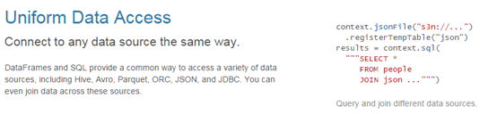
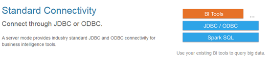

# SparkSQL

## 第1章 Spark SQL概述

### 1.1 什么是Spark SQL

​		Spark SQL是Spark用来处理结构化数据的一个模块，它提供了2个编程抽象：**DataFrame**和**DataSet**，并且作为分布式SQL查询引擎的作用。

​		我们已经学习了Hive，它是将Hive SQL转换成MapReduce然后提交到集群上执行，大大简化了编写MapReduc的程序的复杂性，由于MapReduce这种计算模型执行效率比较慢。所有Spark SQL的应运而生，它是将Spark SQL转换成RDD，然后提交到集群执行，执行效率非常快！

### 1.2 Spark SQL特点

1. 易整合

	

2. 统一的数据访问方式

	

3. 兼容Hive

	

4. 标准的数据连接

	

### 1.3 什么是DataFrame

​		与RDD类似，**DataFrame**也是一个分布式数据容器。然而**DataFrame**更像传统数据库的二维表格，除了数据以外，还记录数据的**结构信息**，即**schema**。同时，与Hive类似，DataFrame也支持嵌套数据类型（struct、array和map）。从API易用性的角度上看，DataFrame API提供的是一套高层的关系操作，比函数式的RDD API要更加友好，门槛更低。

​		上图直观地体现了DataFrame和RDD的区别。左侧的RDD[Person]虽然以Person为类型参数，但Spark框架本身不了解Person类的内部结构。而右侧的DataFrame却提供了详细的结构信息，使得Spark SQL可以清楚地知道该数据集中包含哪些列，每列的名称和类型各是什么。			

​		DataFrame是为数据提供了Schema的视图。可以把它当做数据库中的一张表来对待，**DataFrame也是懒执行的**。**性能上比RDD要高**，主要原因：

​		**优化的执行计划**：查询计划通过**Spark catalyst optimiser**进行优化。

+ 例如

	

​		为了说明查询优化，我们来看上图展示的人口数据分析的示例。图中构造了两个DataFrame，将它们join之后又做了一次filter操作。如果原封不动地执行这个执行计划，最终的执行效率是不高的。因为join是一个代价较大的操作，也可能会产生一个较大的数据集。如果我们能将filter下推到 join下方，先对DataFrame进行过滤，再join过滤后的较小的结果集，便可以有效缩短执行时间。而Spark SQL的查询优化器正是这样做的。简而言之，**逻辑查询计划优化**就是一个利用**基于关系代数的等价变换**，将高成本的操作替换为低成本操作的过程。 

### 1.4 什么是DataSet

1. 是**Dataframe API**的一个扩展，是Spark最新的数据抽象。
2. 用户友好的API风格，既具有**类型安全检查**也具有**Dataframe的查询优化特性**。
3. Dataset支持编解码器，当需要访问非堆上的数据时可以避免反序列化整个对象，提高了效率。
4. 样例类被用来在Dataset中定义数据的结构信息，样例类中每个属性的名称直接映射到DataSet中的字段名称。
5. **Dataframe是Dataset的特列**，**DataFrame=Dataset[Row]** ，所以可以通过as方法将Dataframe转换为Dataset。Row是一个类型，跟Car、Person这些的类型一样，所有的表结构信息我都用Row来表示。
6. DataSet是强类型的。比如可以有Dataset[Car]，Dataset[Person].

7. DataFrame只是知道字段，但是不知道字段的类型，所以在执行这些操作的时候是没办法在编译的时候检查是否类型失败的，比如你可以对一个String进行减法操作，在执行的时候才报错，而DataSet不仅仅知道字段，而且知道字段类型，所以有更严格的错误检查。就跟JSON对象和类对象之间的类比。

## 第2章 Spark SQL编程

### 2.1 SparkSession 新的起始点

​		在老的版本中，SparkSQL提供两种SQL查询起始点：一个叫SQLContext，用于Spark自己提供的SQL查询；一个叫HiveContext，用于连接Hive的查询。

​		SparkSession是Spark最新的SQL查询起始点，实质上是SQLContext和HiveContext的组合，所以在SQLContext和HiveContext上可用的API在SparkSession上同样是可以使用的。SparkSession内部封装了sparkContext，所以计算实际上是由sparkContext完成的。