+ 命令

	```
	bin/flume-ng agent --conf conf/ --conf-file job/netcat-flume-logger.conf --name a1 -Dflume.root.logger=INFO,console
	
	bin/flume-ng agent -n a1 -c conf -f job/files-flume-logger.conf -Dflume.root.logger=INFO,console
	
	bin/flume-ng agent --conf conf/ --conf-file job/group2/flume1.conf --name a1
	```

# Flume

## 一、flume概述
### 1. 定义
​    	Flume 是Cloudera 提供的一个高可用的，高可靠的，分布式的海量日志采集、聚合和传输的系统。Flume 基于流式架构，灵活简单。

### 2. flume基础架构
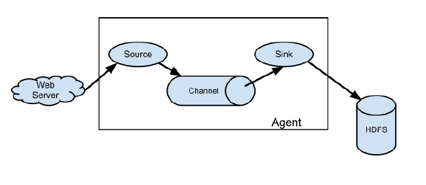
#### 2.1 Agent
​    Agent是一个JVM 进程，它以事件的形式将数据从源头送至目的。 Agent主要有3个部分组成，Source、Channel、Sink。

#### 2.2 Source
​		Source是负责接收数据到Flume Agent的组件。Source组件可以处理各种类型、各种格式的日志数据，包括**avro**（跨机器端口）、thrift、**exec**（监控文件）、jms、**spooling directory**（文件夹）、**netcat**（网络端口）、sequence generator、syslog、http、legacy。 

#### 2.3 Shannel
​		Channel是位于Source 和Sink 之间的缓冲区。因此，Channel允许Source 和Sink运作在不同的速率上。Channel 是线程安全的，可以同时处理几个 Source 的写入操作和几个Sink的读取操作。

​		Flume自带两种Channel：**Memory Channel**和 **File Channel**以及**Kafka Channel**。

​		Memory Channel是内存中的队列。Memory Channel在不需要关心数据丢失的情景下适用。如果需要关心数据丢失，那么 Memory Channel就不应该使用，因为程序死亡、机器宕机或者重启都会导致数据丢失。 

​    	File Channel 将所有事件写到磁盘。因此在程序关闭或机器宕机的情况下不会丢失数据。

#### 2.4 Sink

​		Sink 不断地轮询 Channel 中的事件且批量地移除它们，并将这些事件批量写入到存储或索引系统、或者被发送到另一个 Flume Agent。

​		Sink 组件目的地包括 **hdfs**、**logger**、**avro**、thrift、ipc、**file**、**HBase**、solr、自定义。

#### 2.5 Event

​		传输单元，Flume 数据传输的基本单元，以 Event 的形式将数据从源头送至目的地。 Event由**Header**和**Body**两部分组成，Header用来存放该 event的一些属性，为 **K-V**结构， Body用来存放该条数据，形式为字节数组。 

## 二、安装部署

​		上传解压，配置flume/conf下**flume-env.sh**

```xml
export JAVA_HOME=/opt/module/jdk1.8.0_181
```

## 三、案例

### 1. 监听端口数据

 +  需求分析

	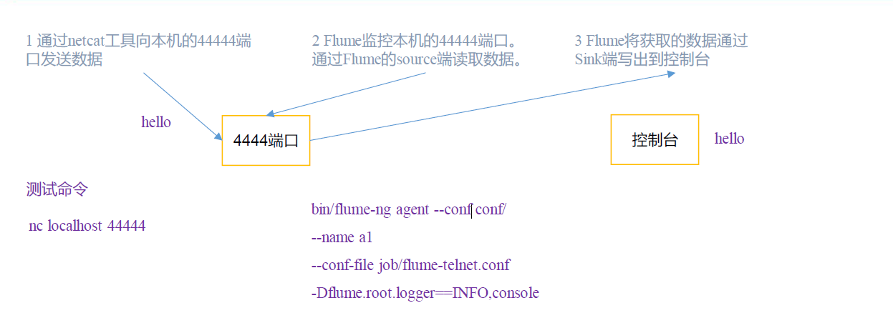

+ 安装netcat工具

	```
	sudo yum install -y nc
	```

+ 配置Agent文件

	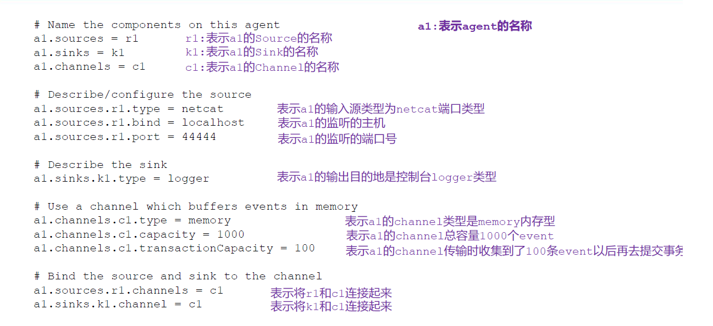


+ 启动

	```xml
	bin/flume-ng agent -c conf/ -n a1 -f job/flume-netcat-logger.conf -Dflume.root.logger=INFO,console
	```

	--conf/-c：表示配置文件存储在conf/目录
	--name/-n：表示给agent 起名为a1
	--conf-file/-f：flume 本次启动读取的配置文件是在job 文件夹下的flume-telnet.conf
	文件。
	-Dflume.root.logger=INFO,console ：-D 表示flume 运行时动态修改flume.root.logger
	参数属性值，并将控制台日志打印级别设置为INFO 级别。日志级别包括:log、info、warn、
	error。

### 2.监控单个追加文件上传hdfs

+ 需求分析

	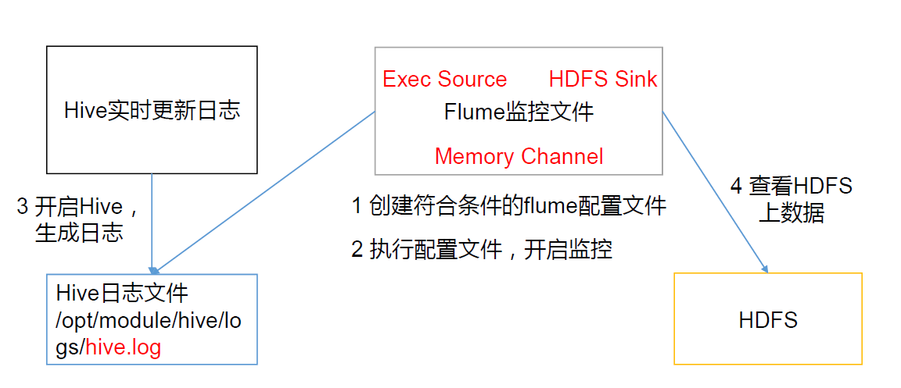

+ 配置Agent文件

	+ 所需jar包

		commons-configuration-1.6.jar、
		hadoop-auth-2.7.2.jar、
		hadoop-common-2.7.2.jar、
		hadoop-hdfs-2.7.2.jar、
		commons-io-2.4.jar、
		htrace-core-3.1.0-incubating.jar

	+ 配置文件

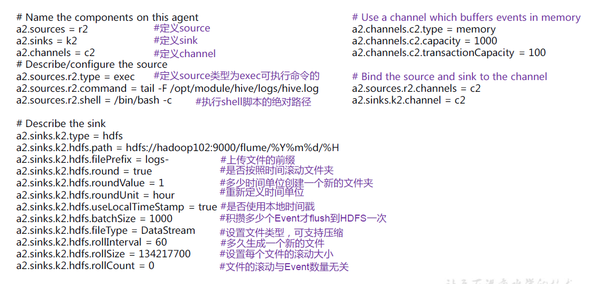

### 3.监控目录下文件

+ 需求分析

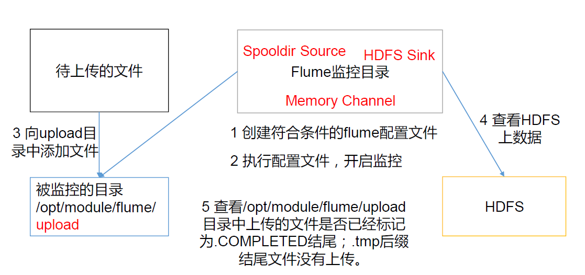

+ 配置Agent文件

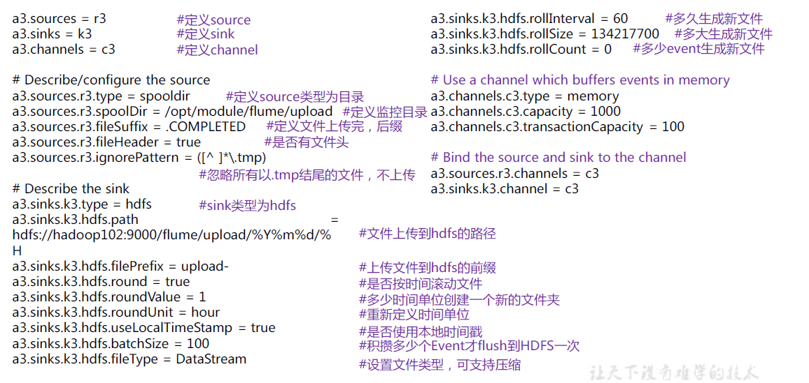

### 4. 监控目录下追加文件

+ **Exec source** 适用于监控一个实时追加的文件，但不能保证数据不丢失；

+ **Spooldir Source** 能够保证数据不丢失，且能够实现断点续传，但延迟较高，不能实时监控；

+ **Taildir Source** 既能够实现断点续传，又可以保证数据不丢失，还能够进行实时监控。


+ 需求分析


+ Agent配置文件

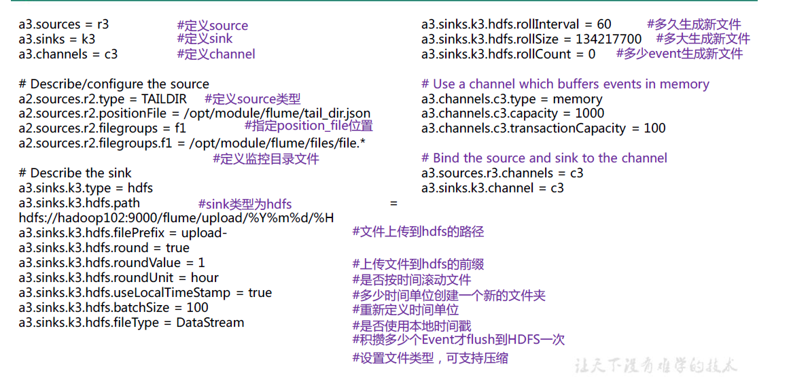

+ position说明

	​		Taildir Source 维护了一个json 格式的position File，其会定期的往position File
	中更新每个文件读取到的最新的位置，因此能够实现断点续传。Position File 的格式如下：

	```json
	{"inode":2496272,"pos":12,"file":"/opt/module/flume/files/file1.t
	xt"}
	{"inode":2496275,"pos":12,"file":"/opt/module/flume/files/file2.t
	xt"}
	```

	+ 注：Linux 中储存文件元数据的区域就叫做inode，每个inode 都有一个号码，操作系统用inode 号码来识别不同的文件，Unix/Linux 系统内部不使用文件名，而使用inode 号码来识别文件

## 四、Flume高阶

### 1.flume事务

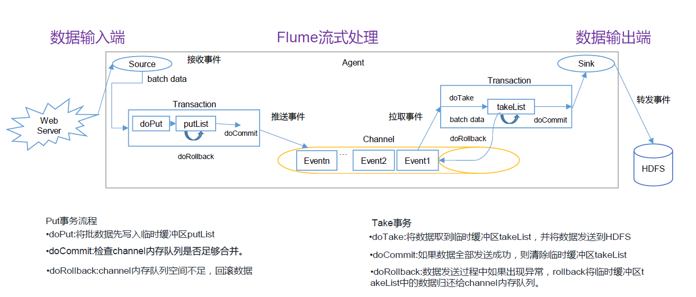
### 2.agent流程图
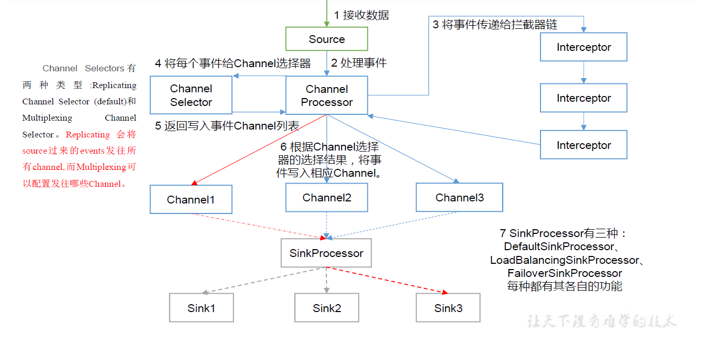

+ **ChannelSelector** 的作用就是选出Event 将要被发往哪个Channel。其共有两种类型，分别是**Replicating**（复制）和**Multiplexing**（多路复用）。

	​        **ReplicatingSelector** 会将同一个Event发往所有的 Channel。

	​        **Multiplexing** 会根据相应的原则，将不同的 Event发往不同的Channel。

+ **SinkProcessor **

	  	  SinkProcessor 共 有 三 种 类 型 ，分 别 是 **DefaultSinkProcessor** 、**LoadBalancingSinkProcessor** 和**FailoverSinkProcessor**

	​     	DefaultSinkProcessor 对应的是单个的 Sink，LoadBalancingSinkProcessor 和FailoverSinkProcessor 对应的是 Sink Group，LoadBalancingSinkProcessor 可以实现负载均衡的功能，FailoverSinkProcessor可以实现故障转移的功能。   

### 3. 高阶案例

#### 3.1复制多路复用

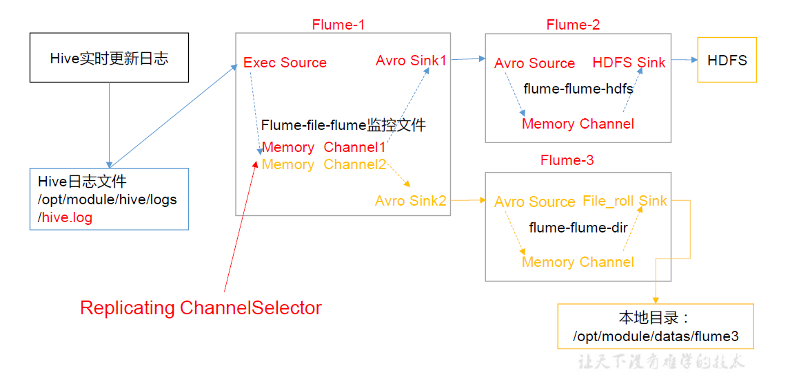

#### 3.2负载均衡和故障转移


#### 3.4聚合

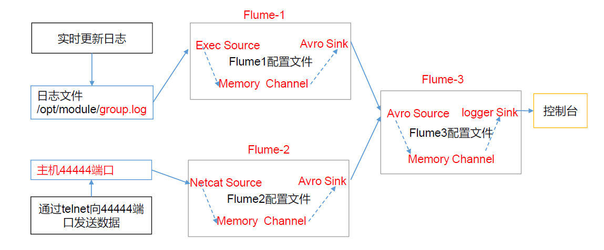