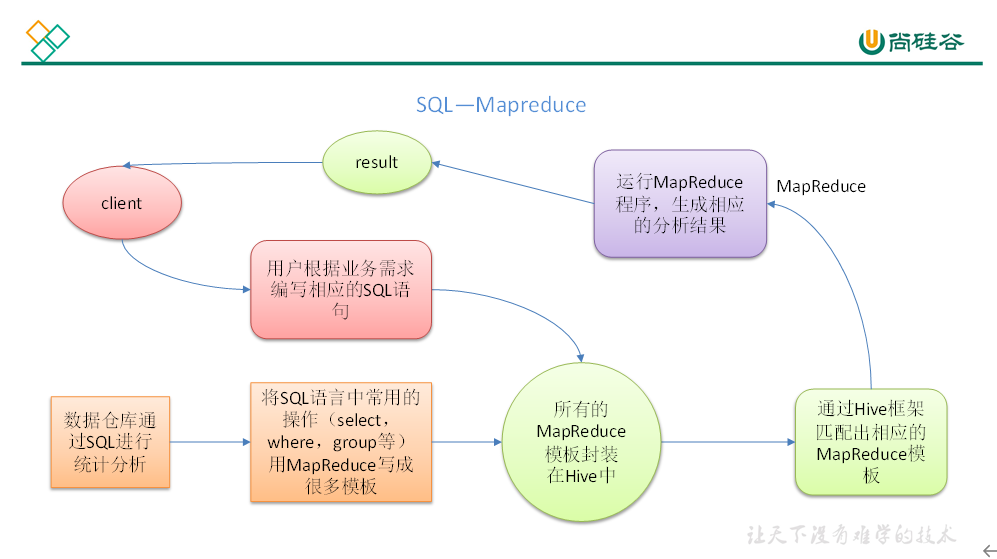
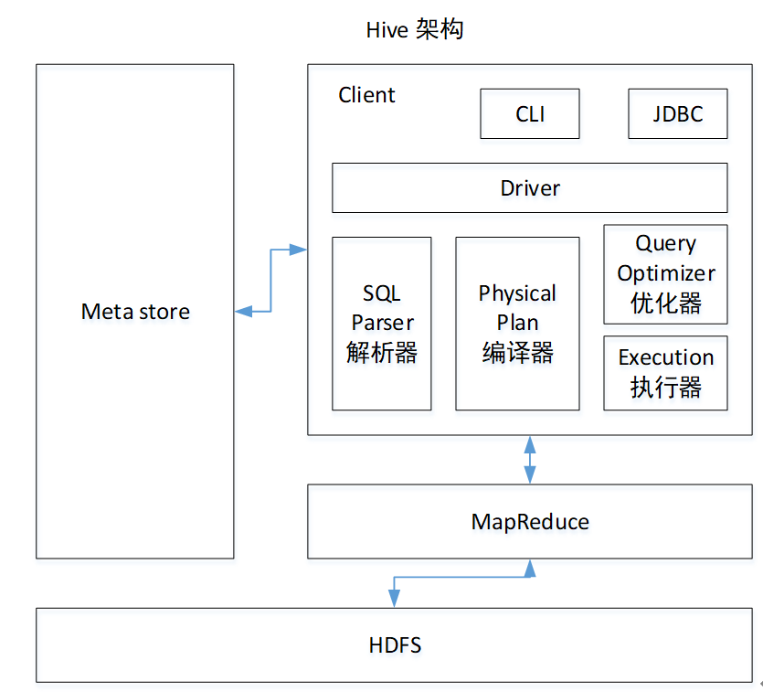
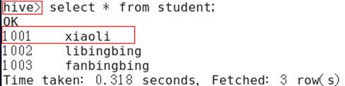
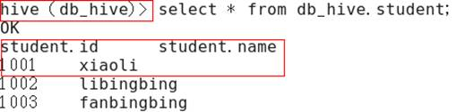

# Hive

## 第1章 Hive基本概念

### 1.1 什么是Hive

​		Hive：由Facebook开源用于解决海量结构化日志的数据统计。

​		Hive是基于Hadoop的一个数据仓库工具，可以将结构化的数据文件映射为一张表，并提供类SQL查询功能。

​		本质是：将HQL转化成MapReduce程序



### 1.2 Hive的优缺点

#### 1.2.1 优点

1. 操作接口采用类SQL语法，提供快速开发的能力（简单、容易上手）。

2. 避免了去写MapReduce，减少开发人员的学习成本。

3. Hive的执行延迟比较高，因此Hive常用于数据分析，对实时性要求不高的场合。

4. Hive优势在于处理大数据，对于处理小数据没有优势，因为Hive的执行延迟比较高。

5. Hive支持用户自定义函数，用户可以根据自己的需求来实现自己的函数

#### 1.2.2 缺点

1. Hive的HQL表达能力有限

	（1）迭代式算法无法表达

	（2）数据挖掘方面不擅长

2. Hive的效率比较低

	（1）Hive自动生成的MapReduce作业，通常情况下不够智能化

	（2）Hive调优比较困难，粒度较粗

### 1.3 Hive架构原理



1. 用户接口：Client

	CLI（hive shell）、JDBC/ODBC(java访问hive)、WEBUI（浏览器访问hive）

2. 元数据：Metastore

	元数据包括：表名、表所属的数据库（默认是default）、表的拥有者、列/分区字段、表的类型（是否是外部表）、表的数据所在目录等；

	默认存储在自带的derby数据库中，推荐使用MySQL存储Metastore

3. Hadoop

	使用HDFS进行存储，使用MapReduce进行计算。

4. 驱动器：Driver

	（1）解析器（SQL Parser）：将SQL字符串转换成抽象语法树AST，这一步一般都用第三方工具库完成，比如antlr；对AST进行语法分析，比如表是否存在、字段是否存在、SQL语义是否有误。

	（2）编译器（Physical Plan）：将AST编译生成逻辑执行计划。

	（3）优化器（Query Optimizer）：对逻辑执行计划进行优化。

	（4）执行器（Execution）：把逻辑执行计划转换成可以运行的物理计划。对于Hive来说，就是MR/Spark。

​	    Hive通过给用户提供的一系列交互接口，接收到用户的指令(SQL)，使用自己的Driver，结合元数据(MetaStore)，将这些指令翻译成MapReduce，提交到Hadoop中执行，最后，将执行返回的结果输出到用户交互接口。

### 1.4 Hive和数据库比较

​		由于 Hive 采用了类似SQL 的查询语言 HQL(Hive Query Language)，因此很容易将 Hive 理解为数据库。其实从结构上来看，Hive 和数据库除了拥有类似的查询语言，再无类似之处。本节将从多个方面来阐述 Hive 和数据库的差异。数据库可以用在 Online 的应用中，但是Hive 是为数据仓库而设计的，清楚这一点，有助于从应用角度理解 Hive 的特性。

#### 1.4.1 查询语言

​		由于SQL被广泛的应用在数据仓库中，因此，专门针对Hive的特性设计了类SQL的查询语言HQL。熟悉SQL开发的开发者可以很方便的使用Hive进行开发。

#### 1.4.2 数据存储位置

​		Hive 是建立在 Hadoop 之上的，所有 Hive 的数据都是存储在 HDFS 中的。而数据库则可以将数据保存在块设备或者本地文件系统中。

#### 1.4.3 数据更新

​		由于Hive是针对数据仓库应用设计的，而数据仓库的内容是**读多写少**的。因此，Hive中不建议对数据的改写，所有的数据都是在加载的时候确定好的。而数据库中的数据通常是需要经常进行修改的，因此可以使用 INSERT INTO … VALUES 添加数据，使用 UPDATE … SET修改数据。

#### 1.4.4 索引

​		Hive在加载数据的过程中不会对数据进行任何处理，甚至不会对数据进行扫描，因此也没有对数据中的某些Key建立索引。Hive要访问数据中满足条件的特定值时，需要暴力扫描整个数据，因此访问延迟较高。由于 MapReduce 的引入， Hive 可以并行访问数据，因此即使没有索引，对于大数据量的访问，Hive 仍然可以体现出优势。数据库中，通常会针对一个或者几个列建立索引，因此对于少量的特定条件的数据的访问，数据库可以有很高的效率，较低的延迟。由于数据的访问延迟较高，决定了 Hive 不适合在线数据查询。

#### 1.4.5 执行

​		Hive中大多数查询的执行是通过 Hadoop 提供的 MapReduce 来实现的。而数据库通常有自己的执行引擎。

#### 1.4.6 执行延迟

​		Hive 在查询数据的时候，由于没有索引，需要扫描整个表，因此延迟较高。另外一个导致 Hive 执行延迟高的因素是 MapReduce框架。由于MapReduce 本身具有较高的延迟，因此在利用MapReduce 执行Hive查询时，也会有较高的延迟。相对的，数据库的执行延迟较低。当然，这个低是有条件的，即数据规模较小，当数据规模大到超过数据库的处理能力的时候，Hive的并行计算显然能体现出优势。

#### 1.4.7 可扩展性

​		由于Hive是建立在Hadoop之上的，因此Hive的可扩展性是和Hadoop的可扩展性是一致的。而数据库由于 ACID 语义的严格限制，扩展行非常有限。目前最先进的并行数据库 Oracle 在理论上的扩展能力也只有100台左右。

#### 1.4.8 数据规模

​		由于Hive建立在集群上并可以利用MapReduce进行并行计算，因此可以支持很大规模的数据；对应的，数据库可以支持的数据规模较小。

## 第2章 Hive基本操作

### 2.1 安装

​		上传解压 hive-env.sh hive-site.xml

### 2.2 基本操作

```shell
（1）启动hive
[atguigu@hadoop102 hive]$ bin/hive

（2）查看数据库
hive> show databases;

（3）打开默认数据库
hive> use default;

（4）显示default数据库中的表
hive> show tables;

（5）创建一张表
hive> create table student(id int, name string);

（6）显示数据库中有几张表
hive> show tables;

（7）查看表的结构
hive> desc student;

（8）向表中插入数据
hive> insert into student values(1000,"ss");

（9）查询表中数据
hive> select * from student;

（10）退出hive
hive> quit;
```

### 2.3 导入数据

​		将本地/opt/module/data/student.txt这个目录下的数据导入到hive的student(id int, name string)表中。

1. 数据准备

	在/opt/module/data这个目录下准备数据

	（1）在/opt/module/目录下创建data

	[atguigu@hadoop102 module]$ mkdir data

	（2）在/opt/module/datas/目录下创建student.txt文件并添加数据

	[atguigu@hadoop102 datas]$ touch student.txt

	[atguigu@hadoop102 datas]$ vi student.txt

	1001 zhangshan

	1002 lishi

	1003 zhaoliu

	注意以tab键间隔。

2. Hive实际操作

```shell
（1）启动hive
[atguigu@hadoop102 hive]$ bin/hive

（2）显示数据库
hive> show databases;

（3）使用default数据库
hive> use default;

（4）显示default数据库中的表
hive> show tables;

（5）删除已创建的student表
hive> drop table student;

（6）创建student表, 并声明文件分隔符’\t’
hive> create table student(id int, name string) ROW FORMAT DELIMITED FIELDS TERMINATED
 BY '\t';

（7）加载/opt/module/data/student.txt 文件到student数据库表中。
hive> load data local inpath '/opt/module/data/student.txt' into table student;

（8）Hive查询结果
hive> select * from student;
OK
1001 zhangshan
1002 lishi
1003 zhaoliu
Time taken: 0.266 seconds, Fetched: 3 row(s)
```

### 2.4 常用交互

```shell
  [atguigu@hadoop102 hive]$ bin/hive  -help  usage: hive   -d,--define <key=value>     Variable subsitution to apply to  hive                   
  commands. e.g. -d A=B or  --define A=B     
  --database <databasename>    Specify the database to use   
  -e <quoted-query-string>     SQL from command line   
  -f <filename>          
  SQL from files   
  -H,--help            Print help information     
  --hiveconf <property=value>   Use value for given property      
  --hivevar <key=value>      Variable subsitution to apply to hive                   commands.  e.g. 
  --hivevar A=B   -i <filename>           Initialization SQL file   
  -S,--silent           Silent mode in  interactive shell   
  -v,--verbose           Verbose mode (echo  executed SQL to the console)  
```

1．“-e”不进入hive的交互窗口执行sql语句

```shell
[atguigu@hadoop102 hive]$ bin/hive -e "select id from student;"
```

2．“-f”执行脚本中sql语句

​     （1）在/opt/module/datas目录下创建hivef.sql文件

```shell
[atguigu@hadoop102 datas]$ touch hivef.sql
```

​       文件中写入正确的sql语句

```sql
  select * from student;
```

​     （2）执行文件中的sql语句

```shell
[atguigu@hadoop102 hive]$ bin/hive -f /opt/module/datas/hivef.sql
```

​     （3）执行文件中的sql语句并将结果写入文件中

```shell
[atguigu@hadoop102 hive]$ bin/hive -f /opt/module/datas/hivef.sql > /opt/module/datas/hive_result.txt
```

### 2.5 Hive其他命令操作

1．在hive cli命令窗口中如何查看hdfs文件系统

```shell
hive> dfs -ls /;
```

2．在hive cli命令窗口中如何查看本地文件系统

```shell
hive> ! ls /opt/module/datas;
```

3．查看在hive中输入的所有历史命令

​    （1）进入到当前用户的根目录/root或/home/atguigu

​    （2）查看. hivehistory文件

```shell
[atguigu@hadoop102 ~]$ cat .hivehistory
```

### 2.6 Hive常见属性配置

#### 2.6.1 Hive数据仓库位置配置

1. Default数据仓库的最原始位置是在hdfs上的：/user/hive/warehouse路径下。

2. 在仓库目录下，没有对默认的数据库default创建文件夹。如果某张表属于default数据库，直接在数据仓库目录下创建一个文件夹。

3. 修改default数据仓库原始位置（将hive-default.xml.template如下配置信息拷贝到hive-site.xml文件中）。

```xml
<property> 
	<name>hive.metastore.warehouse.dir</name>
    <value>/user/hive/warehouse</value>  
    <description>location of default database for the  warehouse</description> 
 </property>  
```

​		配置同组用户有执行权限

```shell
bin/hdfs dfs -chmod g+w /user/hive/warehouse
```

#### 2.6.2 查询后信息显示配置

1. 在hive-site.xml文件中添加如下配置信息，就可以实现显示当前数据库，以及查询表的头信息配置。

```xml
<property>
 <name>hive.cli.print.header</name>
 <value>true</value>
</property>
 
<property>
 <name>hive.cli.print.current.db</name>
 <value>true</value>
</property>
```

2. 重新启动hive，对比配置前后差异。

（1）配置前，如图所示



（2）配置后，如图所示



#### 2.6.3 Hive运行日志信息配置

1. Hive的log默认存放在/tmp/atguigu/hive.log目录下（当前用户名下）

2. 修改hive的log存放日志到/opt/module/hive/logs

​    （1）修改/opt/module/hive/conf/hive-log4j.properties.template文件名称为

​			hive-log4j.properties

​		[atguigu@hadoop102 conf]$ pwd

​			/opt/module/hive/conf

​		[atguigu@hadoop102 conf]$ mv hive-log4j.properties.template hive-log4j.properties

​    （2）在hive-log4j.properties文件中修改log存放位置

​			hive.log.dir=/opt/module/hive/logs

#### 2.6.4 参数配置方式

1. 查看当前所有的配置信息

	hive>set;

2. 参数的配置三种方式

​    （1）配置文件方式

​		默认配置文件：hive-default.xml

​		用户自定义配置文件：hive-site.xml

   	 注意：用户自定义配置会覆盖默认配置。另外，Hive也会读入Hadoop的配置，因为Hive是作为Hadoop的客户端启动的，Hive的配置会覆盖Hadoop的配置。配置文件的设定对本机启动的所有Hive进程都有效。

​	（2）命令行参数方式

​		启动Hive时，可以在命令行添加-hiveconf param=value来设定参数。

​	例如：

​		[atguigu@hadoop103 hive]$ bin/hive -hiveconf mapred.reduce.tasks=10;

​		注意：仅对本次hive启动有效

​		查看参数设置：

​			hive (default)> set mapred.reduce.tasks;

​	（3）参数声明方式

​		可以在HQL中使用SET关键字设定参数

​			例如：

​		hive (default)> set mapred.reduce.tasks=100;

​		注意：仅对本次hive启动有效。

​		查看参数设置

​			hive (default)> set mapred.reduce.tasks;

​		上述三种设定方式的优先级依次递增。即配置文件<命令行参数<参数声明。注意某些系统级的参数，例如log4j相关的设定，必须用前两种方式设定，因为那些参数的读取在会话建立以前已经完成了。

## 第3章 Hive数据类型

### 3.1 基本数据类型

| Hive数据类型 | Java数据类型 |                         长度                         | 例子                                 |
| ------------ | ------------ | :--------------------------------------------------: | ------------------------------------ |
| TINYINT      | byte         |                   1byte有符号整数                    | 20                                   |
| SMALINT      | short        |                   2byte有符号整数                    | 20                                   |
| INT          | int          |                   4byte有符号整数                    | 20                                   |
| BIGINT       | long         |                   8byte有符号整数                    | 20                                   |
| BOOLEAN      | boolean      |               布尔类型，true或者false                | TRUE FALSE                           |
| FLOAT        | float        |                     单精度浮点数                     | 3.14159                              |
| DOUBLE       | double       |                     双精度浮点数                     | 3.14159                              |
| STRING       | string       | 字符系列。可以指定字符集。可以使用单引号或者双引号。 | ‘now is the time’ “for all good men” |
| TIMESTAMP    |              |                       时间类型                       |                                      |
| BINARY       |              |                       字节数组                       |                                      |

​		对于Hive的String类型相当于数据库的varchar类型，该类型是一个可变的字符串，不过它不能声明其中最多能存储多少个字符，理论上它可以存储2GB的字符数。

### 3.2 集合数据类型

表3-2

| 数据类型 | 描述                                                         | 语法示例 |
| -------- | ------------------------------------------------------------ | -------- |
| STRUCT   | 和c语言中的struct类似，都可以通过“点”符号访问元素内容。例如，如果某个列的数据类型是STRUCT{first STRING, last STRING},那么第1个元素可以通过字段.first来引用。 | struct() |
| MAP      | MAP是一组键-值对元组集合，使用数组表示法可以访问数据。例如，如果某个列的数据类型是MAP，其中键->值对是’first’->’John’和’last’->’Doe’，那么可以通过字段名[‘last’]获取最后一个元素 | map()    |
| ARRAY    | 数组是一组具有相同类型和名称的变量的集合。这些变量称为数组的元素，每个数组元素都有一个编号，编号从零开始。例如，数组值为[‘John’,  ‘Doe’]，那么第2个元素可以通过数组名[1]进行引用。 | Array()  |

​		Hive有三种复杂数据类型ARRAY、MAP 和 STRUCT。ARRAY和MAP与Java中的Array和Map类似，而STRUCT与C语言中的Struct类似，它封装了一个命名字段集合，复杂数据类型允许任意层次的嵌套。

案例实操

1. 假设某表有如下一行，我们用JSON格式来表示其数据结构。在Hive下访问的格式为

```json
 {      
   "name": "songsong",      
   "friends": ["bingbing" , "lili"] ,    //列表Array,       
   "children": {           //键值Map,       
       "xiao song": 18 ,      
       "xiaoxiao song": 19     
   }     
  "address": {                      //结构Struct,
        "street": "hui long guan" ,
        "city": "beijing" 
           }  
}  
```

2. 基于上述数据结构，我们在Hive里创建对应的表，并导入数据。 

创建本地测试文件test.txt

```
  songsong,bingbing_lili,xiao  song:18_xiaoxiao song:19,hui long guan_beijing  yangyang,caicai_susu,xiao  yang:18_xiaoxiao yang:19,chao yang_beijing  
```

​	注意：MAP，STRUCT和ARRAY里的元素间关系都可以用同一个字符表示，这里用“_”。

3. Hive上创建测试表test

```shell
 create table test( 
 name string, 
 friends array<string>,
 children map<string, int>,  
 address struct<street:string,  city:string> 
 ) 
 row format delimited  
 fields terminated by ',' 
 collection items terminated by '_' 
 map keys terminated by ':'  
 lines terminated by '\n';  
```

​		字段解释：

​		row format delimited fields terminated by ',' -- 列分隔符

​		collection items terminated by '_'    --MAP STRUCT 和 ARRAY 的分隔符(数据分割符号)

​		map keys terminated by ':'             -- MAP中的key与value的分隔符

​		lines terminated by '\n';               -- 行分隔符

4. 导入文本数据到测试表

```shell
hive (default)> load data local inpath "/opt/module/datas/test.txt" into table test;
```

5. 访问三种集合列里的数据，以下分别是ARRAY，MAP，STRUCT的访问方式

```shell
hive (default)> select  friends[1],children['xiao song'],address.city from test  where name="songsong";  OK  _c0    _c1   city  lili    18    beijing  Time taken: 0.076 seconds, Fetched: 1  row(s)  
```

### 3.3 类型转化

​		Hive的原子数据类型是可以进行隐式转换的，类似于Java的类型转换，例如某表达式使用INT类型，TINYINT会自动转换为INT类型，但是Hive不会进行反向转化，例如，某表达式使用TINYINT类型，INT不会自动转换为TINYINT类型，它会返回错误，除非使用CAST操作。

1. 隐式类型转换规则如下

	（1）任何整数类型都可以隐式地转换为一个范围更广的类型，如TINYINT可以转换成INT，INT可以转换成BIGINT。

	（2）所有整数类型、FLOAT和STRING类型都可以隐式地转换成DOUBLE。

	（3）TINYINT、SMALLINT、INT都可以转换为FLOAT。

	（4）BOOLEAN类型不可以转换为任何其它的类型。

2. 可以使用CAST操作显示进行数据类型转换

	例如CAST('1' AS INT)将把字符串'1' 转换成整数1；如果强制类型转换失败，如执行CAST('X' AS INT)，表达式返回空值 NULL。

## 示例

```shell
CREATE TABLE hive_hbase_emp_table( 
empno int, 
ename string, 
job string, 
mgr int, 
hiredate string, 
sal double, 
comm double, 
deptno int) 
STORED BY 'org.apache.hadoop.hive.hbase.HBaseStorageHandler' 
WITH SERDEPROPERTIES ("hbase.columns.mapping" =":key,info:ename,info:job,info:mgr,info:hiredate,info:sal,info:co mm,info:deptno") 
TBLPROPERTIES ("hbase.table.name" = "hbase_emp_table"); 
```


```shell
CREATE EXTERNAL TABLE hiveweibo(
id string,
name string,
url string,
focus int)
STORED BY 
'org.apache.hadoop.hive.hbase.HBaseStorageHandler'
WITH SERDEPROPERTIES ("hbase.columns.mapping" = ":key,info:name,info:url,info:focus") 
TBLPROPERTIES ("hbase.table.name" = "weibo");
```
