# Kafka

## 一、Kafka概述

### 1.1 定义

​		Kafka 是一个**分布式**的基于**发布/订阅模式**的**消息队列**（Message Queue），主要应用于大数据实时处理领域。

### 1.2 消息队列

#### 1.2.1 消息队列的应用场景

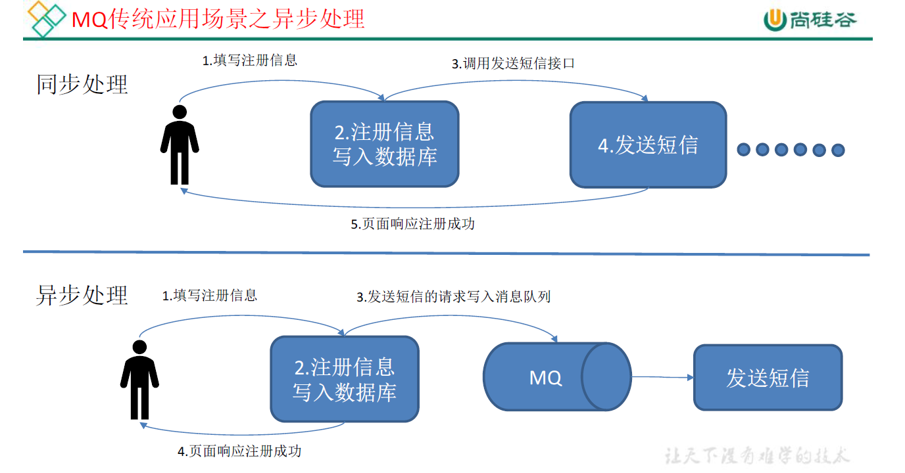

**消息队列的好处**

1. **解耦：**允许独立的修改两边的处理过程，只需遵守相同的接口约束。
2. **可恢复性**：系统部分组件失效不影响整个系统，降低进程间的耦合度，所以即使进程挂掉，队列中的消息在恢复后仍可继续被处理。
3. **缓冲：**控制和优化数据流经过系统的速度，解决生产和消费的处理速度不一致的情况。
4. **灵活性&&峰值处理能力：**能够是关键组件顶住突发的访问压力，避免因为突发的超负荷请求而崩溃。
5. **异步通信：**提供生产和消费异步处理机制。

#### 1.2.2 两种模式

1. **点对点模式(一对一)**: 消费者主动拉取数据，消息收到后清除

	​		消息生产者生产消息发送到Queue 中，然后消息消费者从Queue 中取出并且消费消息。 消息被消费以后，queue 中不再有存储，所以消息消费者不可能消费到已经被消费的消息。 Queue 支持存在多个消费者，但是对一个消息而言，只会有一个消费者可以消费。

	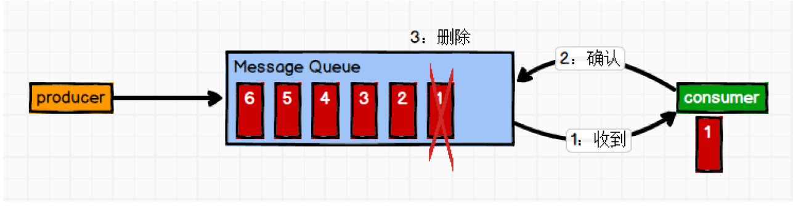

2. **发布/订阅模式(一对多)**：消费者消费数据后不清除

	​		消息生产者（发布）将消息发布到 topic 中，同时有多个消息消费者（订阅）消费该消息。和点对点方式不同，发布到 topic 的消息会被所有订阅者消费。 

	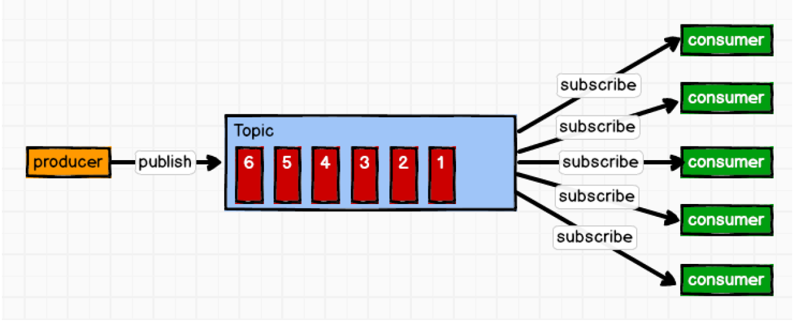

### 1.3 Kafka基础架构

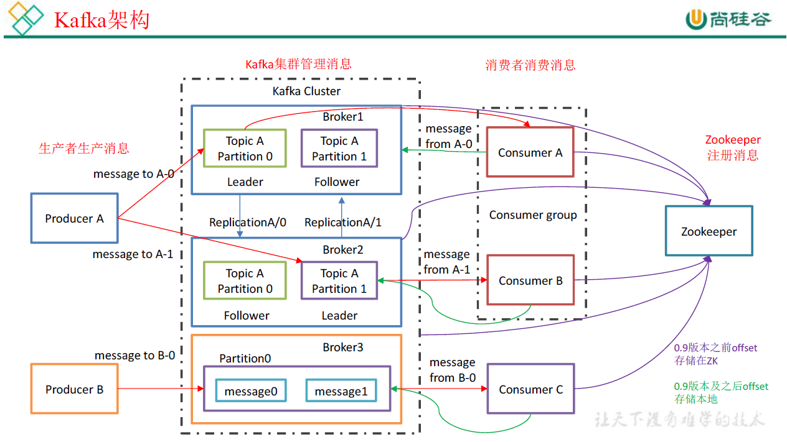

1. **Producer** ：消息生产者，就是向 kafka broker 发消息的客户端； 
2. **Consumer** ：消息消费者，向 kafka broker 取消息的客户端； 
3. **Consumer Group （CG）**：消费者组，由多个 consumer 组成。消费者组内每个消费者负责消费不同分区的数据，**一个分区只能由一个组内的一个消费者消费**；消费者组之间互不影响。所有的消费者都属于某个消费者组，即消费者组是**逻辑上**的一个订阅者。 
4. **Broker** ：一台 kafka 服务器就是一个 broker。一个集群由多个 broker 组成。一个 broker可以容纳多个topic。 
5. **Topic** ：可以理解为一个队列，生产者和消费者面向的都是一个topic； 
6. **Partition**：为了实现扩展性，一个非常大的 topic 可以分布到多个broker（即服务器）上，一个topic 可以分为多个partition，每个partition 是一个有序的队列； 
7. **Replica**：副本，为保证集群中的某个节点发生故障时，该节点上的partition 数据不丢失，且kafka 仍然能够继续工作，kafka 提供了副本机制，一个topic 的每个分区都有若干个副本，一个leader 和若干个follower。
8. **leader**：每个分区多个副本的“主”，生产者发送数据的对象，以及消费者消费数据的对象都是leader。
9. **follower**：每个分区多个副本中的“从”，实时从 leader 中同步数据，保持和 leader 数据的同步。leader 发生故障时，某个 follower 会成为新的 follower。 

## 二、Kafka快速入门

### 2.1 安装部署

1. zookeeper

2. 上传/解压/配置

	+ 配置server.properties   (**broker.id全局唯一**)

		```properties
		
		#broker的全局唯一编号，不能重复
		broker.id=0 
		
		#删除topic功能使能
		delete.topic.enable=true 
		#处理网络请求的线程数量
		num.network.threads=3 
		#用来处理磁盘IO的现成数量
		num.io.threads=8 
		#发送套接字的缓冲区大小
		socket.send.buffer.bytes=102400 
		#接收套接字的缓冲区大小
		socket.receive.buffer.bytes=102400 
		#请求套接字的缓冲区大小
		socket.request.max.bytes=104857600 
		
		#kafka运行日志存放的路径
		log.dirs=/home/neu/kafka/logs 
		
		#topic在当前broker上的分区个数
		num.partitions=1 
		#用来恢复和清理data下数据的线程数量
		num.recovery.threads.per.data.dir=1 
		#segment文件保留的最长时间，超时将被删除
		log.retention.hours=168 
		#配置连接Zookeeper集群地址
		zookeeper.connect=master:2181,slave01:2181,slave02:2181 
		```

	+ 环境变量

		```bash
		#KAFKA_HOME 
		export KAFKA_HOME=/home/neu/kafka 
		export PATH=$PATH:$KAFKA_HOME/bin 
		```

## 三、Kafka架构

### 3.1 kafka工作流程和文件存储机制

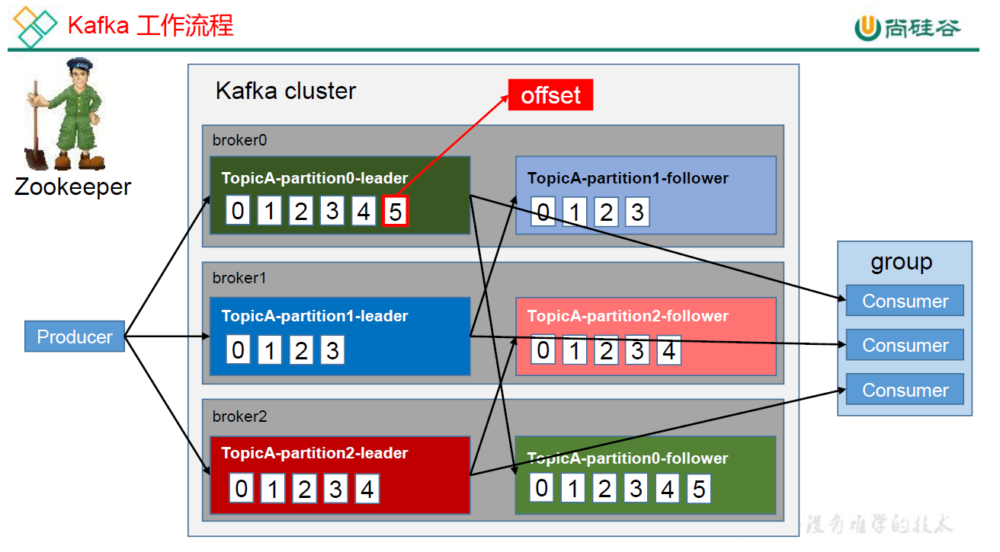

​		Kafka 中消息是以 topic 进行分类的，生产者生产消息，消费者消费消息，都是面向 topic的。

​		topic 是**逻辑**上的概念，而 partition 是**物理**上的概念，每个 partition 对应于一个 log 文件，该 log 文件中存储的就是 producer 生产的数据。Producer 生产的数据会被不断追加到该log文件末端，且每条数据都有自己的 offset。消费者组中的每个消费者，都会实时记录自己消费到了哪个**offset**，以便出错恢复时，从上次的位置继续消费。 

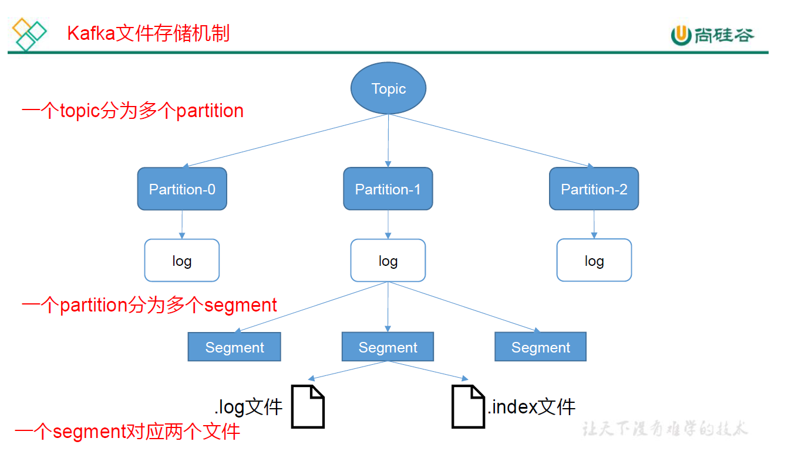

​		由于生产者生产的消息会不断追加到log 文件末尾，为防止log 文件过大导致数据定位效率低下，Kafka 采取了分片和索引机制，将每个partition 分为多个**segment**:**（默认七天清除，可限制切分大小）**。每个segment对应两个文件——“**.index**”文件和“**.log**”文件。这些文件位于一个文件夹下，该文件夹的命名规则为：**topic 名称+分区序号**。例如，first 这个topic 有三个分区，则其对应的文件夹为first-0,first-1,first-2。

### 3.2 kafka生产者

#### 3.2.1 分区策略

1. 分区原因

	+ 方便在集群中扩展，每个Partition 可以通过调整以适应它所在的机器，而一个 topic又可以有多个Partition 组成，因此整个集群就可以适应任意大小的数据了；

	+ 可以提高并发，因为可以以Partition 为单位读写了。 

2. 分区原则

	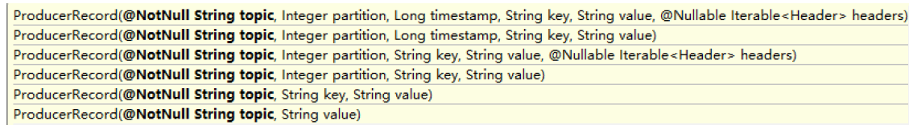

	+ **指明 partition** 的情况下，直接将指明的值直接作为 partiton 值；

	+ **没有指明 partition 值但有 key** 的情况下，将 key 的 hash 值与 topic 的 partition 数进行取余得到 partition 值； 
	+ 既没有 partition 值又没有 key 值的情况下，第一次调用时随机生成一个整数（后面每次调用在这个整数上自增），将这个值与 topic 可用的 partition 总数取余得到 partition 值，也就是常说的 **round-robin** 算法。 

#### 3.2.2 数据可靠性

​		为保证 producer 发送的数据，能可靠的发送到指定的 topic，topic 的每个 partition 收到producer 发送的数据后，都需要向 producer 发送 **ack**（acknowledgement 确认收到），如果producer 收到 ack，就会进行下一轮的发送，否则重新发送数据。 

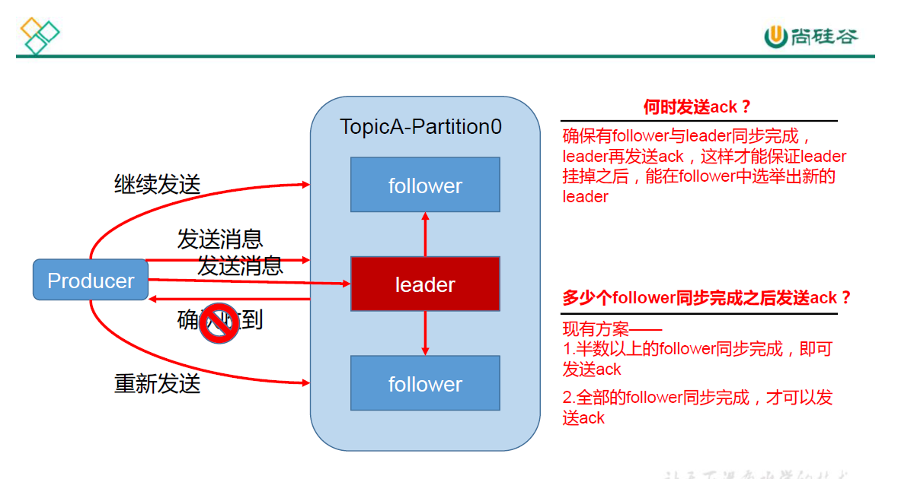

1. **follower副本数据同步策略**

	| 方案                      | 优点                                           | 缺点                                            |
	| ------------------------- | ---------------------------------------------- | ----------------------------------------------- |
	| 半数以上完成同步，发送ack | 延迟低                                         | 选举新leader时，允许n个节点故障，需要2n+1个副本 |
	| 全部同步完成，发送ack     | 选举新leader时，允许n个节点故障，需要n+1个副本 | 延迟高                                          |

	Kafka 选择了第二种方案，原因如下： 

	+ 同样为了容忍 n 台节点的故障，第一种方案需要 2n+1 个副本，而第二种方案只需要 n+1个副本，而Kafka 的每个分区都有大量的数据，第一种方案会造成大量数据的冗余。 

	+ 虽然第二种方案的网络延迟会比较高，但网络延迟对 Kafka 的影响较小。

2. **ISR**

	​		采用第二种方案之后，设想以下情景leader 收到数据，所有 follower 都开始同步数据，但有一个follower，因为某种故障，迟迟不能与 leader 进行同步，那leader 就要一直等下去，直到它完成同步，才能发送 ack。这个问题怎么解决呢？ 

	​		Leader 维护了一个动态的**in-sync replica set (ISR)**，意为和 leader 保持同步的 follower 集合。当ISR 中的follower 完成数据的同步之后，leader 就会给follower 发送ack。如果follower长时间未向leader同步 数据，则该 follower将被踢出ISR ，该时间阈值由replica.lag.time.max.ms 参数设定。Leader 发生故障之后，就会从 ISR 中选举新的 leader。 

	​		**原来是条数+时间限制，干掉条数是避免以下情况：生产者每个batch大小超过条数会造成follower在ISR内外反复横跳，zk中反复修改**

3. **ack 应答机制** 

	 		对于某些不太重要的数据，对数据的可靠性要求不是很高，能够容忍数据的少量丢失，所以没必要等ISR 中的 follower 全部接收成功。

	​		所以 Kafka 为用户提供了三种可靠性级别，用户根据对可靠性和延迟的要求进行权衡，选择以下的配置。  

	+ **0**：producer 不等待 broker 的ack，这一操作提供了一个最低的延迟，broker 一接收到还没有写入磁盘就已经返回，当 broker 故障时有可能丢失数据； 
	+ **1**：producer 等待broker 的ack，partition 的 leader 落盘成功后返回ack，如果在 follower同步成功之前leader 故障，那么将会丢失数据；
	+ **-1(all)**：producer 等待 broker 的ack，partition 的leader 和 follower 全部落盘成功后才返回ack。但是如果在 follower 同步完成后，broker 发送ack 之前，leader 发生故障，那么会造成数据重复。 

4. **故障细节处理**

	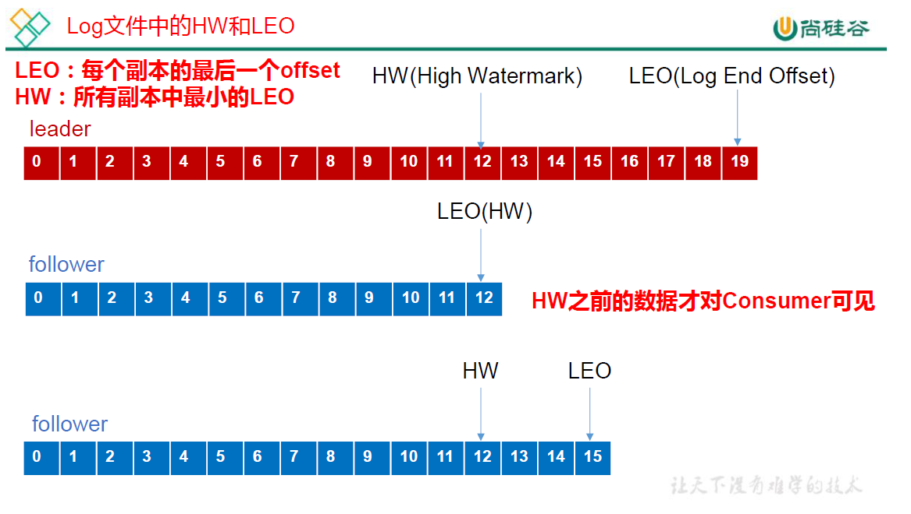

	**LEO：指的是每个副本最大的offset；** 
	**HW：指的是消费者能见到的最大的offset，ISR 队列中最小的LEO。** 

	1. follower 故障 

		​		follower 发生故障后会被临时踢出ISR，待该 follower 恢复后，follower 会读取本地磁盘记录的上次的HW，并将 log 文件高于HW 的部分截取掉，从 HW 开始向 leader 进行同步。等该follower 的LEO 大于等于该Partition 的HW，即follower 追上 leader 之后，就可以重新加入ISR 了。 

	2. leader 故障 

		​		leader 发生故障之后，会从 ISR 中选出一个新的 leader，之后，为保证多个副本之间的数据一致性，其余的follower 会先将各自的log 文件高于HW 的部分截掉，然后从新的 leader同步数据。

		**注意：这只能保证副本之间的数据一致性，并不能保证数据不丢失或者不重复。** 

#### 3.2.3 Exactly Once策略

​		将服务器的ACK 级别设置为-1，可以保证Producer到Server之间不会丢失数据，即**At Least Once**语义。相对的，将服务器 ACK 级别设置为 0，可以保证生产者每条消息只会被发送一次，即**At Most Once**语义。 

​		**At Least Once 可以保证数据不丢失，但是不能保证数据不重复；相对的，At Least Once可以保证数据不重复，但是不能保证数据不丢失。**但是，对于一些非常重要的信息，比如说交易数据，下游数据消费者要求数据既不重复也不丢失，即 Exactly Once 语义。在 0.11 版本以前的Kafka，对此是无能为力的，只能保证数据不丢失，再在下游消费者对数据做全局去重。对于多个下游应用的情况，每个都需要单独做全局去重，这就对性能造成了很大影响。 

​		0.11 版本的Kafka，引入了一项重大特性：**幂等性**。所谓的幂等性就是指Producer 不论向 Server 发送多少次重复数据，Server 端都只会持久化一条。幂等性结合At Least Once 语义，就构成了Kafka 的Exactly Once 语义。即： 

​								**At Least Once + 幂等性 = Exactly Once** 

​		要启用幂等性，只需要将Producer 的参数中 enable.idompotence 设置为true 即可。Kafka的幂等性实现其实就是将原来下游需要做的去重放在了数据上游。开启幂等性的Producer 在初始化的时候会被分配一个 PID，发往同一 Partition 的消息会附带 Sequence Number。而Broker 端会对<PID, Partition, SeqNumber>做缓存，当具有相同主键的消息提交时，Broker 只会持久化一条。 

​		但是PID 重启就会变化，同时不同的Partition 也具有不同主键，所以幂等性无法保证跨分区跨会话的Exactly Once。 

### 3.3 Kafka消费者

#### 3.3.1 消费方式

​		consumer 采用**pull（拉）**模式从broker 中读取数据。

​		push（推）模式很难适应消费速率不同的消费者，因为消息发送速率是由 broker 决定的。它的目标是尽可能以最快速度传递消息，但是这样很容易造成 consumer 来不及处理消息， 典型的表现就是拒绝服务以及网络拥塞。而 pull 模式则可以根据 consumer 的消费能力以适当的速率消费消息。 

​		pull 模式不足之处是，如果 kafka 没有数据，消费者可能会陷入循环中，一直返回空数据。针对这一点，Kafka 的消费者在消费数据时会传入一个时长参数timeout，如果当前没有数据可供消费，consumer 会等待一段时间之后再返回，这段时长即为timeout。 

#### 3.3.2 分区策略

​		一个consumer group 中有多个consumer，一个 topic 有多个partition，所以必然会涉及到partition 的分配问题，即确定那个 partition 由哪个 consumer 来消费。 Kafka 有两种分配策略，一是 RoundRobin 轮询，一是Range 取余。

#### 3.3.3 offset的维护

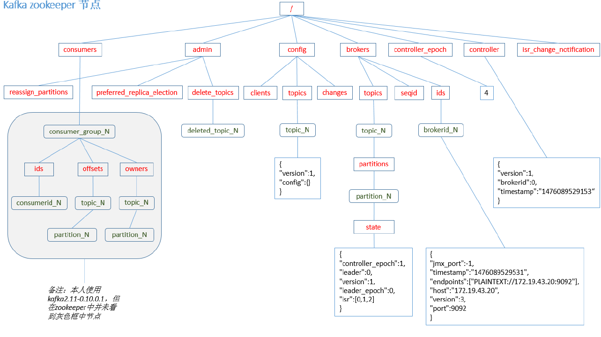

​		Kafka 0.9 版本之前，consumer 默认将 offset 保存在 Zookeeper 中，从 0.9 版本开始，consumer 默认将offset 保存在Kafka 一个内置的 topic 中，该topic 为**__consumer_offsets**。

 		**exclude.internal.topics=false**

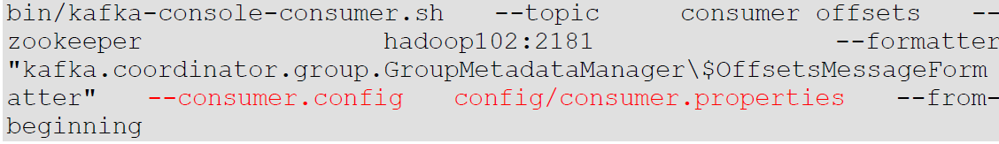

#### 3.3.4 消费者组

### 3.4 Kafka高效读写数据

1. 顺序写磁盘

	​		Kafka 的producer 生产数据，要写入到log 文件中，写的过程是一直追加到文件末端，为顺序写。 

2. 零复制技术

	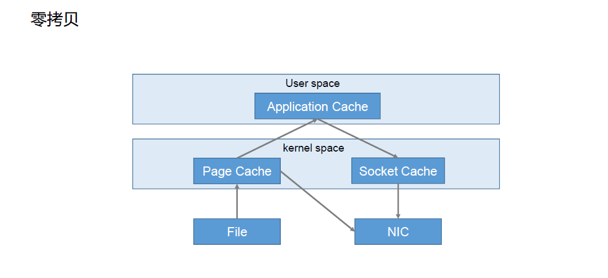

### 3.5 Zookeeper在Kafka中的作用

​		Kafka 集群中有一个 broker 会被选举为 Controller，负责管理集群 broker 的上下线，所有topic 的分区副本分配和leader 选举等工作。 

​		Controller 的管理工作都是依赖于 Zookeeper 的。 以下为partition 的 leader 选举过程： 

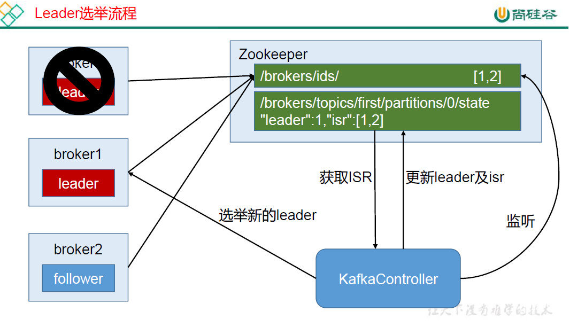

### 3.6 Kafka事务

​		Kafka 从0.11 版本开始引入了事务支持。事务可以保证 Kafka 在Exactly Once 语义的基础上，生产和消费可以跨分区和会话，要么全部成功，要么全部失败。

1.  Producer事务

	​		为了实现跨分区跨会话的事务，需要引入一个全局唯一的Transaction ID，并将Producer获得的PID 和Transaction ID 绑定。这样当Producer 重启后就可以通过正在进行的Transaction ID 获得原来的PID。 

	​		为了管理Transaction，Kafka 引入了一个新的组件Transaction Coordinator。Producer 就是通过和 Transaction Coordinator 交互获得 Transaction ID 对应的任务状态。Transaction Coordinator 还负责将事务所有写入 Kafka 的一个内部 Topic，这样即使整个服务重启，由于事务状态得到保存，进行中的事务状态可以得到恢复，从而继续进行。

2. Consumer事务

	​		上述事务机制主要是从Producer 方面考虑，对于 Consumer 而言，事务的保证就会相对较弱，尤其时无法保证 Commit 的信息被精确消费。这是由于 Consumer 可以通过 offset 访问任意信息，而且不同的Segment File 生命周期不同，同一事务的消息可能会出现重启后被删除的情况。

## 四、Kaf API

​		Kafka 的Producer 发送消息采用的是异步发送的方式。在消息发送的过程中，涉及到了两个线程——main 线程和 Sender 线程，以及一个线程共享变量——RecordAccumulator。 main 线程将消息发送给 RecordAccumulator，Sender 线程不断从 RecordAccumulator 中拉取消息发送到Kafka broker。 

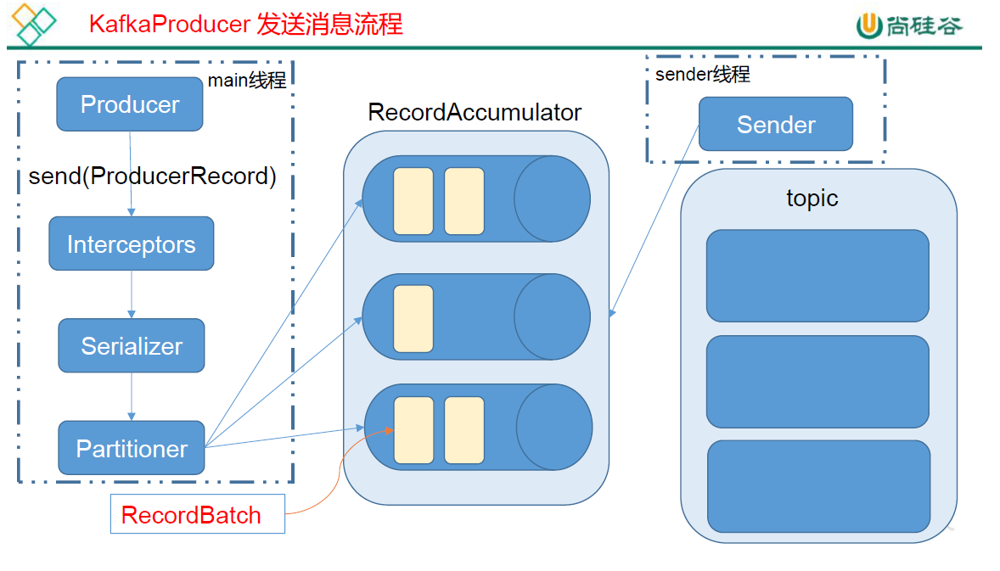