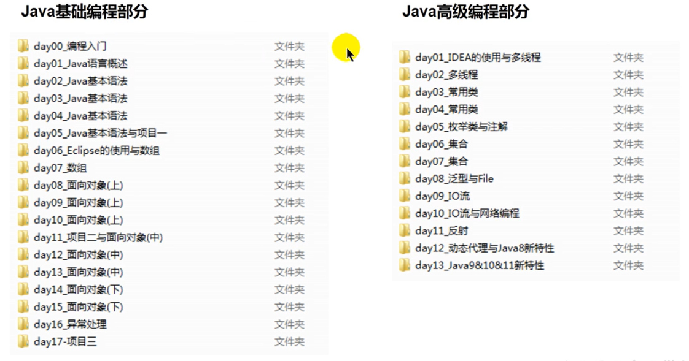
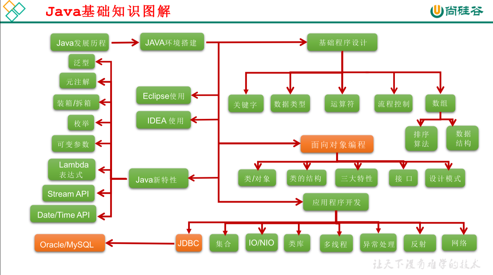
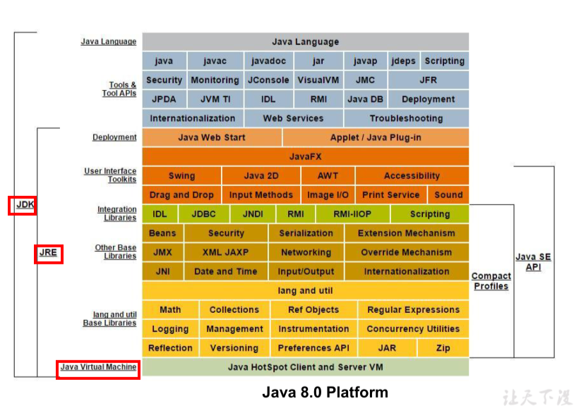
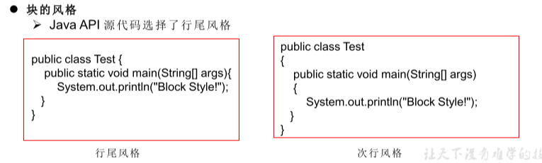
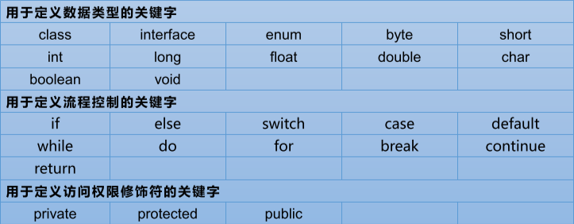
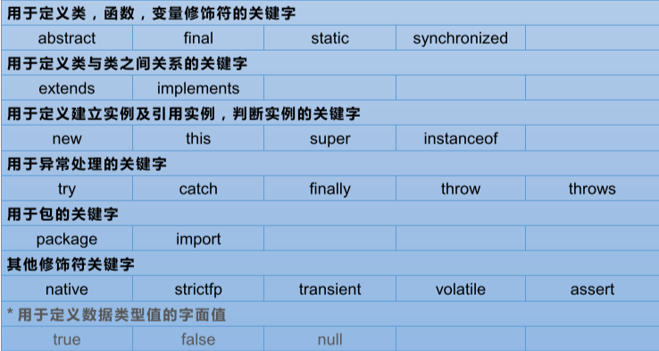
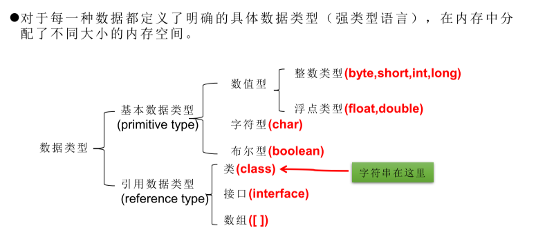

# 0. 课程结构

# 1. Java语言概述

## 1.1软件开发介绍

- 图形化界面(Graphical User Interface GUI)
  这种方式简单直观，使用 者易于接受，容易上手操作。
- 命令行方式(Command Line Interface CLI)
  需要有一个控制台，输 入特定的指令，让计算机完成一些操作。较为麻烦，需要记录住一些命令。

- 常用DOS命令
  - dir : 列出当前目录下的文件以及文件夹
  - md : 创建目录
  - rd : 删除目录
  - cd : 进入指定目录
  - cd.. : 退回到上一级目录
  - cd\: 退回到根目录
  - del : 删除文件
  - exit : 退出 dos 命令行

## 1.2 计算机编程语言介绍

1. 第一代语言
    机器语言。指令以二进制代码形式存在。
2. 第二代语言
    汇编语言。使用助记符表示一条机器指令
3. 第三代语言
   高级语言 C、Pascal、Fortran面向过程的语言
   C++面向过程/面向对象
   Java跨平台的纯面向对象的语言
   .NET跨语言的平台
   Python、Scala…

## 1.3 Java语言概述

## 1.4 运新机制及运行过程

- Java虚拟机（Java Virtual Machine）
  一次编译，到处运行
- 垃圾收集机制（Garbage Collection）
  自动进行

## 1.5 Java环境搭建

- 什么是JDK，JRE

  - JDK（Java Development Kit Java开发工具包）
    JDK是提供给Java开发人员使用的，其中包含了java的开发工具，也包括了 JRE。所以安装了JDK，就不用在单独安装JRE了。
    其中的开发工具：编译工具(javac.exe) 打包工具(jar.exe)等。
  - JRE（Java Runtime Environment Java运行环境）
    包括Java虚拟机(JVM Java Virtual Machine)和Java程序所需的核心类库等， 如果运行一个开发好的Java程序，计算机中只需要安装JRE即可。

  

## 1.6 开发体验

## 1.7 常见问题及解决方法

## 1.8 注释

- 单行注释

- 多行注释

- 文档注释

## 1.9 良好编程风格

## 1.10 常见开发工具

# 2. Java基本语法

## 1. 关键字和保留字

## 2. 标识符

## 3. 变量

## 4. 运算符

## 5. 程序流程控制

