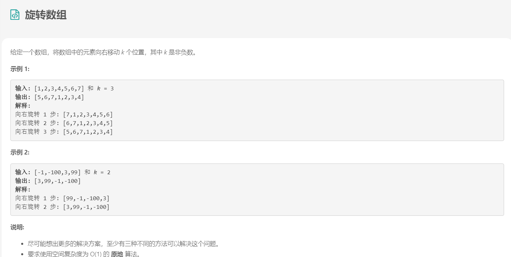
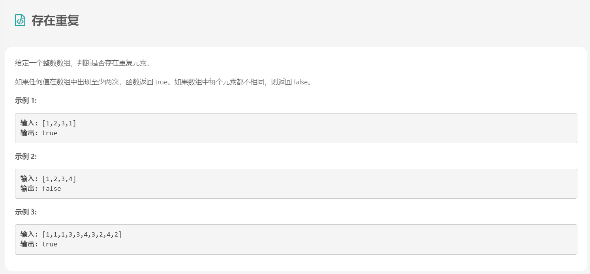
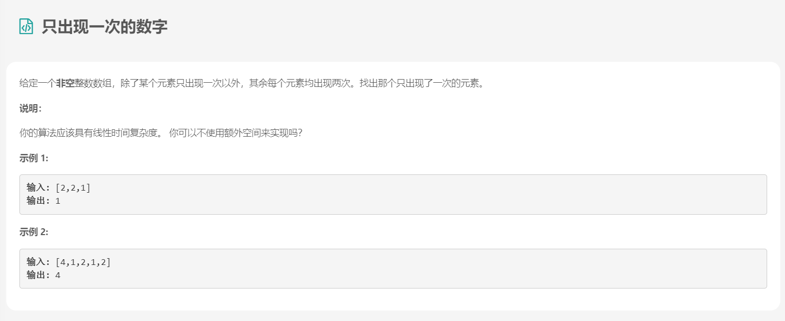
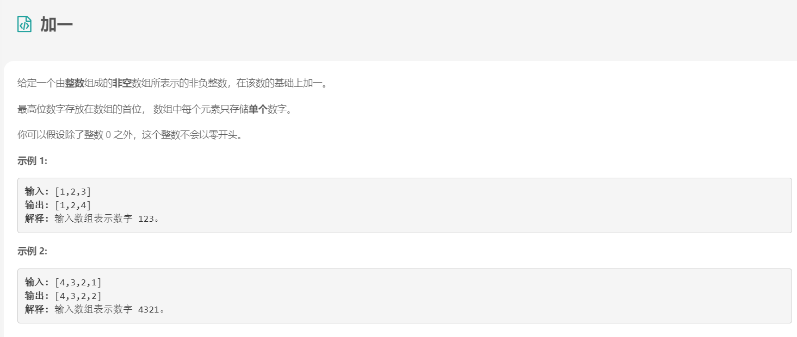
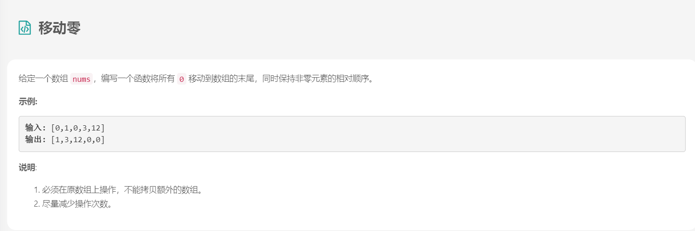
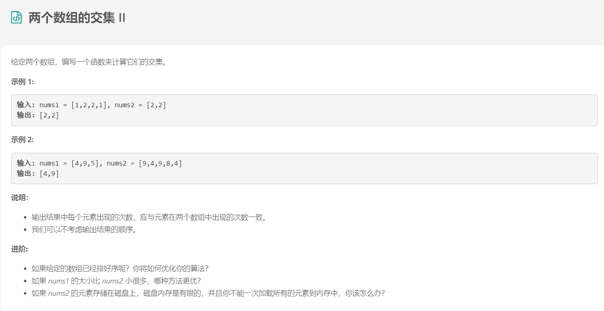
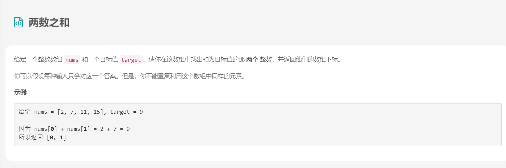
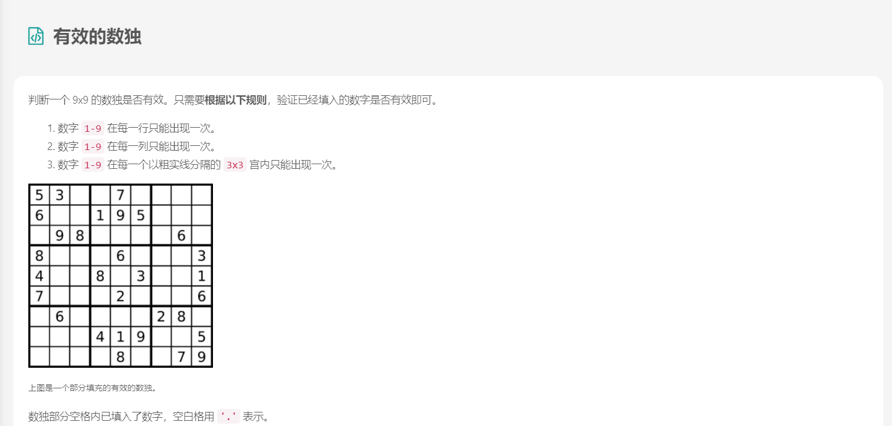
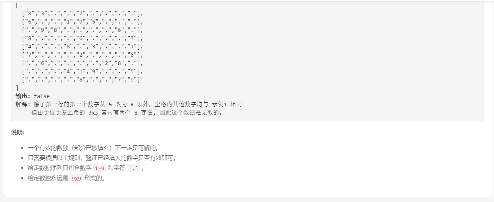
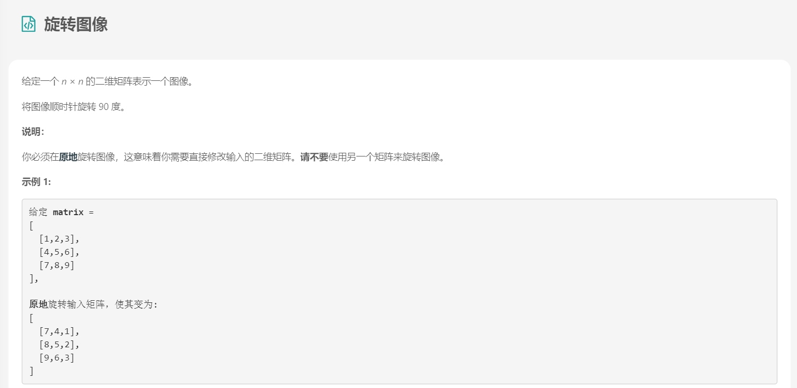

# 第1章 初级算法

## 1. 数组

### 1.1 删除数组中的重复项

+ 题目描述

	给定一个排序数组，你需要在 原地 删除重复出现的元素，使得每个元素只出现一次，返回移除后数组的新长度。

	不要使用额外的数组空间，你必须在 原地 修改输入数组 并在使用 O(1) 额外空间的条件下完成。


+ 解法

	```java
	class Solution {
	    public int removeDuplicates(int[] nums) {
	  if (nums.length == 0) return 0;
	    int i = 0;
	    for (int j = 1; j < nums.length; j++) {
	        if (nums[j] != nums[i]) {
	            i++;
	            nums[i] = nums[j];
	        }
	    }
	    return i + 1;
	    }
	}
	```

+ 复杂度分析
	- 时间复杂度：O(n)，假设数组的长度是 n，那么 i和 j分别最多遍历 n步。
	- 空间复杂度：O(1)。

### 1.2 旋转数组

+ 题目描述

	

+ 解法

	```java
	//暴力
	class Solution {
	    public void rotate(int[] nums, int k) {
	    int temp, previous;
	        for (int i = 0; i < k; i++) {
	            previous = nums[nums.length - 1];
	            for (int j = 0; j < nums.length; j++) {
	                temp = nums[j];
	                nums[j] = previous;
	                previous = temp;
	            }
	        }
	    }
	}
```
	
	+ 时间复杂度：O(n*k) 。每个元素都被移动 1 步（O(n)） k次（O(k)） 。
	+ 空间复杂度：O(1) 。没有额外空间被使用。
	
	```java
	//使用额外数组
	public class Solution {
	    public void rotate(int[] nums, int k) {
	        int[] a = new int[nums.length];
	        for (int i = 0; i < nums.length; i++) {
	            a[(i + k) % nums.length] = nums[i];
	        }
	        for (int i = 0; i < nums.length; i++) {
	            nums[i] = a[i];
	        }
	    }
	}
	```
	
	+ 时间复杂度： O(n)。将数字放到新的数组中需要一遍遍历，另一边来把新数组的元素拷贝回原数组。
	+ 空间复杂度： O(n)。另一个数组需要原数组长度的空间。
	
	```java
	//反转
	public class Solution {
	    public void rotate(int[] nums, int k) {
	        k %= nums.length;
	        reverse(nums, 0, nums.length - 1);
	        reverse(nums, 0, k - 1);
	        reverse(nums, k, nums.length - 1);
	    }
	    public void reverse(int[] nums, int start, int end) {
	        while (start < end) {
	            int temp = nums[start];
	            nums[start] = nums[end];
	            nums[end] = temp;
	            start++;
	            end--;
	        }
	    }
	}
	
	```
	
	- 时间复杂度：O(n)。 n 个元素被反转了总共 3 次。
	- 空间复杂度：O(1)。 没有使用额外的空间。
	
	```java
	//换装替换
	public class Solution {
	    public void rotate(int[] nums, int k) {
	        k = k % nums.length;
	        int count = 0;
	        for (int start = 0; count < nums.length; start++) {
	            int current = start;
	            int prev = nums[start];
	            do {
	                int next = (current + k) % nums.length;
	                int temp = nums[next];
	                nums[next] = prev;
	                prev = temp;
	                current = next;
	                count++;
	            } while (start != current);
	        }
	    }
	}
	```
	
	- 时间复杂度：O(n) 。只遍历了每个元素一次。
	- 空间复杂度：O(1) 。使用了常数个额外空间。

### 1.3 存在重复

+ 题目描述

	

+ 解法

	```java
	//超时
	class Solution {
	   public boolean containsDuplicate(int[] nums) {
	    for (int i = 1; i < nums.length; ++i) {
	        for (int j = 0; j < i; ++j) {
	            if (nums[j] == nums[i]) return true;  
	        }
	    }
	    return false;
	}
	}
	```

	+ 时间复杂度 : O(n^2)。最坏的情况下，需要检查 n(n+1)/2 对整数。因此，时间复杂度为 O(n^2)。

	+ 空间复杂度 : O(1)*O*(1)。只使用了常数额外空间。

	```java
	//排序
	class Solution {
	public boolean containsDuplicate(int[] nums) {
	    Arrays.sort(nums);
	    for (int i = 0; i < nums.length - 1; ++i) {
	        if (nums[i] == nums[i + 1]) return true;
	    }
	    return false;
	}
	}
	```

	+ 时间复杂度 : O(nlogn)。
		排序的复杂度是 O(nlogn)，扫描的复杂度是 O(n)。整个算法主要由排序过程决定，因此是 O(nlogn)。
	+ 空间复杂度 : O(1)。
		这取决于具体的排序算法实现，通常而言，使用 堆排序 的话，是 O(1)。

	```java
	//哈希表
	class Solution {
	public boolean containsDuplicate(int[] nums) {
	    Set<Integer> set = new HashSet<>(nums.length);
	    for (int x: nums) {
	        if (set.contains(x)) return true;
	        set.add(x);
	    }
	    return false;
	}
	}
	```

	+ 时间复杂度 : O(n)O。
		search() 和 insert() 各自使用 nn 次，每个操作耗费常数时间。

	+ 空间复杂度 : O(n)。

		哈希表占用的空间与元素数量是线性关系。

### 1.4 只出现一次的数字

+ 题目描述

	

+ 解法

	```java
	//列表遍历
	class Solution {
	    public int singleNumber(int[] nums) {
	        List<Integer> list = new LinkedList<>();
	        for (int num : nums) {
	            if (!list.contains(num)) {
	                list.add(num);
	            } else {
	                list.remove((Object)num);
	            }
	        }
	        return list.get(0);
	    }
	}
	```

	+ 时间复杂度：O(n^2)。我们遍历 nums 花费 O(n) 的时间。我们还要在列表中遍历判断是否存在这个数字，花费 O(n)的时间，所以总循环时间为 O(n^2)。
	+ 空间复杂度：O(n) 。我们需要一个大小为 n 的列表保存所有的nums 中元素。

	```java
	//哈希表
	class Solution {
	    public int singleNumber(int[] nums) {
	        Map<Integer, Object> map = new HashMap<>();
	        for (int num : nums) {
	            if (!map.containsKey(num)) {
	                map.put(num, null);
	            } else {
	                map.remove(num);
	            }
	        }
	        return map.keySet().iterator().next();
	    }  
	}
	```

	+ 时间复杂度：O(n) 。for 循环的时间复杂度是 O(n) 的。
	+ 空间复杂度： O(n) 。hash\_tablehash_table 需要的空间与 nums 中元素个数相等。

	```java
	//数学
	class Solution {
	    public int singleNumber(int[] nums) {
	        Integer[] numArray = Arrays.stream(nums).boxed().toArray(Integer[]::new);
	        int sum = 0;
	        for (int i = 0; i < numArray.length; i++) {
	            sum += numArray[i];
	        }
	        Set<Integer> set = new HashSet<>(Arrays.asList(numArray));
	        int setSum = set.stream().mapToInt(Integer::intValue).sum();
	        return 2 * setSum - sum;
	    }
	}
	```

	```java
	//异或运算
	class Solution {
	    public int singleNumber(int[] nums) {
	        int result = 0;
	        for (int num : nums) {
	            result = result ^ num;
	        }
	        return result;
	    }
	}
	```

### 1.5 加一

+ 题目描述

	

+ 解法

```java
class Solution {
    public int[] plusOne(int[] digits) {
        for (int i = digits.length - 1; i >= 0; i--) {
            digits[i]++;
            digits[i] = digits[i] % 10;
            if (digits[i] != 0) return digits;
        }
        digits = new int[digits.length + 1];
        digits[0] = 1;
        return digits;
    }
}
```

### 1.6 移动零

+ 题目描述

	

+ 解法

	```java
	class Solution {
	    public void moveZeroes(int[] nums) {
	        int length = nums.length;
	        int currentIndex = 0;
	        for (int i=0; i<length; i++) {
	            if (nums[i] != 0) {
	                nums[currentIndex] = nums[i];
	                if (currentIndex != i) {
	                    nums[i] = 0;
	                }
	                currentIndex++;
	            }
	        }
	    }
	}
	```

### 1.7 两个数组的交集II

+ 题目描述

	

+ 解法

```java
class Solution {
  public int[] intersect(int[] nums1, int[] nums2) {
    if (nums1.length > nums2.length) {
        return intersect(nums2, nums1);
    }
    HashMap<Integer, Integer> m = new HashMap<>();
    for (int n : nums1) {
        m.put(n, m.getOrDefault(n, 0) + 1);
    }
    int k = 0;
    for (int n : nums2) {
        int cnt = m.getOrDefault(n, 0);
        if (cnt > 0) {
            nums1[k++] = n;
            m.put(n, cnt - 1);
        }
    }
    return Arrays.copyOfRange(nums1, 0, k);
}
}
```

### 1.8  两数之和

+ 题目描述

	

+ 解法

	```java
	//暴力法
	class Solution {
	    public int[] twoSum(int[] nums, int target) {
	        for (int i = 0; i < nums.length; i++) {
	            for (int j = i + 1; j < nums.length; j++) {
	                if (nums[j] == target - nums[i]) {
	                    return new int[] { i, j };
	                }
	            }
	        }
	        throw new IllegalArgumentException("No two sum solution");
	    }
	}
	```

	```java
	//两遍哈希表
	class Solution {
	    public int[] twoSum(int[] nums, int target) {
	        Map<Integer, Integer> map = new HashMap<>();
	        for (int i = 0; i < nums.length; i++) {
	            map.put(nums[i], i);
	        }
	        for (int i = 0; i < nums.length; i++) {
	            int complement = target - nums[i];
	            if (map.containsKey(complement) && map.get(complement) != i) {
	                return new int[] { i, map.get(complement) };
	            }
	        }
	        throw new IllegalArgumentException("No two sum solution");
	    }
	}
	```

	```java
	//一遍哈希表
	class Solution {
	    public int[] twoSum(int[] nums, int target) {
	        Map<Integer, Integer> map = new HashMap<>();
	        for (int i = 0; i < nums.length; i++) {
	            int complement = target - nums[i];
	            if (map.containsKey(complement)) {
	                return new int[] { map.get(complement), i };
	            }
	            map.put(nums[i], i);
	        }
	        throw new IllegalArgumentException("No two sum solution");
	    }
	}
	```

### 1.9 有效的数独

+ 问题描述

	

	

+ 解法

	```java
	class Solution {
	  public boolean isValidSudoku(char[][] board) {
	    // init data
	    HashMap<Integer, Integer> [] rows = new HashMap[9];
	    HashMap<Integer, Integer> [] columns = new HashMap[9];
	    HashMap<Integer, Integer> [] boxes = new HashMap[9];
	    for (int i = 0; i < 9; i++) {
	      rows[i] = new HashMap<Integer, Integer>();
	      columns[i] = new HashMap<Integer, Integer>();
	      boxes[i] = new HashMap<Integer, Integer>();
	    }
	
	    // validate a board
	    for (int i = 0; i < 9; i++) {
	      for (int j = 0; j < 9; j++) {
	        char num = board[i][j];
	        if (num != '.') {
	          int n = (int)num;
	          int box_index = (i / 3 ) * 3 + j / 3;
	
	          // keep the current cell value
	          rows[i].put(n, rows[i].getOrDefault(n, 0) + 1);
	          columns[j].put(n, columns[j].getOrDefault(n, 0) + 1);
	          boxes[box_index].put(n, boxes[box_index].getOrDefault(n, 0) + 1);
	
	          // check if this value has been already seen before
	          if (rows[i].get(n) > 1 || columns[j].get(n) > 1 || boxes[box_index].get(n) > 1)
	            return false;
	        }
	      }
	    }
	
	    return true;
	  }
	}
	```

### 1.10 旋转图像

+ 题目描述

	

+ 解法

	```java
	//转置加翻转
	class Solution {
	  public void rotate(int[][] matrix) {
	    int n = matrix.length;
	
	    // transpose matrix
	    for (int i = 0; i < n; i++) {
	      for (int j = i; j < n; j++) {
	        int tmp = matrix[j][i];
	        matrix[j][i] = matrix[i][j];
	        matrix[i][j] = tmp;
	      }
	    }
	    // reverse each row
	    for (int i = 0; i < n; i++) {
	      for (int j = 0; j < n / 2; j++) {
	        int tmp = matrix[i][j];
	        matrix[i][j] = matrix[i][n - j - 1];
	        matrix[i][n - j - 1] = tmp;
	      }
	    }
	  }
	}
	```

## 2. 字符串


## 3. 链表