# 第1章 初级算法

## 1. 数组

### 1.1 删除数组中的重复项

+ 题目描述

	给定一个排序数组，你需要在 原地 删除重复出现的元素，使得每个元素只出现一次，返回移除后数组的新长度。

	不要使用额外的数组空间，你必须在 原地 修改输入数组 并在使用 O(1) 额外空间的条件下完成。


+ 解法

	```java
	class Solution {
	    public int removeDuplicates(int[] nums) {
	  if (nums.length == 0) return 0;
	    int i = 0;
	    for (int j = 1; j < nums.length; j++) {
	        if (nums[j] != nums[i]) {
	            i++;
	            nums[i] = nums[j];
	        }
	    }
	    return i + 1;
	    }
	}
	```

+ 复杂度分析
	- 时间复杂度：O(n)，假设数组的长度是 n，那么 i和 j分别最多遍历 n步。
	- 空间复杂度：O(1)。

### 1.2 旋转数组

+ 题目描述

	

+ 解法

	```java
	//暴力
	class Solution {
	    public void rotate(int[] nums, int k) {
	    int temp, previous;
	        for (int i = 0; i < k; i++) {
	            previous = nums[nums.length - 1];
	            for (int j = 0; j < nums.length; j++) {
	                temp = nums[j];
	                nums[j] = previous;
	                previous = temp;
	            }
	        }
	    }
	}
	```
```
	
	+ 时间复杂度：O(n*k) 。每个元素都被移动 1 步（O(n)） k次（O(k)） 。
	+ 空间复杂度：O(1) 。没有额外空间被使用。
	
	```java
	//使用额外数组
	public class Solution {
	    public void rotate(int[] nums, int k) {
	        int[] a = new int[nums.length];
	        for (int i = 0; i < nums.length; i++) {
	            a[(i + k) % nums.length] = nums[i];
	        }
	        for (int i = 0; i < nums.length; i++) {
	            nums[i] = a[i];
	        }
	    }
	}
```

	+ 时间复杂度： O(n)。将数字放到新的数组中需要一遍遍历，另一边来把新数组的元素拷贝回原数组。
	+ 空间复杂度： O(n)。另一个数组需要原数组长度的空间。
	
	```java
	//反转
	public class Solution {
	    public void rotate(int[] nums, int k) {
	        k %= nums.length;
	        reverse(nums, 0, nums.length - 1);
	        reverse(nums, 0, k - 1);
	        reverse(nums, k, nums.length - 1);
	    }
	    public void reverse(int[] nums, int start, int end) {
	        while (start < end) {
	            int temp = nums[start];
	            nums[start] = nums[end];
	            nums[end] = temp;
	            start++;
	            end--;
	        }
	    }
	}
	
	```
	
	- 时间复杂度：O(n)。 n 个元素被反转了总共 3 次。
	- 空间复杂度：O(1)。 没有使用额外的空间。
	
	```java
	//换装替换
	public class Solution {
	    public void rotate(int[] nums, int k) {
	        k = k % nums.length;
	        int count = 0;
	        for (int start = 0; count < nums.length; start++) {
	            int current = start;
	            int prev = nums[start];
	            do {
	                int next = (current + k) % nums.length;
	                int temp = nums[next];
	                nums[next] = prev;
	                prev = temp;
	                current = next;
	                count++;
	            } while (start != current);
	        }
	    }
	}
	```
	
	- 时间复杂度：O(n) 。只遍历了每个元素一次。
	- 空间复杂度：O(1) 。使用了常数个额外空间。

### 1.3 存在重复

+ 题目描述

	

+ 解法

	```java
	//超时
	class Solution {
	   public boolean containsDuplicate(int[] nums) {
	    for (int i = 1; i < nums.length; ++i) {
	        for (int j = 0; j < i; ++j) {
	            if (nums[j] == nums[i]) return true;  
	        }
	    }
	    return false;
	}
	}
	```

	+ 时间复杂度 : O(n^2)。最坏的情况下，需要检查 n(n+1)/2 对整数。因此，时间复杂度为 O(n^2)。

	+ 空间复杂度 : O(1)*O*(1)。只使用了常数额外空间。

	```java
	//排序
	class Solution {
	public boolean containsDuplicate(int[] nums) {
	    Arrays.sort(nums);
	    for (int i = 0; i < nums.length - 1; ++i) {
	        if (nums[i] == nums[i + 1]) return true;
	    }
	    return false;
	}
	}
	```

	+ 时间复杂度 : O(nlogn)。
		排序的复杂度是 O(nlogn)，扫描的复杂度是 O(n)。整个算法主要由排序过程决定，因此是 O(nlogn)。
	+ 空间复杂度 : O(1)。
		这取决于具体的排序算法实现，通常而言，使用 堆排序 的话，是 O(1)。

	```java
	//哈希表
	class Solution {
	public boolean containsDuplicate(int[] nums) {
	    Set<Integer> set = new HashSet<>(nums.length);
	    for (int x: nums) {
	        if (set.contains(x)) return true;
	        set.add(x);
	    }
	    return false;
	}
	}
	```

	+ 时间复杂度 : O(n)O。
		search() 和 insert() 各自使用 nn 次，每个操作耗费常数时间。

	+ 空间复杂度 : O(n)。

		哈希表占用的空间与元素数量是线性关系。

### 1.4 只出现一次的数字

+ 题目描述

	

+ 解法

	```java
	//列表遍历
	class Solution {
	    public int singleNumber(int[] nums) {
	        List<Integer> list = new LinkedList<>();
	        for (int num : nums) {
	            if (!list.contains(num)) {
	                list.add(num);
	            } else {
	                list.remove((Object)num);
	            }
	        }
	        return list.get(0);
	    }
	}
	```

	+ 时间复杂度：O(n^2)。我们遍历 nums 花费 O(n) 的时间。我们还要在列表中遍历判断是否存在这个数字，花费 O(n)的时间，所以总循环时间为 O(n^2)。
	+ 空间复杂度：O(n) 。我们需要一个大小为 n 的列表保存所有的nums 中元素。

	```java
	//哈希表
	class Solution {
	    public int singleNumber(int[] nums) {
	        Map<Integer, Object> map = new HashMap<>();
	        for (int num : nums) {
	            if (!map.containsKey(num)) {
	                map.put(num, null);
	            } else {
	                map.remove(num);
	            }
	        }
	        return map.keySet().iterator().next();
	    }  
	}
	```

	+ 时间复杂度：O(n) 。for 循环的时间复杂度是 O(n) 的。
	+ 空间复杂度： O(n) 。hash\_tablehash_table 需要的空间与 nums 中元素个数相等。

	```java
	//数学
	class Solution {
	    public int singleNumber(int[] nums) {
	        Integer[] numArray = Arrays.stream(nums).boxed().toArray(Integer[]::new);
	        int sum = 0;
	        for (int i = 0; i < numArray.length; i++) {
	            sum += numArray[i];
	        }
	        Set<Integer> set = new HashSet<>(Arrays.asList(numArray));
	        int setSum = set.stream().mapToInt(Integer::intValue).sum();
	        return 2 * setSum - sum;
	    }
	}
	```

	```java
	//异或运算
	class Solution {
	    public int singleNumber(int[] nums) {
	        int result = 0;
	        for (int num : nums) {
	            result = result ^ num;
	        }
	        return result;
	    }
	}
	```

### 1.5 加一

+ 题目描述

	

+ 解法

```java
class Solution {
    public int[] plusOne(int[] digits) {
        for (int i = digits.length - 1; i >= 0; i--) {
            digits[i]++;
            digits[i] = digits[i] % 10;
            if (digits[i] != 0) return digits;
        }
        digits = new int[digits.length + 1];
        digits[0] = 1;
        return digits;
    }
}
```

### 1.6 移动零

+ 题目描述

	

+ 解法

	```java
	class Solution {
	    public void moveZeroes(int[] nums) {
	        int length = nums.length;
	        int currentIndex = 0;
	        for (int i=0; i<length; i++) {
	            if (nums[i] != 0) {
	                nums[currentIndex] = nums[i];
	                if (currentIndex != i) {
	                    nums[i] = 0;
	                }
	                currentIndex++;
	            }
	        }
	    }
	}
	```

### 1.7 两个数组的交集②

+ 题目描述

	

+ 解法

```java
class Solution {
  public int[] intersect(int[] nums1, int[] nums2) {
    if (nums1.length > nums2.length) {
        return intersect(nums2, nums1);
    }
    HashMap<Integer, Integer> m = new HashMap<>();
    for (int n : nums1) {
        m.put(n, m.getOrDefault(n, 0) + 1);
    }
    int k = 0;
    for (int n : nums2) {
        int cnt = m.getOrDefault(n, 0);
        if (cnt > 0) {
            nums1[k++] = n;
            m.put(n, cnt - 1);
        }
    }
    return Arrays.copyOfRange(nums1, 0, k);
}
}
```

### 1.8  两数之和

+ 题目描述

	

+ 解法

	```java
	//暴力法
	class Solution {
	    public int[] twoSum(int[] nums, int target) {
	        for (int i = 0; i < nums.length; i++) {
	            for (int j = i + 1; j < nums.length; j++) {
	                if (nums[j] == target - nums[i]) {
	                    return new int[] { i, j };
	                }
	            }
	        }
	        throw new IllegalArgumentException("No two sum solution");
	    }
	}
	```

	```java
	//两遍哈希表
	class Solution {
	    public int[] twoSum(int[] nums, int target) {
	        Map<Integer, Integer> map = new HashMap<>();
	        for (int i = 0; i < nums.length; i++) {
	            map.put(nums[i], i);
	        }
	        for (int i = 0; i < nums.length; i++) {
	            int complement = target - nums[i];
	            if (map.containsKey(complement) && map.get(complement) != i) {
	                return new int[] { i, map.get(complement) };
	            }
	        }
	        throw new IllegalArgumentException("No two sum solution");
	    }
	}
	```

	```java
	//一遍哈希表
	class Solution {
	    public int[] twoSum(int[] nums, int target) {
	        Map<Integer, Integer> map = new HashMap<>();
	        for (int i = 0; i < nums.length; i++) {
	            int complement = target - nums[i];
	            if (map.containsKey(complement)) {
	                return new int[] { map.get(complement), i };
	            }
	            map.put(nums[i], i);
	        }
	        throw new IllegalArgumentException("No two sum solution");
	    }
	}
	```

### 1.9 有效的数独

+ 问题描述

	

	

+ 解法

	```java
	class Solution {
	  public boolean isValidSudoku(char[][] board) {
	    // init data
	    HashMap<Integer, Integer> [] rows = new HashMap[9];
	    HashMap<Integer, Integer> [] columns = new HashMap[9];
	    HashMap<Integer, Integer> [] boxes = new HashMap[9];
	    for (int i = 0; i < 9; i++) {
	      rows[i] = new HashMap<Integer, Integer>();
	      columns[i] = new HashMap<Integer, Integer>();
	      boxes[i] = new HashMap<Integer, Integer>();
	    }
	
	    // validate a board
	    for (int i = 0; i < 9; i++) {
	      for (int j = 0; j < 9; j++) {
	        char num = board[i][j];
	        if (num != '.') {
	          int n = (int)num;
	          int box_index = (i / 3 ) * 3 + j / 3;
	
	          // keep the current cell value
	          rows[i].put(n, rows[i].getOrDefault(n, 0) + 1);
	          columns[j].put(n, columns[j].getOrDefault(n, 0) + 1);
	          boxes[box_index].put(n, boxes[box_index].getOrDefault(n, 0) + 1);
	
	          // check if this value has been already seen before
	          if (rows[i].get(n) > 1 || columns[j].get(n) > 1 || boxes[box_index].get(n) > 1)
	            return false;
	        }
	      }
	    }
	
	    return true;
	  }
	}
	```

### 1.10 旋转图像

+ 题目描述

	

+ 解法

	```java
	//转置加翻转
	class Solution {
	  public void rotate(int[][] matrix) {
	    int n = matrix.length;
	
	    // transpose matrix
	    for (int i = 0; i < n; i++) {
	      for (int j = i; j < n; j++) {
	        int tmp = matrix[j][i];
	        matrix[j][i] = matrix[i][j];
	        matrix[i][j] = tmp;
	      }
	    }
	    // reverse each row
	    for (int i = 0; i < n; i++) {
	      for (int j = 0; j < n / 2; j++) {
	        int tmp = matrix[i][j];
	        matrix[i][j] = matrix[i][n - j - 1];
	        matrix[i][n - j - 1] = tmp;
	      }
	    }
	  }
	}
	```

### 1.11 买卖股票的最佳时机②

- 题目描述

	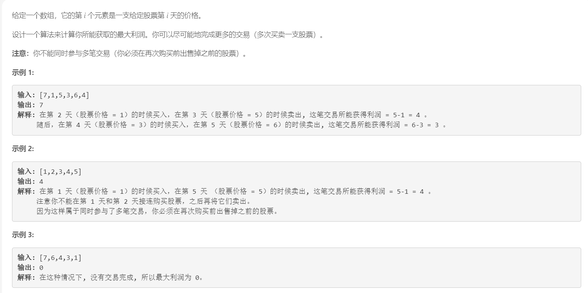

- 解法

	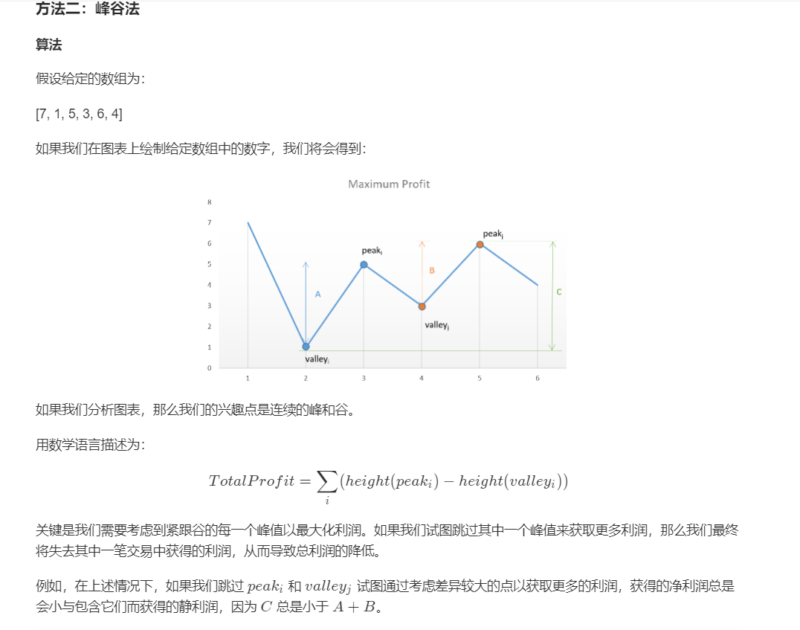

	```java
	class Solution {
	    public int maxProfit(int[] prices) {
	        int i = 0;
	        int valley = prices[0];
	        int peak = prices[0];
	        int maxprofit = 0;
	        while (i < prices.length - 1) {
	            while (i < prices.length - 1 && prices[i] >= prices[i + 1])
	                i++;
	            valley = prices[i];
	            while (i < prices.length - 1 && prices[i] <= prices[i + 1])
	                i++;
	            peak = prices[i];
	            maxprofit += peak - valley;
	        }
	        return maxprofit;
	    }
	}
	
	```

	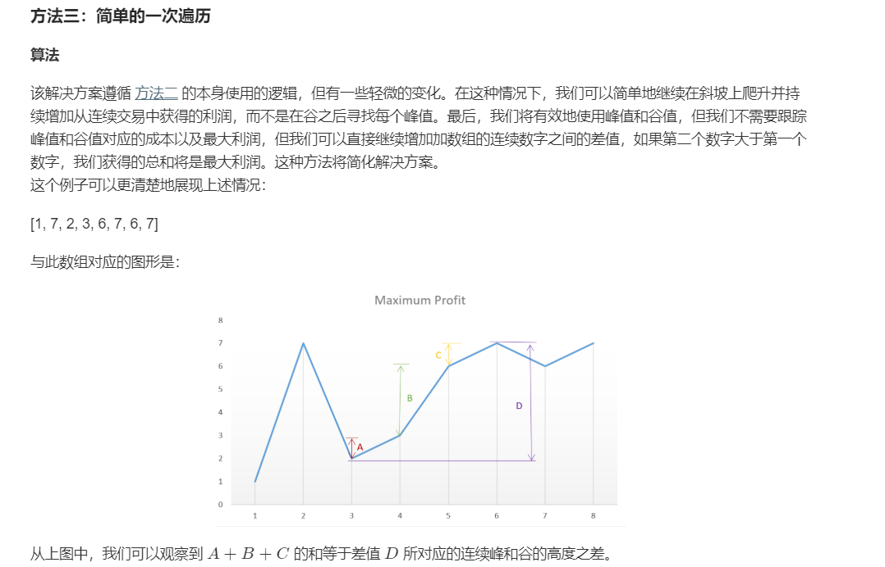

	```java
	class Solution {
	    public int maxProfit(int[] prices) {
	        int maxprofit = 0;
	        for (int i = 1; i < prices.length; i++) {
	            if (prices[i] > prices[i - 1])
	                maxprofit += prices[i] - prices[i - 1];
	        }
	        return maxprofit;
	    }
	}
	
	```


## 2. 字符串

### 2.1 反转字符串

+ 题目描述

	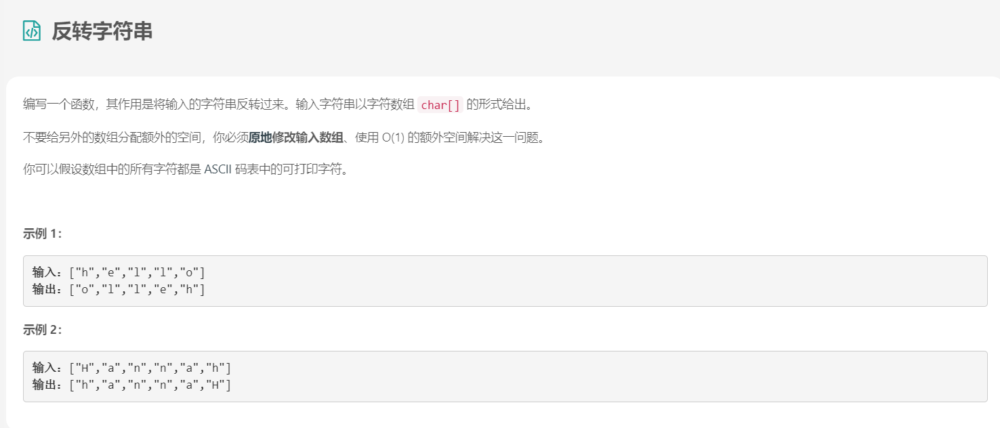

+ 解法

	```java
	//双指针
	class Solution {
	    public void reverseString(char[] s) {
	        int left = 0, right = s.length - 1;
	        while (left < right) {
	            char tmp = s[left];
	            s[left++] = s[right];
	            s[right--] = tmp;
	        }
	    }
	}
	```

	```java
	//递归
	class Solution {
	  public void helper(char[] s, int left, int right) {
	    if (left >= right) return;
	    char tmp = s[left];
	    s[left++] = s[right];
	    s[right--] = tmp;
	    helper(s, left, right);
	  }
	
	  public void reverseString(char[] s) {
	    helper(s, 0, s.length - 1);
	  }
	}
	```

### 2.2 整数反转

+ 题目描述

	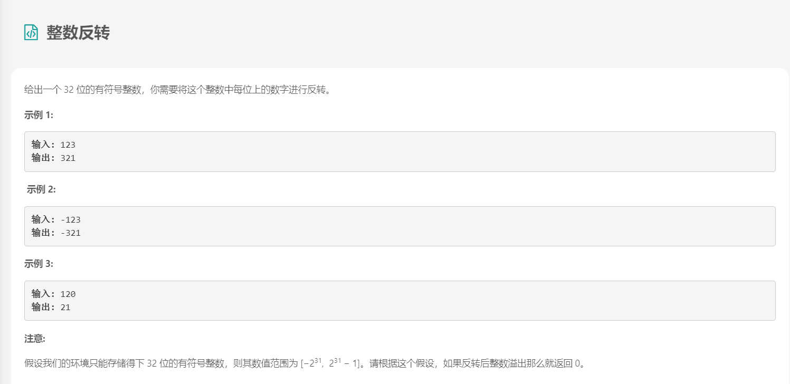

+ 解法

	```java
	class Solution {
	    public int reverse(int x) {
	        int rev = 0;
	        while (x != 0) {
	            int pop = x % 10;
	            x /= 10;
	            if (rev > Integer.MAX_VALUE/10 || (rev == Integer.MAX_VALUE / 10 && pop > 7)) return 0;
	            if (rev < Integer.MIN_VALUE/10 || (rev == Integer.MIN_VALUE / 10 && pop < -8)) return 0;
	            rev = rev * 10 + pop;
	        }
	        return rev;
	    }
	}
	```

### 2.3 字符串中的第一个惟一的字符

+ 题目描述

	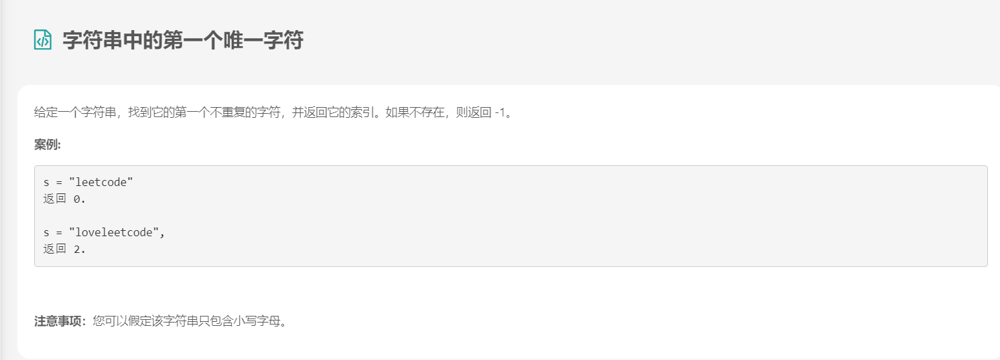

+ 解法

	```java
	class Solution {
	    public int firstUniqChar(String s) {
	        HashMap<Character, Integer> count = new HashMap<Character, Integer>();
	        int n = s.length();
	        // build hash map : character and how often it appears
	        for (int i = 0; i < n; i++) {
	            char c = s.charAt(i);
	            count.put(c, count.getOrDefault(c, 0) + 1);
	        }
	        
	        // find the index
	        for (int i = 0; i < n; i++) {
	            if (count.get(s.charAt(i)) == 1) 
	                return i;
	        }
	        return -1;
	    }
	}
	```

### 2.4 有效的字母异位词

+ 题目描述

	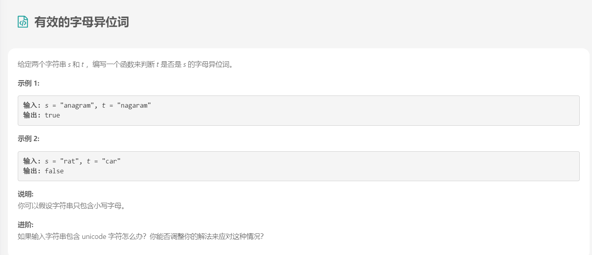

+ 解法

	```java
	//排序
	public boolean isAnagram(String s, String t) {
	    if (s.length() != t.length()) {
	        return false;
	    }
	    char[] str1 = s.toCharArray();
	    char[] str2 = t.toCharArray();
	    Arrays.sort(str1);
	    Arrays.sort(str2);
	    return Arrays.equals(str1, str2);
	}
	```

	```java
	class Solution {
	public boolean isAnagram(String s, String t) {
	    if (s.length() != t.length()) {
	        return false;
	    }
	    int[] counter = new int[26];
	    for (int i = 0; i < s.length(); i++) {
	        counter[s.charAt(i) - 'a']++;
	        counter[t.charAt(i) - 'a']--;
	    }
	    for (int count : counter) {
	        if (count != 0) {
	            return false;
	        }
	    }
	    return true;
	}
	}
	```

	```java
	class Solution {
	public boolean isAnagram(String s, String t) {
	    if (s.length() != t.length()) {
	        return false;
	    }
	    int[] table = new int[26];
	    for (int i = 0; i < s.length(); i++) {
	        table[s.charAt(i) - 'a']++;
	    }
	    for (int i = 0; i < t.length(); i++) {
	        table[t.charAt(i) - 'a']--;
	        if (table[t.charAt(i) - 'a'] < 0) {
	            return false;
	        }
	    }
	    return true;
	}
	}
	```

### 2.5 验证回文字符串

+ 题目描述

	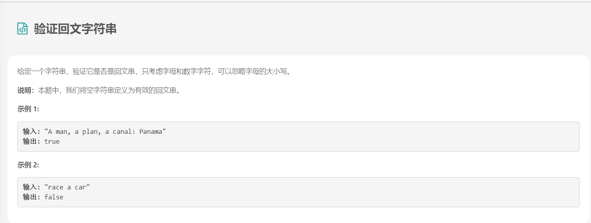

+ 解法

	```java
	class Solution {
	    public boolean isPalindrome(String s) {
        s = s.toLowerCase();
	        char[] chars = s.toCharArray();
	        int left = 0, right = chars.length - 1;
	        while (right > left) {
	            if ((chars[left] >= '0' && chars[left] <= '9') || (chars[left] >= 'a' && chars[left] <= 'z')) {
	                if ((chars[right] >= '0' && chars[right] <= '9') || (chars[right] >= 'a' && chars[right] <= 'z')) {
	                    if (chars[left] != chars[right]) {
	                        return false;
	                    } else {
	                        left++;
	                        right--;
	                    }
	                } else {
	                    right--;
	                }
	            } else {
	                left++;
	            }
	        }
	        return true;
	    }
	}
	```

### 2.6 字符串转换整数（atoi）

- 题目描述

	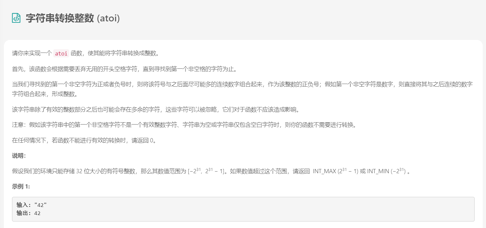

	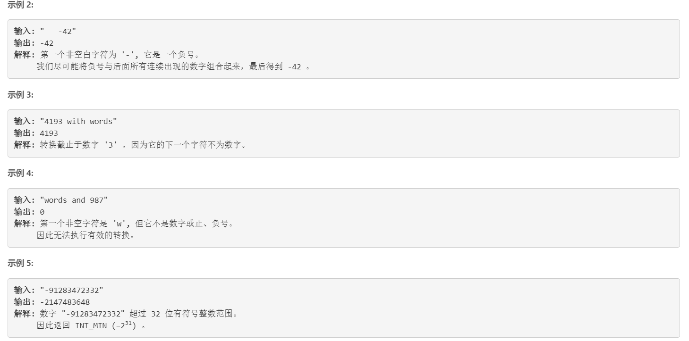

- 解法

	```java
	class Solution {
	
	    public int myAtoi(String str) {
	        int len = str.length();
	
	        // 去除前导空格
	        int index = 0;
	        while (index < len) {
	            if (str.charAt(index) != ' ') {
	                break;
	            }
	            index++;
	        }
	
	        if (index == len) {
	            return 0;
	        }
	
	        // 第 1 个字符如果是符号，判断合法性，并记录正负
	        int sign = 1;
	        char firstChar = str.charAt(index);
	        if (firstChar == '+') {
	            index++;
	            sign = 1;
	        } else if (firstChar == '-') {
	            index++;
	            sign = -1;
	        }
	
	        // 不能使用 long 类型，这是题目说的
	        int res = 0;
	        while (index < len) {
	            char currChar = str.charAt(index);
	            // 判断合法性
	            if (currChar > '9' || currChar < '0') {
	                break;
	            }
	
	            // 题目中说：环境只能存储 32 位大小的有符号整数，因此，需要提前判断乘以 10 以后是否越界
	            if (res > Integer.MAX_VALUE / 10 || (res == Integer.MAX_VALUE / 10 && (currChar - '0') > Integer.MAX_VALUE % 10)) {
	                return Integer.MAX_VALUE;
	            }
	            if (res < Integer.MIN_VALUE / 10 || (res == Integer.MIN_VALUE / 10 && (currChar - '0') > -(Integer.MIN_VALUE % 10))) {
	                return Integer.MIN_VALUE;
	            }
	
	            // 每一步都把符号位乘进去
	            res = res * 10 + sign * (currChar - '0');
	            index++;
	        }
	
	        return res;
	    }
	}
	```

### 2.7 实现strStr()

- 题目描述

	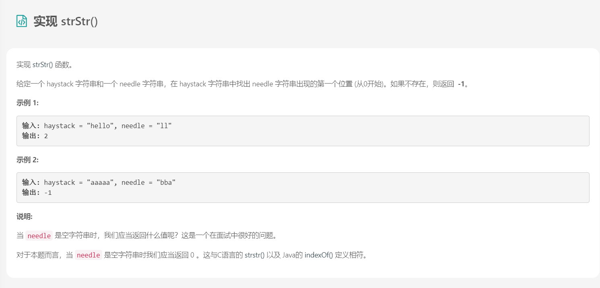

- 解法

	```java
	//滑动窗口逐一比较
	class Solution {
	  public int strStr(String haystack, String needle) {
	    int L = needle.length(), n = haystack.length();
	
	    for (int start = 0; start < n - L + 1; ++start) {
	      if (haystack.substring(start, start + L).equals(needle)) {
	        return start;
	      }
	    }
	    return -1;
	  }
	}
	```

	```java
	//KMP
	```

### 2.8 外观数列

- 题目描述

	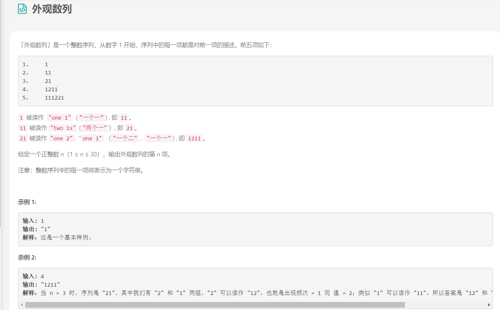

- 解法

	```java
	class Solution {
	     public String countAndSay(int n) {
	        String str = "1";
	        for (int i = 2; i <= n; i++) {
	            StringBuilder builder = new StringBuilder();
	            char pre = str.charAt(0);
	            int count = 1;
	            for (int j = 1; j < str.length(); j++) {
	                char c = str.charAt(j);
	                if (c == pre) {
	                    count++;
	                } else {
	                    builder.append(count).append(pre);
	                    pre = c;
	                    count = 1;
	                }
	            }
	            builder.append(count).append(pre);
	            str = builder.toString();
	        }
	
	        return str;
	    }
	
	}
	```

### 2.9 最长公共前缀

- 题目描述

	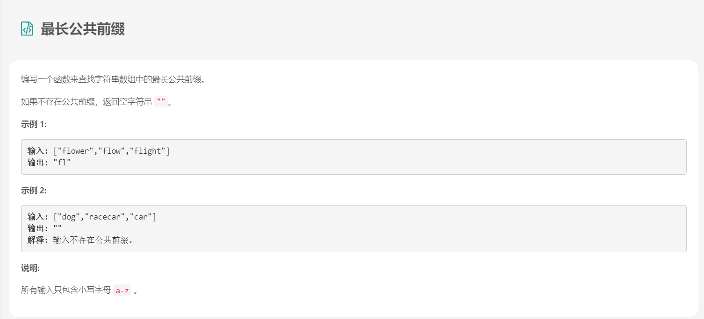

- 解法

	```java
	//LCP
	class Solution {
   public String longestCommonPrefix(String[] strs) {
	   if (strs.length == 0) return "";
	   String prefix = strs[0];
	   for (int i = 1; i < strs.length; i++)
	       while (strs[i].indexOf(prefix) != 0) {
	           prefix = prefix.substring(0, prefix.length() - 1);
	           if (prefix.isEmpty()) return "";
	       }        
	   return prefix;
	}
	}
	```
	
	```java
	//水平扫描
	public String longestCommonPrefix(String[] strs) {
	    if (strs == null || strs.length == 0) return "";
	    for (int i = 0; i < strs[0].length() ; i++){
	        char c = strs[0].charAt(i);
	        for (int j = 1; j < strs.length; j ++) {
	            if (i == strs[j].length() || strs[j].charAt(i) != c)
	                return strs[0].substring(0, i);             
	        }
	    }
	    return strs[0];
	}
	
	```
	
	```java
	//二分法
	public String longestCommonPrefix(String[] strs) {
	    if (strs == null || strs.length == 0)
	        return "";
	    int minLen = Integer.MAX_VALUE;
	    for (String str : strs)
	        minLen = Math.min(minLen, str.length());
	    int low = 1;
	    int high = minLen;
	    while (low <= high) {
	        int middle = (low + high) / 2;
	        if (isCommonPrefix(strs, middle))
	            low = middle + 1;
	        else
	            high = middle - 1;
	    }
	    return strs[0].substring(0, (low + high) / 2);
	}
	
	private boolean isCommonPrefix(String[] strs, int len){
	    String str1 = strs[0].substring(0,len);
	    for (int i = 1; i < strs.length; i++)
	        if (!strs[i].startsWith(str1))
	            return false;
	    return true;
	
	```

## 3. 链表

### 3.1 删除链表中的节点

- 题目描述

	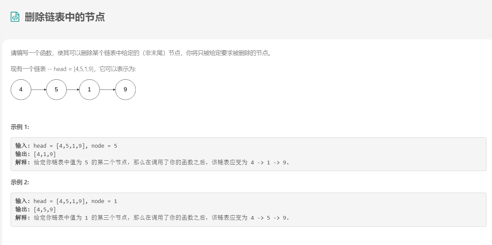

- 解法

	```java
	/**
	 * Definition for singly-linked list.
	 * public class ListNode {
	 *     int val;
	 *     ListNode next;
	 *     ListNode(int x) { val = x; }
	 * }
	 */
	class Solution {
	  public void deleteNode(ListNode node) {
	    node.val = node.next.val;
	    node.next = node.next.next;
	}
	}
	```

### 3.2 删除链表的倒数第N个节点

- 题目描述

	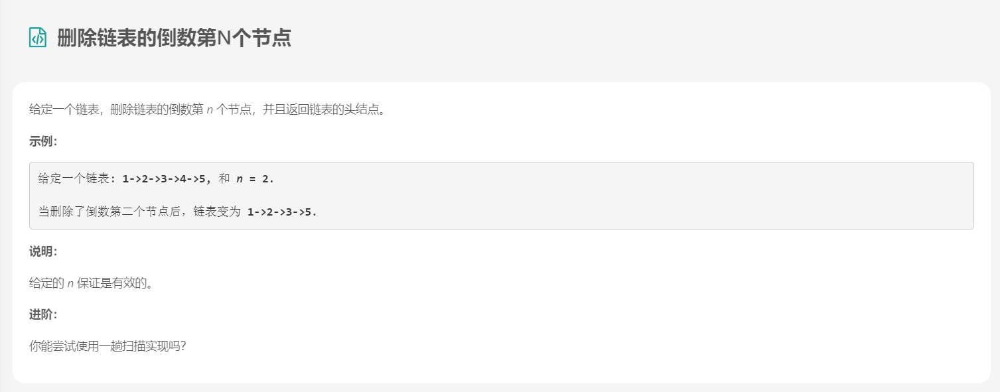

- 解法

	```java
	/**
	 * Definition for singly-linked list.
	 * public class ListNode {
	 *     int val;
	 *     ListNode next;
	 *     ListNode(int x) { val = x; }
	 * }
	 */
	class Solution {
	  public ListNode removeNthFromEnd(ListNode head, int n) {
	    ListNode dummy = new ListNode(0);
	    dummy.next = head;
	    int length  = 0;
	    ListNode first = head;
	    while (first != null) {
	        length++;
	        first = first.next;
	    }
	    length -= n;
	    first = dummy;
	    while (length > 0) {
	        length--;
	        first = first.next;
	    }
	    first.next = first.next.next;
	    return dummy.next;
	}
	}
	```

	```java
	/**
	 * Definition for singly-linked list.
	 * public class ListNode {
	 *     int val;
	 *     ListNode next;
	 *     ListNode(int x) { val = x; }
	 * }
	 */
	class Solution {
	public ListNode removeNthFromEnd(ListNode head, int n) {
	    ListNode dummy = new ListNode(0);
	    dummy.next = head;
	    ListNode first = dummy;
	    ListNode second = dummy;
	    // Advances first pointer so that the gap between first and second is n nodes apart
	    for (int i = 1; i <= n + 1; i++) {
	        first = first.next;
	    }
	    // Move first to the end, maintaining the gap
	    while (first != null) {
	        first = first.next;
	        second = second.next;
	    }
	    second.next = second.next.next;
	    return dummy.next;
	}
	}
	```

### 3.3 反转链表

- 题目描述

	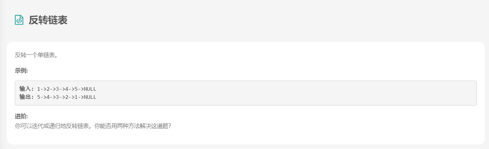

- 解法

	```java
	/**
	 * Definition for singly-linked list.
	 * public class ListNode {
	 *     int val;
	 *     ListNode next;
	 *     ListNode(int x) { val = x; }
	 * }
	 */
	//迭代
	class Solution {
	  public ListNode reverseList(ListNode head) {
	    ListNode prev = null;
	    ListNode curr = head;
	    while (curr != null) {
	        ListNode nextTemp = curr.next;
	        curr.next = prev;
	        prev = curr;
	        curr = nextTemp;
	    }
	    return prev;
	}
	}
	```

	```java
	//递归
	public ListNode reverseList(ListNode head) {
	    if (head == null || head.next == null) return head;
	    ListNode p = reverseList(head.next);
	    head.next.next = head;
	    head.next = null;
	    return p;
	}
	```

### 3.4 合并两个有序列表

- 题目描述

	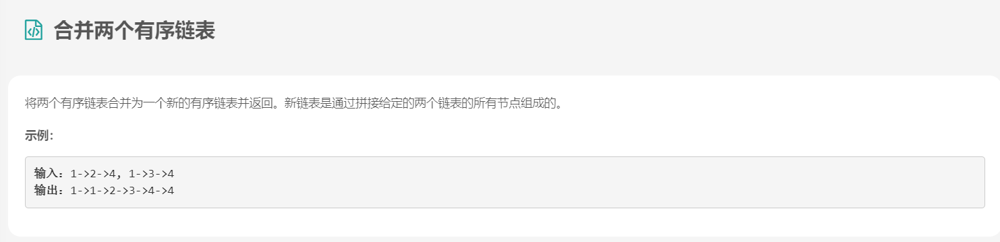

- 解法

	```java
	/**
	 * Definition for singly-linked list.
	 * public class ListNode {
	 *     int val;
	 *     ListNode next;
	 *     ListNode(int x) { val = x; }
	 * }
	 */
	class Solution {
	    public ListNode mergeTwoLists(ListNode l1, ListNode l2) {
	        if (l1 == null) {
	            return l2;
	        }
	        else if (l2 == null) {
	            return l1;
	        }
	        else if (l1.val < l2.val) {
	            l1.next = mergeTwoLists(l1.next, l2);
	            return l1;
	        }
	        else {
	            l2.next = mergeTwoLists(l1, l2.next);
	            return l2;
	        }
	
	    }
	}
	```

	```java
	class Solution {
	    public ListNode mergeTwoLists(ListNode l1, ListNode l2) {
	        // maintain an unchanging reference to node ahead of the return node.
	        ListNode prehead = new ListNode(-1);
	
	        ListNode prev = prehead;
	        while (l1 != null && l2 != null) {
	            if (l1.val <= l2.val) {
	                prev.next = l1;
	                l1 = l1.next;
	            } else {
	                prev.next = l2;
	                l2 = l2.next;
	            }
	            prev = prev.next;
	        }
	
	        // exactly one of l1 and l2 can be non-null at this point, so connect
	        // the non-null list to the end of the merged list.
	        prev.next = l1 == null ? l2 : l1;
	
	        return prehead.next;
	    }
	}
	```

### 3.5 环形链表

- 题目描述

	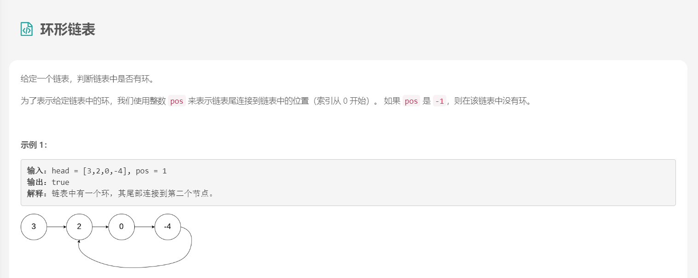

- 解法

	```java
	/**
	 * Definition for singly-linked list.
	 * class ListNode {
	 *     int val;
	 *     ListNode next;
	 *     ListNode(int x) {
	 *         val = x;
	 *         next = null;
	 *     }
	 * }
	 */
	public class Solution {
	 public boolean hasCycle(ListNode head) {
	    if (head == null || head.next == null) {
	        return false;
	    }
	    ListNode slow = head;
	    ListNode fast = head.next;
	    while (slow != fast) {
	        if (fast == null || fast.next == null) {
	            return false;
	        }
	        slow = slow.next;
	        fast = fast.next.next;
	    }
	    return true;
	}
	}
	```

### 3.6 回文链表

- 题目描述

	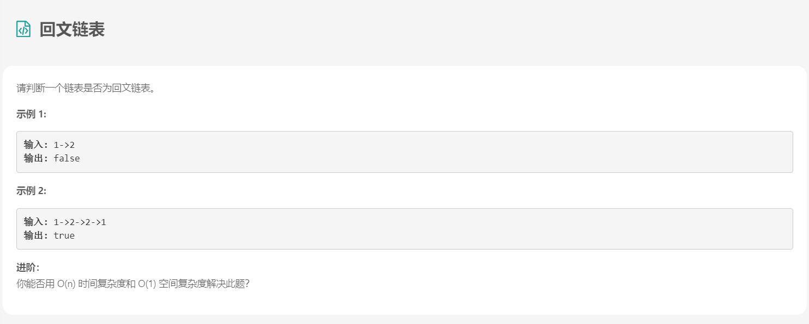

- 解法

	```java
	class Solution {
	
	    public boolean isPalindrome(ListNode head) {
	
	        if (head == null) return true;
	
	        // Find the end of first half and reverse second half.
	        ListNode firstHalfEnd = endOfFirstHalf(head);
	        ListNode secondHalfStart = reverseList(firstHalfEnd.next);
	
	        // Check whether or not there is a palindrome.
	        ListNode p1 = head;
	        ListNode p2 = secondHalfStart;
	        boolean result = true;
	        while (result && p2 != null) {
	            if (p1.val != p2.val) result = false;
	            p1 = p1.next;
	            p2 = p2.next;
	        }        
	
	        // Restore the list and return the result.
	        firstHalfEnd.next = reverseList(secondHalfStart);
	        return result;
	    }
	
	    // Taken from https://leetcode.com/problems/reverse-linked-list/solution/
	    private ListNode reverseList(ListNode head) {
	        ListNode prev = null;
	        ListNode curr = head;
	        while (curr != null) {
	            ListNode nextTemp = curr.next;
	            curr.next = prev;
	            prev = curr;
	            curr = nextTemp;
	        }
	        return prev;
	    }
	
	    private ListNode endOfFirstHalf(ListNode head) {
	        ListNode fast = head;
	        ListNode slow = head;
	        while (fast.next != null && fast.next.next != null) {
	            fast = fast.next.next;
	            slow = slow.next;
	        }
	        return slow;
	    }
	}
	```

## 4. 树

### 4.1 二叉树的最大深度

- 题目描述

	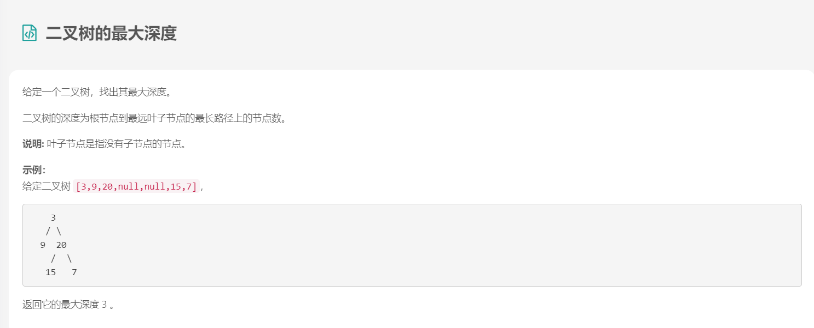

- 解法

	```java
	/**
	 * Definition for a binary tree node.
	 * public class TreeNode {
	 *     int val;
	 *     TreeNode left;
	 *     TreeNode right;
	 *     TreeNode(int x) { val = x; }
	 * }
	 */
	class Solution {
	  public int maxDepth(TreeNode root) {
	    if (root == null) {
	      return 0;
	    } else {
	      int left_height = maxDepth(root.left);
	      int right_height = maxDepth(root.right);
	      return java.lang.Math.max(left_height, right_height) + 1;
	    }
	  }
	}
	```

### 4.2 验证二叉搜索树

- 题目描述

	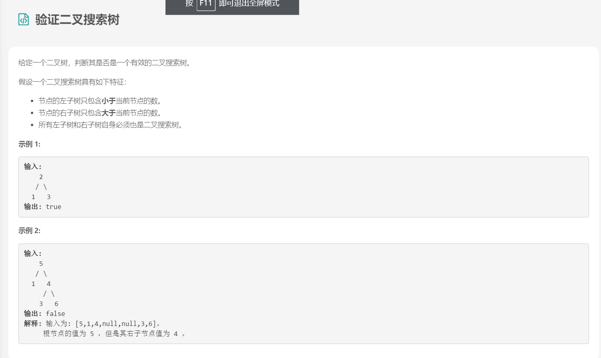

- 解法

	```java
	/**
	 * Definition for a binary tree node.
	 * public class TreeNode {
	 *     int val;
	 *     TreeNode left;
	 *     TreeNode right;
	 *     TreeNode(int x) { val = x; }
	 * }
	 */
	class Solution {
	  public boolean helper(TreeNode node, Integer lower, Integer upper) {
	    if (node == null) return true;
	
	    int val = node.val;
	    if (lower != null && val <= lower) return false;
	    if (upper != null && val >= upper) return false;
	
	    if (! helper(node.right, val, upper)) return false;
	    if (! helper(node.left, lower, val)) return false;
	    return true;
	  }
	
	  public boolean isValidBST(TreeNode root) {
	    return helper(root, null, null);
	  }
	}
	```

	```java
	/**
	 * Definition for a binary tree node.
	 * public class TreeNode {
	 *     int val;
	 *     TreeNode left;
	 *     TreeNode right;
	 *     TreeNode(int x) { val = x; }
	 * }
	 */
	class Solution {
	  public boolean isValidBST(TreeNode root) {
	    Stack<TreeNode> stack = new Stack();
	    double inorder = - Double.MAX_VALUE;
	
	    while (!stack.isEmpty() || root != null) {
	      while (root != null) {
	        stack.push(root);
	        root = root.left;
	      }
	      root = stack.pop();
	      // If next element in inorder traversal
	      // is smaller than the previous one
	      // that's not BST.
	      if (root.val <= inorder) return false;
	      inorder = root.val;
	      root = root.right;
	    }
	    return true;
	  }
	}
	```

### 4.3 对称二叉树

- 题目描述

	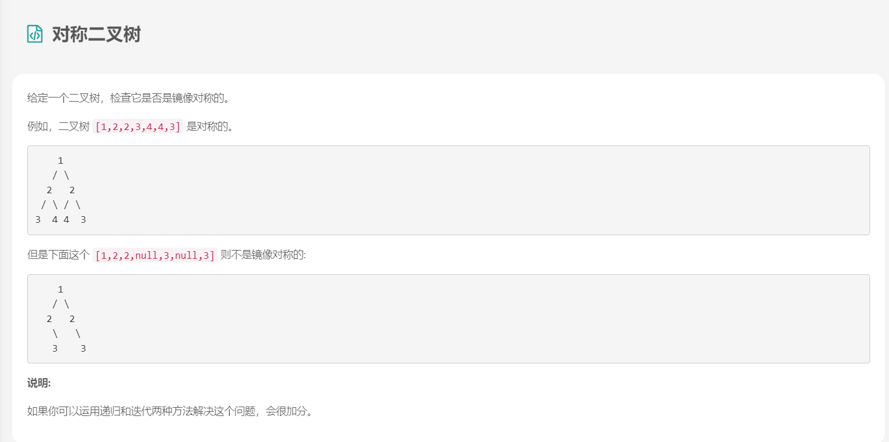

- 解法

	```java
	/**
	 * Definition for a binary tree node.
	 * public class TreeNode {
	 *     int val;
	 *     TreeNode left;
	 *     TreeNode right;
	 *     TreeNode(int x) { val = x; }
	 * }
	 */
	class Solution {
	    public boolean isSymmetric(TreeNode root) {
	    return isMirror(root, root);
	}
	
	public boolean isMirror(TreeNode t1, TreeNode t2) {
	    if (t1 == null && t2 == null) return true;
	    if (t1 == null || t2 == null) return false;
	    return (t1.val == t2.val)
	        && isMirror(t1.right, t2.left)
	        && isMirror(t1.left, t2.right);
	
	}
	}
	```

	```java
	/**
	 * Definition for a binary tree node.
	 * public class TreeNode {
	 *     int val;
	 *     TreeNode left;
	 *     TreeNode right;
	 *     TreeNode(int x) { val = x; }
	 * }
	 */
	class Solution {
	public boolean isSymmetric(TreeNode root) {
	    Queue<TreeNode> q = new LinkedList<>();
	    q.add(root);
	    q.add(root);
	    while (!q.isEmpty()) {
	        TreeNode t1 = q.poll();
	        TreeNode t2 = q.poll();
	        if (t1 == null && t2 == null) continue;
	        if (t1 == null || t2 == null) return false;
	        if (t1.val != t2.val) return false;
	        q.add(t1.left);
	        q.add(t2.right);
	        q.add(t1.right);
	        q.add(t2.left);
	    }
	    return true;
	}
	
	}
	```

### 4.4 二叉树的层次遍历

- 题目描述

	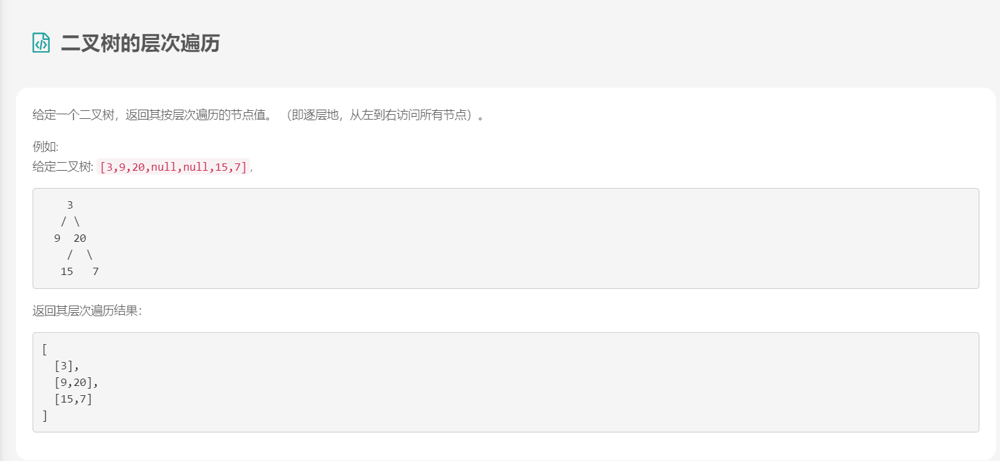

- 解法

	```java
	/**
	 * Definition for a binary tree node.
	 * public class TreeNode {
	 *     int val;
	 *     TreeNode left;
	 *     TreeNode right;
	 *     TreeNode(int x) { val = x; }
	 * }
	 */
	class Solution {
	    List<List<Integer>> levels = new ArrayList<List<Integer>>();
	
	    public void helper(TreeNode node, int level) {
	        // start the current level
	        if (levels.size() == level)
	            levels.add(new ArrayList<Integer>());
	
	         // fulfil the current level
	         levels.get(level).add(node.val);
	
	         // process child nodes for the next level
	         if (node.left != null)
	            helper(node.left, level + 1);
	         if (node.right != null)
	            helper(node.right, level + 1);
	    }
	    
	    public List<List<Integer>> levelOrder(TreeNode root) {
	        if (root == null) return levels;
	        helper(root, 0);
	        return levels;
	    }
	}
	
	```

	

## 5. 排序和搜索

### 5.1 合并两个有序数组

- 题目描述

	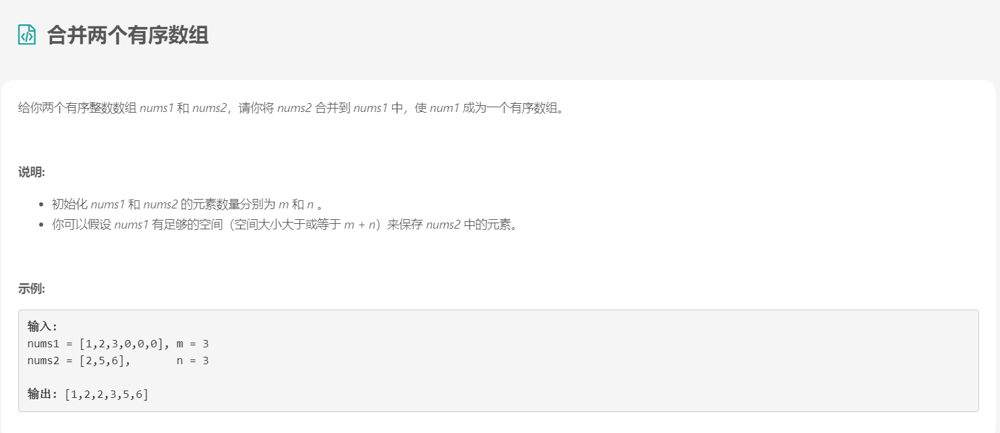

- 解法

	```java
	class Solution {
	  public void merge(int[] nums1, int m, int[] nums2, int n) {
	    // two get pointers for nums1 and nums2
	    int p1 = m - 1;
	    int p2 = n - 1;
	    // set pointer for nums1
	    int p = m + n - 1;
	
	    // while there are still elements to compare
	    while ((p1 >= 0) && (p2 >= 0))
	      // compare two elements from nums1 and nums2 
	      // and add the largest one in nums1 
	      nums1[p--] = (nums1[p1] < nums2[p2]) ? nums2[p2--] : nums1[p1--];
	
	    // add missing elements from nums2
	    System.arraycopy(nums2, 0, nums1, 0, p2 + 1);
	  }
	}
	
	```

### 5.2 第一个错误的版本

- 题目描述

	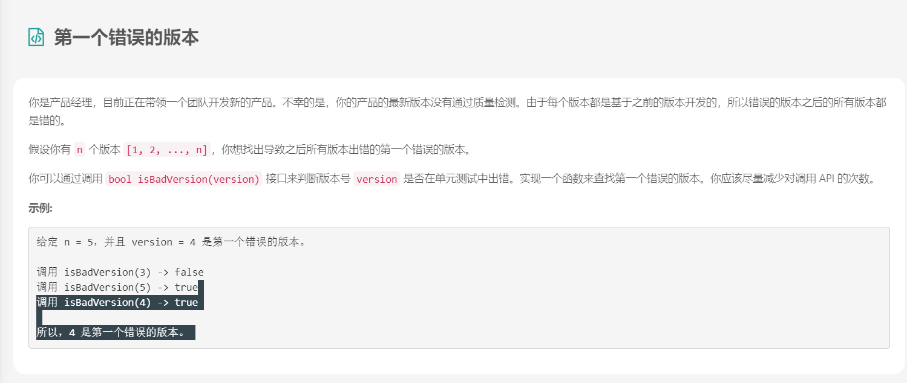

- 解法

	```java
	/* The isBadVersion API is defined in the parent class VersionControl.
	      boolean isBadVersion(int version); */
	
	public class Solution extends VersionControl {
	 public int firstBadVersion(int n) {
	    int left = 1;
	    int right = n;
	    while (left < right) {
	        int mid = left + (right - left) / 2;
	        if (isBadVersion(mid)) {
	            right = mid;
	        } else {
	            left = mid + 1;
	        }
	    }
	    return left;
	}
	
	}
	```

## 6. 动态规划

### 6.1 爬楼梯

- 题目描述

	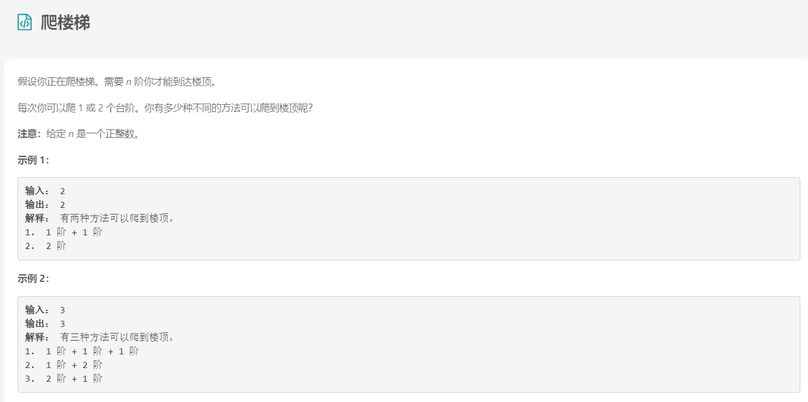

- 解法

## 7. 设计问题

### 7.1 Shuffle an Array

- 题目描述

	

- 解法

	

## 8. 数学


## 9. 其他 


