# 链表

## 1. 单链表

### 1.1 简介-单链表

​		单链表中的每个结点不仅包含值，还包含链接到下一个结点的引用字段。通过这种方式，单链表将所有结点按顺序组织起来。

​		下面是一个单链表的例子：


​		蓝色箭头显示单个链接列表中的结点是如何组合在一起的

- 节点结构

	在大多数情况下，使用头结点(第一个结点)来表示整个列表。

	```java
		// Definition for singly-linked list.
	public class SinglyListNode {
	    int val;
	    SinglyListNode next;
	    SinglyListNode(int x) { val = x; }
	}
	```

- 操作

	​		与数组不同，我们无法在常量时间内访问单链表中的随机元素。 如果我们想要获得第 **i** 个元素，我们必须从头结点**逐个遍历**。 我们按索引来访问元素平均要花费 **O(N)**时间，其中 N 是链表的长度。

### 1.2 添加操作-单链表

​	如果我们想在给定的结点 **prev** 之后添加新值，我们应该：

1. 使用给定值初始化新结点 **cur**

2. 将 **cur**的**“next”**字段链接到 prev 的下一个结点 **next**

3. 将 **prev** 中的**“next”**字段链接到 **cur** 

	

	与数组不同，不需要将所有元素移动到插入元素之后，可以在 **O(1)** 时间复杂度中将新结点插入到链表中。

### 1.3 删除操作-单链表

​		如果我们想从单链表中删除现有结点 `cur`，可以分两步完成：

1. 找到 cur 的上一个结点 `prev` 及其下一个结点 `next；`

2. 接下来链接 `prev` 到 cur 的下一个节点 `next。`

	​		第一步中，找出 `prev` 和 `next`。必须从头结点遍历链表，以找出 `prev`，它的平均时间是 `O(N)`，其中 N 是链表的长度。因此，删除结点的时间复杂度将是 `O(N)`。

	空间复杂度为 `O(1)`，因为我们只需要常量空间来存储指针。

### 1.4 设计链表

- 题目描述

	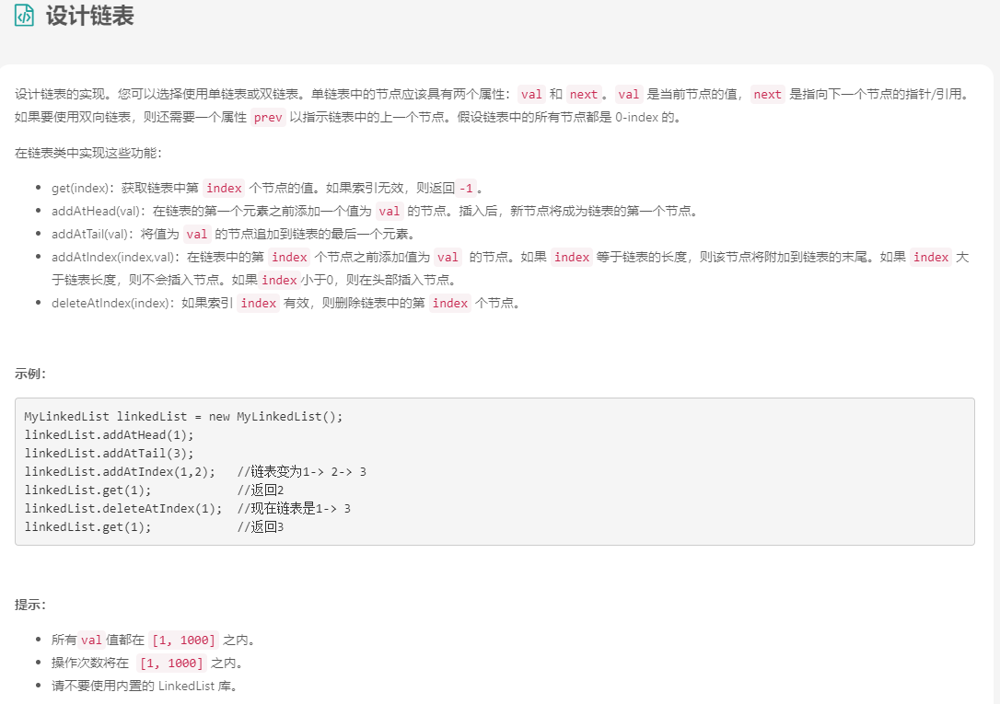

- 解法

	```java
	//单链表
	public class ListNode {
	  int val;
	  ListNode next;
	  ListNode(int x) { val = x; }
	}
	
	class MyLinkedList {
	  int size;
	  ListNode head;  // sentinel node as pseudo-head
	  public MyLinkedList() {
	    size = 0;
	    head = new ListNode(0);
	  }
	
	  /** Get the value of the index-th node in the linked list. If the index is invalid, return -1. */
	  public int get(int index) {
	    // if index is invalid
	    if (index < 0 || index >= size) return -1;
	
	    ListNode curr = head;
	    // index steps needed 
	    // to move from sentinel node to wanted index
	    for(int i = 0; i < index + 1; ++i) curr = curr.next;
	    return curr.val;
	  }
	
	  /** Add a node of value val before the first element of the linked list. After the insertion, the new node will be the first node of the linked list. */
	  public void addAtHead(int val) {
	    addAtIndex(0, val);
	  }
	
	  /** Append a node of value val to the last element of the linked list. */
	  public void addAtTail(int val) {
	    addAtIndex(size, val);
	  }
	
	  /** Add a node of value val before the index-th node in the linked list. If index equals to the length of linked list, the node will be appended to the end of linked list. If index is greater than the length, the node will not be inserted. */
	  public void addAtIndex(int index, int val) {
	    // If index is greater than the length, 
	    // the node will not be inserted.
	    if (index > size) return;
	
	    // [so weird] If index is negative, 
	    // the node will be inserted at the head of the list.
	    if (index < 0) index = 0;
	
	    ++size;
	    // find predecessor of the node to be added
	    ListNode pred = head;
	    for(int i = 0; i < index; ++i) pred = pred.next;
	
	    // node to be added
	    ListNode toAdd = new ListNode(val);
	    // insertion itself
	    toAdd.next = pred.next;
	    pred.next = toAdd;
	  }
	
	  /** Delete the index-th node in the linked list, if the index is valid. */
	  public void deleteAtIndex(int index) {
	    // if the index is invalid, do nothing
	    if (index < 0 || index >= size) return;
	
	    size--;
	    // find predecessor of the node to be deleted
	    ListNode pred = head;
	    for(int i = 0; i < index; ++i) pred = pred.next;
	
	    // delete pred.next 
	    pred.next = pred.next.next;
	  }
	}
	```
	
	```java
	//双链表
	public class ListNode {
	  int val;
	  ListNode next;
	  ListNode prev;
	  ListNode(int x) { val = x; }
	}
	
	class MyLinkedList {
	  int size;
	  // sentinel nodes as pseudo-head and pseudo-tail
	  ListNode head, tail;
	  public MyLinkedList() {
	    size = 0;
	    head = new ListNode(0);
	    tail = new ListNode(0);
	    head.next = tail;
	    tail.prev = head;
	  }
	
	  /** Get the value of the index-th node in the linked list. If the index is invalid, return -1. */
	  public int get(int index) {
	    // if index is invalid
	    if (index < 0 || index >= size) return -1;
	
	    // choose the fastest way: to move from the head
	    // or to move from the tail
	    ListNode curr = head;
	    if (index + 1 < size - index)
	      for(int i = 0; i < index + 1; ++i) curr = curr.next;
	    else {
	      curr = tail;
	      for(int i = 0; i < size - index; ++i) curr = curr.prev;
	    }
	
	    return curr.val;
	  }
	
	  /** Add a node of value val before the first element of the linked list. After the insertion, the new node will be the first node of the linked list. */
	  public void addAtHead(int val) {
	    ListNode pred = head, succ = head.next;
	
	    ++size;
	    ListNode toAdd = new ListNode(val);
	    toAdd.prev = pred;
	    toAdd.next = succ;
	    pred.next = toAdd;
	    succ.prev = toAdd;
	  }
	
	  /** Append a node of value val to the last element of the linked list. */
	  public void addAtTail(int val) {
	    ListNode succ = tail, pred = tail.prev;
	
	    ++size;
	    ListNode toAdd = new ListNode(val);
	    toAdd.prev = pred;
	    toAdd.next = succ;
	    pred.next = toAdd;
	    succ.prev = toAdd;
	  }
	
	  /** Add a node of value val before the index-th node in the linked list. If index equals to the length of linked list, the node will be appended to the end of linked list. If index is greater than the length, the node will not be inserted. */
	  public void addAtIndex(int index, int val) {
	    // If index is greater than the length, 
	    // the node will not be inserted.
	    if (index > size) return;
	
	    // [so weird] If index is negative, 
	    // the node will be inserted at the head of the list.
	    if (index < 0) index = 0;
	
	    // find predecessor and successor of the node to be added
	    ListNode pred, succ;
	    if (index < size - index) {
	      pred = head;
	      for(int i = 0; i < index; ++i) pred = pred.next;
	      succ = pred.next;
	    }
	    else {
	      succ = tail;
	      for (int i = 0; i < size - index; ++i) succ = succ.prev;
	      pred = succ.prev;
	    }
	
	    // insertion itself
	    ++size;
	    ListNode toAdd = new ListNode(val);
	    toAdd.prev = pred;
	    toAdd.next = succ;
	    pred.next = toAdd;
	    succ.prev = toAdd;
	  }
	
	  /** Delete the index-th node in the linked list, if the index is valid. */
	  public void deleteAtIndex(int index) {
	    // if the index is invalid, do nothing
	    if (index < 0 || index >= size) return;
	
	    // find predecessor and successor of the node to be deleted
	    ListNode pred, succ;
	    if (index < size - index) {
	      pred = head;
	      for(int i = 0; i < index; ++i) pred = pred.next;
	      succ = pred.next.next;
	    }
	    else {
	      succ = tail;
	      for (int i = 0; i < size - index - 1; ++i) succ = succ.prev;
	      pred = succ.prev.prev;
	    }
	
	    // delete pred.next 
	    --size;
	    pred.next = succ;
	    succ.prev = pred;
	  }
	}
	```

## 2. 双指针技巧

### 2.1 链表中的双指针

- 快慢指针检测链表是否有环

### 2.2 环形链表

```java
public boolean hasCycle(ListNode head) {
    if (head == null || head.next == null) {
        return false;
    }
    ListNode slow = head;
    ListNode fast = head.next;
    while (slow != fast) {
        if (fast == null || fast.next == null) {
            return false;
        }
        slow = slow.next;
        fast = fast.next.next;
    }
    return true;
}
```

### 2.3 环形链表②

- 题目描述

	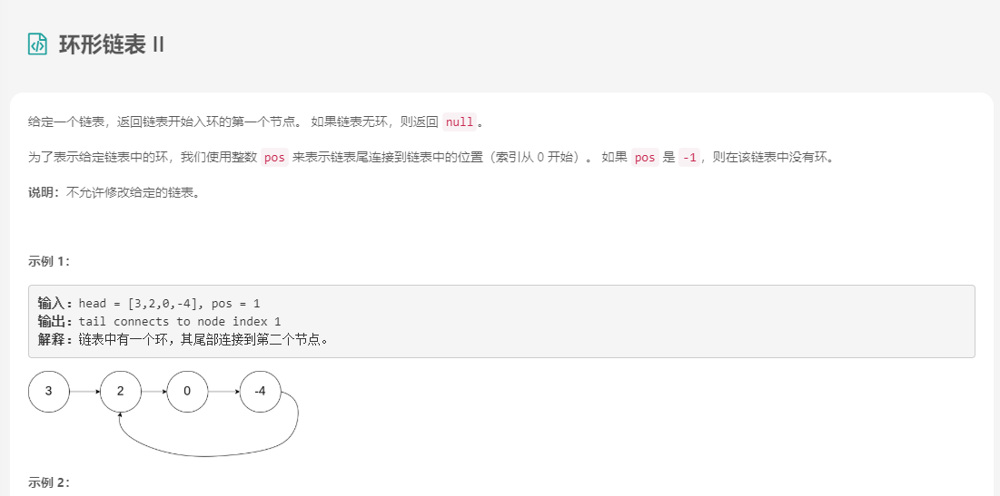

- 解法

	```java
	//哈希集
	/**
	 * Definition for singly-linked list.
	 * class ListNode {
	 *     int val;
	 *     ListNode next;
	 *     ListNode(int x) {
	 *         val = x;
	 *         next = null;
	 *     }
	 * }
	 */
	public class Solution {
	    public ListNode detectCycle(ListNode head) {
	        Set<ListNode> visited = new HashSet<ListNode>();
	
	        ListNode node = head;
	        while (node != null) {
	            if (visited.contains(node)) {
	                return node;
	            }
	            visited.add(node);
	            node = node.next;
	        }
	
	        return null;
	    }
	}
	```

	```java
	//Floyd 算法
	/**
	 * Definition for singly-linked list.
	 * class ListNode {
	 *     int val;
	 *     ListNode next;
	 *     ListNode(int x) {
	 *         val = x;
	 *         next = null;
	 *     }
	 * }
	 */
	public class Solution {
	    private ListNode getIntersect(ListNode head) {
	        ListNode tortoise = head;
	        ListNode hare = head;
	
	        // A fast pointer will either loop around a cycle and meet the slow
	        // pointer or reach the `null` at the end of a non-cyclic list.
	        while (hare != null && hare.next != null) {
	            tortoise = tortoise.next;
	            hare = hare.next.next;
	            if (tortoise == hare) {
	                return tortoise;
	            }
	        }
	
	        return null;
	}
	
	    public ListNode detectCycle(ListNode head) {
	        if (head == null) {
	            return null;
	        }
	
	        // If there is a cycle, the fast/slow pointers will intersect at some
	        // node. Otherwise, there is no cycle, so we cannot find an e***ance to
	        // a cycle.
	        ListNode intersect = getIntersect(head);
	        if (intersect == null) {
	            return null;
	        }
	
	        // To find the e***ance to the cycle, we have two pointers traverse at
	        // the same speed -- one from the front of the list, and the other from
	        // the point of intersection.
	        ListNode ptr1 = head;
	        ListNode ptr2 = intersect;
	        while (ptr1 != ptr2) {
	            ptr1 = ptr1.next;
	            ptr2 = ptr2.next;
	        }
	
	        return ptr1;
	    }
	}
	```

### 2.4 相交链表

- 题目描述

	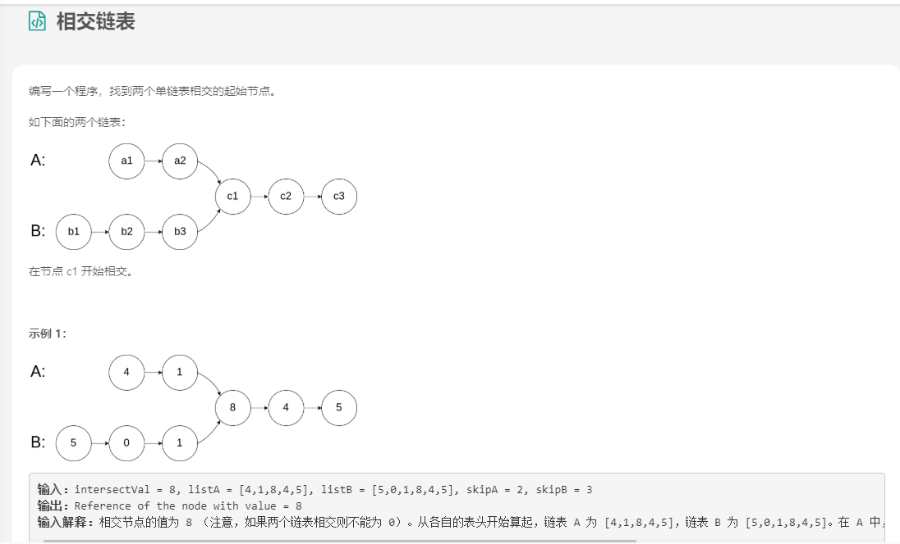

- 解法

	```java
	/**
	 * Definition for singly-linked list.
	 * public class ListNode {
	 *     int val;
	 *     ListNode next;
	 *     ListNode(int x) {
	 *         val = x;
	 *         next = null;
	 *     }
	 * }
	 */
	public class Solution {
	    public ListNode getIntersectionNode(ListNode headA, ListNode headB) {
	        if (headA == null || headB == null) {
	            return null;
	        }
	        ListNode pA = headA;
	        ListNode pB = headB;
	        while (pA != pB) {
	            pA = pA.next;
	            pB = pB.next;
	            if (pA == null && pB == null) {
	                return null;
	            }
	            if (pA == null) {
	                pA = headB;
	            }
	            if (pB == null) {
	                pB = headA;
	            }
	        }
	        return pA;
	    }
	}
	```

### 2.5 删除链表的倒数第N个节点

### 2.6 小结

```java
// Initialize slow & fast pointers
ListNode slow = head;
ListNode fast = head;
/**
 * Change this condition to fit specific problem.
 * Attention: remember to avoid null-pointer error
 **/
while (slow != null && fast != null && fast.next != null) {
    slow = slow.next;           // move slow pointer one step each time
    fast = fast.next.next;      // move fast pointer two steps each time
    if (slow == fast) {         // change this condition to fit specific problem
        return true;
    }
}
return false;   // change return value to fit specific problem
```

## 3. 经典问题

### 3.1 反转链表

```java
/**
 * Definition for singly-linked list.
 * public class ListNode {
 *     int val;
 *     ListNode next;
 *     ListNode(int x) { val = x; }
 * }
 */
class Solution {
public ListNode reverseList(ListNode head) {
    if (head == null || head.next == null) return head;
    ListNode p = reverseList(head.next);
    head.next.next = head;
    head.next = null;
    return p;
}
}
```

### 3.2 移除链表元素

- 题目描述

	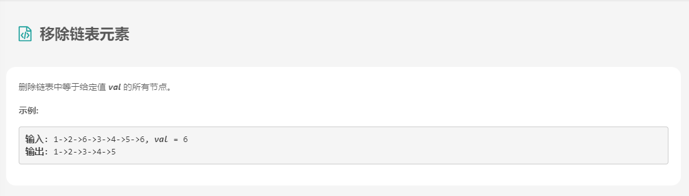

- 解法

	```java
	/**
	 * Definition for singly-linked list.
	 * public class ListNode {
	 *     int val;
	 *     ListNode next;
	 *     ListNode(int x) { val = x; }
	 * }
	 */
	class Solution {
	  public ListNode removeElements(ListNode head, int val) {
	    ListNode sentinel = new ListNode(0);
	    sentinel.next = head;
	
	    ListNode prev = sentinel, curr = head;
	    while (curr != null) {
	      if (curr.val == val) prev.next = curr.next;
	      else prev = curr;
	      curr = curr.next;
	    }
	    return sentinel.next;
	  }
	}
	```

### 3.3 奇偶链表

- 题目描述

	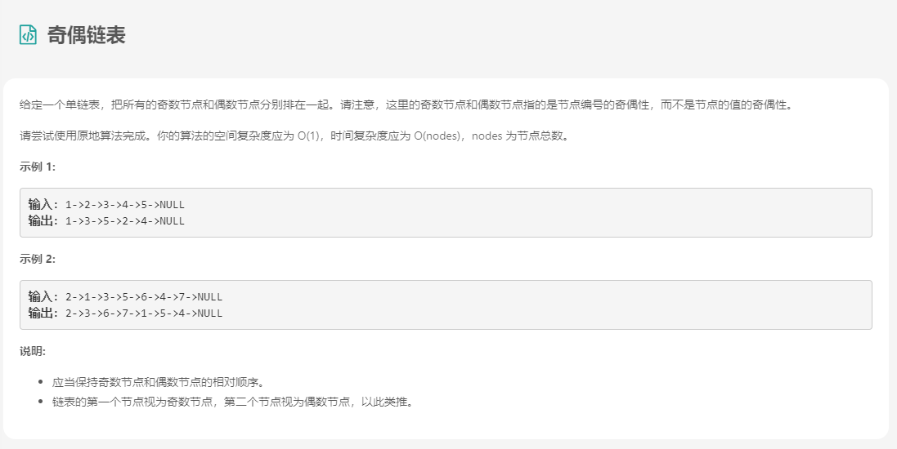

- 解法

  ```java
  /**
   * Definition for singly-linked list.
   * public class ListNode {
   *     int val;
   *     ListNode next;
   *     ListNode() {}
   *     ListNode(int val) { this.val = val; }
   *     ListNode(int val, ListNode next) { this.val = val; this.next = next; }
   * }
   */
    public class Solution {
      public ListNode oddEvenList(ListNode head) {
          if (head == null) return null;
          ListNode odd = head, even = head.next, evenHead = even;
          while (even != null && even.next != null) {
              odd.next = even.next;
              odd = odd.next;
              even.next = odd.next;
              even = even.next;
          }
          odd.next = evenHead;
          return head;
      }
  }
  ```

### 3.4 回文链表

- 题目描述

	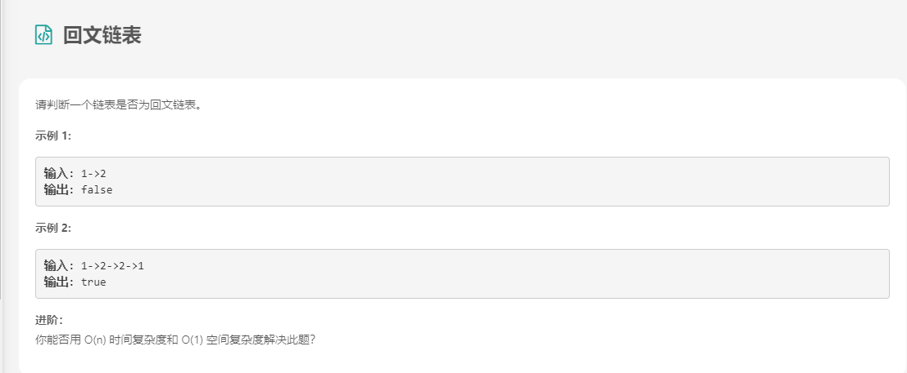

- 解法

	```java
	class Solution {
	
	    public boolean isPalindrome(ListNode head) {
	
	        if (head == null) return true;
	
	        // Find the end of first half and reverse second half.
	        ListNode firstHalfEnd = endOfFirstHalf(head);
	        ListNode secondHalfStart = reverseList(firstHalfEnd.next);
	
	        // Check whether or not there is a palindrome.
	        ListNode p1 = head;
	        ListNode p2 = secondHalfStart;
	        boolean result = true;
	        while (result && p2 != null) {
	            if (p1.val != p2.val) result = false;
	            p1 = p1.next;
	            p2 = p2.next;
	        }        
	
	        // Restore the list and return the result.
	        firstHalfEnd.next = reverseList(secondHalfStart);
	        return result;
	    }
	
	    // Taken from https://leetcode.com/problems/reverse-linked-list/solution/
	    private ListNode reverseList(ListNode head) {
	        ListNode prev = null;
	        ListNode curr = head;
	        while (curr != null) {
	            ListNode nextTemp = curr.next;
	            curr.next = prev;
	            prev = curr;
	            curr = nextTemp;
	        }
	        return prev;
	    }
	
	    private ListNode endOfFirstHalf(ListNode head) {
	        ListNode fast = head;
	        ListNode slow = head;
	        while (fast.next != null && fast.next.next != null) {
	            fast = fast.next.next;
	            slow = slow.next;
	        }
	        return slow;
	    }
	}
	```

## 4. 小结

### 4.1 链表

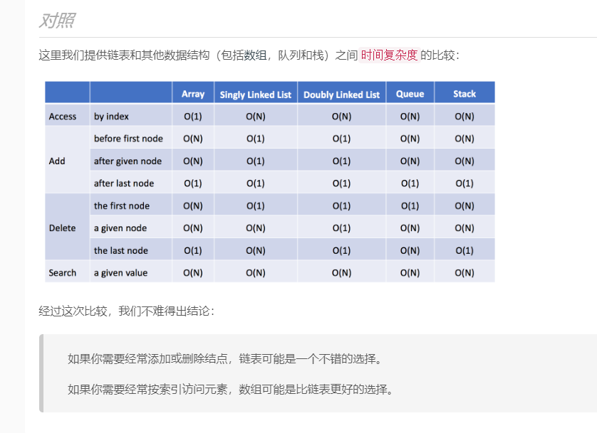

### 4.2 合并两个有序列表

- 题目描述

	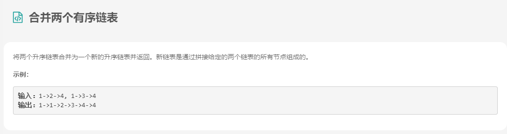

- 解法

	```
	class Solution {
	    public ListNode mergeTwoLists(ListNode l1, ListNode l2) {
	        if (l1 == null) {
	            return l2;
	        }
	        else if (l2 == null) {
	            return l1;
	        }
	        else if (l1.val < l2.val) {
	            l1.next = mergeTwoLists(l1.next, l2);
	            return l1;
	        }
	        else {
	            l2.next = mergeTwoLists(l1, l2.next);
	            return l2;
	        }
	
	    }
	}
	```

### 4.3 两数相加

- 题目描述

	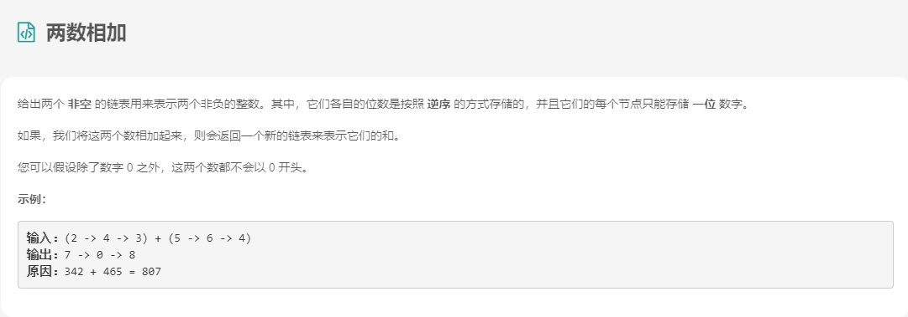

- 解法

	```java
	/**
	 * Definition for singly-linked list.
	 * public class ListNode {
	 *     int val;
	 *     ListNode next;
	 *     ListNode(int x) { val = x; }
	 * }
	 */
	class Solution {
	 public ListNode addTwoNumbers(ListNode l1, ListNode l2) {
	    ListNode dummyHead = new ListNode(0);
	    ListNode p = l1, q = l2, curr = dummyHead;
	    int carry = 0;
	    while (p != null || q != null) {
	        int x = (p != null) ? p.val : 0;
	        int y = (q != null) ? q.val : 0;
	        int sum = carry + x + y;
	        carry = sum / 10;
	        curr.next = new ListNode(sum % 10);
	        curr = curr.next;
	        if (p != null) p = p.next;
	        if (q != null) q = q.next;
	    }
	    if (carry > 0) {
	        curr.next = new ListNode(carry);
	    }
	    return dummyHead.next;
	}
	
	}
	```

### 4.4 扁平化多级双向链表

- 题目描述

	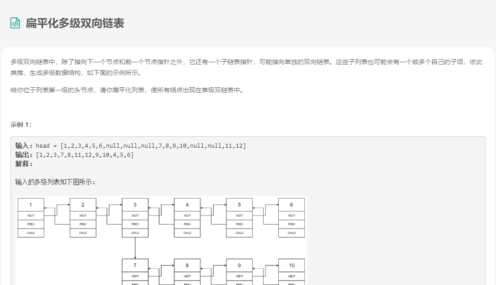

- 解法

	```java
	/*
	// Definition for a Node.
	class Node {
	    public int val;
	    public Node prev;
	    public Node next;
	    public Node child;
	
	    public Node() {}
	
	    public Node(int _val,Node _prev,Node _next,Node _child) {
	        val = _val;
	        prev = _prev;
	        next = _next;
	        child = _child;
	    }
	};
	*/
	class Solution {
	  public Node flatten(Node head) {
	    if (head == null) return head;
	
	    Node pseudoHead = new Node(0, null, head, null);
	    Node curr, prev = pseudoHead;
	
	    Deque<Node> stack = new ArrayDeque<>();
	    stack.push(head);
	
	    while (!stack.isEmpty()) {
	      curr = stack.pop();
	      prev.next = curr;
	      curr.prev = prev;
	
	      if (curr.next != null) stack.push(curr.next);
	      if (curr.child != null) {
	        stack.push(curr.child);
	        // don't forget to remove all child pointers.
	        curr.child = null;
	      }
	      prev = curr;
	    }
	    // detach the pseudo node from the result
	    pseudoHead.next.prev = null;
	    return pseudoHead.next;
	  }
	}
	```

### 4.5 复制带随机指针的链表

- 题目描述

	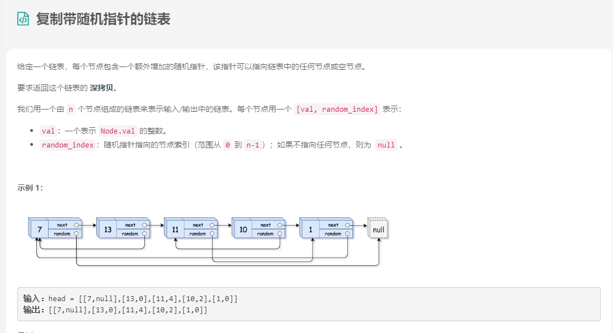

- 解法

	```
	
	```

	

### 4.6 旋转链表

- 题目描述

	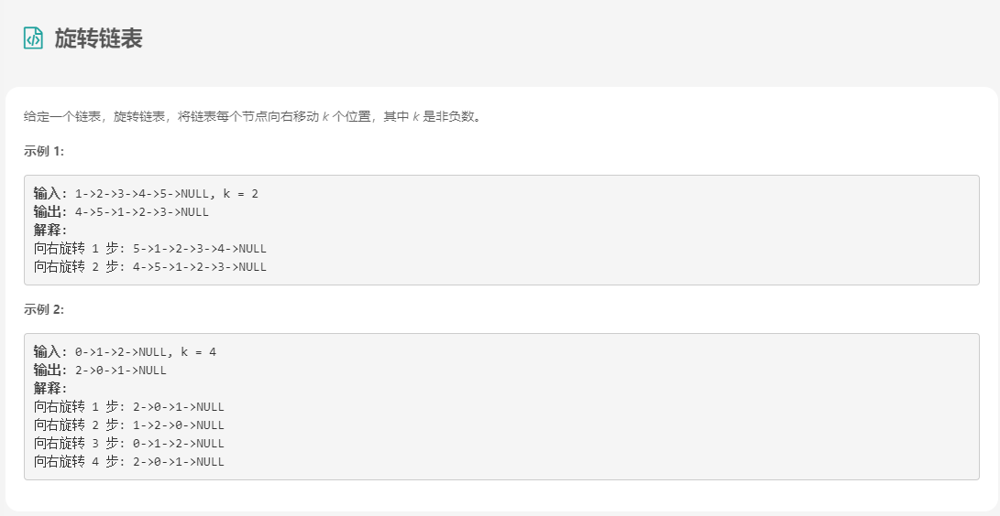

- 解法

	```java
	/**
	 * Definition for singly-linked list.
	 * public class ListNode {
	 *     int val;
	 *     ListNode next;
	 *     ListNode(int x) { val = x; }
	 * }
	 */
	class Solution {
	  public ListNode rotateRight(ListNode head, int k) {
	    // base cases
	    if (head == null) return null;
	    if (head.next == null) return head;
	
	    // close the linked list into the ring
	    ListNode old_tail = head;
	    int n;
	    for(n = 1; old_tail.next != null; n++)
	      old_tail = old_tail.next;
	    old_tail.next = head;
	
	    // find new tail : (n - k % n - 1)th node
	    // and new head : (n - k % n)th node
	    ListNode new_tail = head;
	    for (int i = 0; i < n - k % n - 1; i++)
	      new_tail = new_tail.next;
	    ListNode new_head = new_tail.next;
	
	    // break the ring
	    new_tail.next = null;
	
	    return new_head;
	  }
	}
	```

	