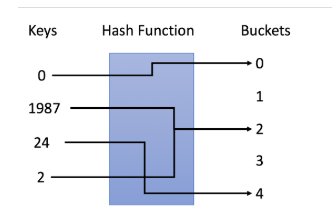
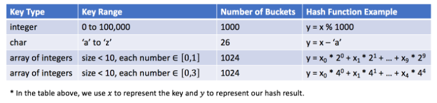

# 哈希表（散列表）

## 1. 设计哈希表

### 1.1 哈希表的原理

- 定义

	**哈希表**是一种数据结构，它使用哈希函数组织数据，以支持**快速插入和搜索**。

- 原理

	哈希表的关键思想是使用哈希函数将键映射到存储桶。更确切地说，

	- 插入一个新键，哈希函数将决定该键应该分配到哪个桶中，并将该键存储在相应的桶中；

	- 搜索一个键时，哈希表将使用相同的哈希函数来查找对应的桶，并只在特定的桶中进行搜索。

- 示例

	

	在示例中，我们使用 `y = x ％ 5` 作为哈希函数完成插入和搜索策略：

	1. 插入：我们通过哈希函数解析键，将它们映射到相应的桶中。
		- 例如，1987 分配给桶 2，而 24 分配给桶 4。
	2. 搜索：我们通过相同的哈希函数解析键，并仅在特定存储桶中搜索。
		- 如果我们搜索 1987，我们将使用相同的哈希函数将1987 映射到 2。因此我们在桶 2 中搜索，我们在那个桶中成功找到了 1987。
		- 例如，如果我们搜索 23，将映射 23 到 3，并在桶 3 中搜索。我们发现 23 不在桶 3 中，这意味着 23 不在哈希表中。

### 1.2 设计哈希表的关键

​		两个基本要素

1. 哈希函数

	​		哈希函数是哈希表中最重要的部分，该函数用于将键映射到特定的桶。在1.1示例中，我们使用 `y = x % 5` 作为散列函数，其中 `x` 是键值，`y` 是分配的桶的索引。

	​		散列函数将取决于**键值的范围**和**桶的数量**。

	

	​		哈希函数的设计是一个开放的问题。其思想是尽可能将键分配到桶中，理想情况下，完美的哈希函数将是键和桶之间的一对一映射。然而，在大多数情况下，哈希函数并不完美，需要在**桶的数量**和**桶的容量**之间进行权衡。

2. 冲突解决

	​		理想情况下，哈希函数是完美的一对一映射，不需要处理冲突。但在大多数情况下，冲突几乎是不可避免的。例如，哈希函数`y = x ％ 5*`中，1987 和 2 都分配给了桶 2，这是一个冲突。

	​		冲突解决算法应该解决以下几个问题：

	​		1. 如何组织在同一个桶中的值？

	​		2. 如果为同一个桶分配了太多的值，该怎么办？

	​		3. 如何在特定的桶中搜索目标值？

	​		根据我们的哈希函数，这些问题与**桶的容量**和**可能映射到同一个桶的键的数目**有关。

	​		让我们假设存储最大键数的桶有 *N* 个键。通常，如果 *N* 是常数且很小，我们可以简单地使用一个数组将键存储在同一个桶中。如果 *N* 是可变的或很大，我们可能需要使用**高度平衡的二叉树**来代替.。

> **插入**和**搜索**是哈希表中的两个基本操作。
>
> 此外，还有基于这两个操作的操作。例如，当我们**删除元素**时，我们将首先搜索元素，然后在元素存在的情况下从相应位置移除元素。

### 1.3 设计哈希集合

### 1.4 设计哈希映射