# 哈希表（散列表）

## 1. 设计哈希表

### 1.1 哈希表的原理

- 定义

	**哈希表**是一种数据结构，它使用哈希函数组织数据，以支持**快速插入和搜索**。

- 原理

	哈希表的关键思想是使用哈希函数将键映射到存储桶。更确切地说，

	- 插入一个新键，哈希函数将决定该键应该分配到哪个桶中，并将该键存储在相应的桶中；

	- 搜索一个键时，哈希表将使用相同的哈希函数来查找对应的桶，并只在特定的桶中进行搜索。

- 示例

	

	在示例中，我们使用 `y = x ％ 5` 作为哈希函数完成插入和搜索策略：

	1. 插入：我们通过哈希函数解析键，将它们映射到相应的桶中。
		- 例如，1987 分配给桶 2，而 24 分配给桶 4。
	2. 搜索：我们通过相同的哈希函数解析键，并仅在特定存储桶中搜索。
		- 如果我们搜索 1987，我们将使用相同的哈希函数将1987 映射到 2。因此我们在桶 2 中搜索，我们在那个桶中成功找到了 1987。
		- 例如，如果我们搜索 23，将映射 23 到 3，并在桶 3 中搜索。我们发现 23 不在桶 3 中，这意味着 23 不在哈希表中。

### 1.2 设计哈希表的关键

​		两个基本要素

1. 哈希函数

	​		哈希函数是哈希表中最重要的部分，该函数用于将键映射到特定的桶。在1.1示例中，我们使用 `y = x % 5` 作为散列函数，其中 `x` 是键值，`y` 是分配的桶的索引。

	​		散列函数将取决于**键值的范围**和**桶的数量**。

	

	​		哈希函数的设计是一个开放的问题。其思想是尽可能将键分配到桶中，理想情况下，完美的哈希函数将是键和桶之间的一对一映射。然而，在大多数情况下，哈希函数并不完美，需要在**桶的数量**和**桶的容量**之间进行权衡。

2. 冲突解决

	​		理想情况下，哈希函数是完美的一对一映射，不需要处理冲突。但在大多数情况下，冲突几乎是不可避免的。例如，哈希函数`y = x ％ 5*`中，1987 和 2 都分配给了桶 2，这是一个冲突。

	​		冲突解决算法应该解决以下几个问题：

	​		1. 如何组织在同一个桶中的值？

	​		2. 如果为同一个桶分配了太多的值，该怎么办？

	​		3. 如何在特定的桶中搜索目标值？

	​		根据我们的哈希函数，这些问题与**桶的容量**和**可能映射到同一个桶的键的数目**有关。

	​		让我们假设存储最大键数的桶有 *N* 个键。通常，如果 *N* 是常数且很小，我们可以简单地使用一个数组将键存储在同一个桶中。如果 *N* 是可变的或很大，我们可能需要使用**高度平衡的二叉树**来代替.。

> **插入**和**搜索**是哈希表中的两个基本操作。
>
> 此外，还有基于这两个操作的操作。例如，当我们**删除元素**时，我们将首先搜索元素，然后在元素存在的情况下从相应位置移除元素。

### 1.3 设计哈希集合

- 题目描述

	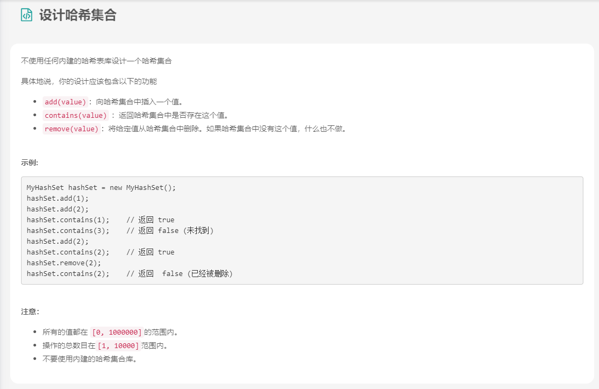

- 解法

	```java
	class MyHashSet {
	  private Bucket[] bucketArray;
	  private int keyRange;
	
	  /** Initialize your data structure here. */
	  public MyHashSet() {
	    this.keyRange = 769;
	    this.bucketArray = new Bucket[this.keyRange];
	    for (int i = 0; i < this.keyRange; ++i)
	      this.bucketArray[i] = new Bucket();
	  }
	
	  protected int _hash(int key) {
	    return (key % this.keyRange);
	  }
	
	  public void add(int key) {
	    int bucketIndex = this._hash(key);
	    this.bucketArray[bucketIndex].insert(key);
	  }
	
	  public void remove(int key) {
	    int bucketIndex = this._hash(key);
	    this.bucketArray[bucketIndex].delete(key);
	  }
	
	  /** Returns true if this set contains the specified element */
	  public boolean contains(int key) {
	    int bucketIndex = this._hash(key);
	    return this.bucketArray[bucketIndex].exists(key);
	  }
	}
	
	
	class Bucket {
	  private LinkedList<Integer> container;
	
	  public Bucket() {
	    container = new LinkedList<Integer>();
	  }
	
	  public void insert(Integer key) {
	    int index = this.container.indexOf(key);
	    if (index == -1) {
	      this.container.addFirst(key);
	    }
	  }
	
	  public void delete(Integer key) {
	    this.container.remove(key);
	  }
	
	  public boolean exists(Integer key) {
	    int index = this.container.indexOf(key);
	    return (index != -1);
	  }
	}
	
	
	/**
	 * Your MyHashSet object will be instantiated and called as such:
	 * MyHashSet obj = new MyHashSet();
	 * obj.add(key);
	 * obj.remove(key);
	 * boolean param_3 = obj.contains(key);
	 */
	```

### 1.4 设计哈希映射

- 题目描述

	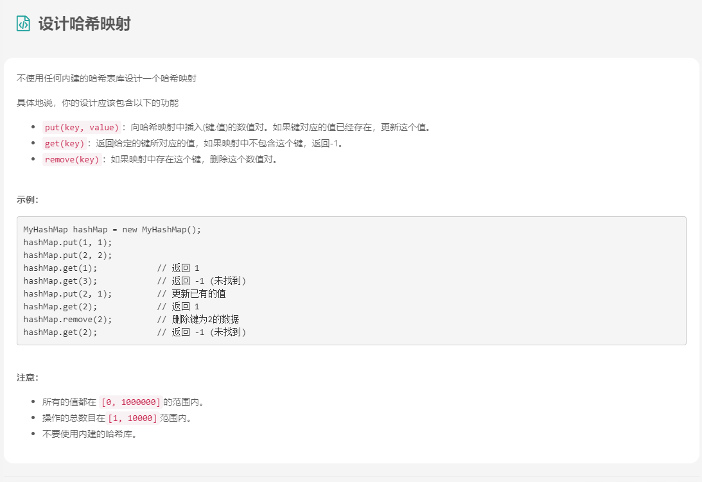

- 解法

	```java
	class Pair<U, V> {
	  public U first;
	  public V second;
	
	  public Pair(U first, V second) {
	    this.first = first;
	    this.second = second;
	  }
	}
	
	
	class Bucket {
	  private List<Pair<Integer, Integer>> bucket;
	
	  public Bucket() {
	    this.bucket = new LinkedList<Pair<Integer, Integer>>();
	  }
	
	  public Integer get(Integer key) {
	    for (Pair<Integer, Integer> pair : this.bucket) {
	      if (pair.first.equals(key))
	        return pair.second;
	    }
	    return -1;
	  }
	
	  public void update(Integer key, Integer value) {
	    boolean found = false;
	    for (Pair<Integer, Integer> pair : this.bucket) {
	      if (pair.first.equals(key)) {
	        pair.second = value;
	        found = true;
	      }
	    }
	    if (!found)
	      this.bucket.add(new Pair<Integer, Integer>(key, value));
	  }
	
	  public void remove(Integer key) {
	    for (Pair<Integer, Integer> pair : this.bucket) {
	      if (pair.first.equals(key)) {
	        this.bucket.remove(pair);
	        break;
	      }
	    }
	  }
	}
	
	class MyHashMap {
	  private int key_space;
	  private List<Bucket> hash_table;
	
	  /** Initialize your data structure here. */
	  public MyHashMap() {
	    this.key_space = 2069;
	    this.hash_table = new ArrayList<Bucket>();
	    for (int i = 0; i < this.key_space; ++i) {
	      this.hash_table.add(new Bucket());
	    }
	  }
	
	  /** value will always be non-negative. */
	  public void put(int key, int value) {
	    int hash_key = key % this.key_space;
	    this.hash_table.get(hash_key).update(key, value);
	  }
	
	  /**
	   * Returns the value to which the specified key is mapped, or -1 if this map contains no mapping
	   * for the key
	   */
	  public int get(int key) {
	    int hash_key = key % this.key_space;
	    return this.hash_table.get(hash_key).get(key);
	  }
	
	  /** Removes the mapping of the specified value key if this map contains a mapping for the key */
	  public void remove(int key) {
	    int hash_key = key % this.key_space;
	    this.hash_table.get(hash_key).remove(key);
	  }
	}
	
	/**
	 * Your MyHashMap object will be instantiated and called as such:
	 * MyHashMap obj = new MyHashMap();
	 * obj.put(key,value);
	 * int param_2 = obj.get(key);
	 * obj.remove(key);
	 */
	```

### 1.5 复杂度分析-哈希表

1. 复杂度分析

	​		如果总共有 `M` 个键，那么在使用哈希表时，可以很容易地达到 `O(M)` 的空间复杂度。但是，你可能已经注意到哈希表的时间复杂度与设计有很强的关系。我们中的大多数人可能已经在每个桶中使用`数组`来将值存储在同一个桶中，理想情况下，桶的大小足够小时，可以看作是一个`常数`。插入和搜索的时间复杂度都是 `O(1)`。但在最坏的情况下，桶大小的最大值将为 `N`。插入时时间复杂度为 `O(1)`，搜索时为 `O(N)`。

2. 内置哈希表的原理

	​	内置哈希表的典型设计是：

	- 键值可以是任何**可哈希化的**类型。并且属于可哈希类型的值将具有**哈希码**。此哈希码将用于映射函数以获取存储区索引。

	- 每个桶包含一个**数组**，用于在初始时将所有值存储在同一个桶中。

	- 如果在同一个桶中有太多的值，这些值将被保留在一个**高度平衡的二叉树搜索树**中。

		​		插入和搜索的平均时间复杂度仍为 O(1)。最坏情况下插入和搜索的时间复杂度是 **O(logN)**，使用高度平衡的 BST。这是在插入和搜索之间的一种权衡。

## 2. 实际应用-哈希集合

### 2.1 哈希集-用法

- 定义

	哈希集是集合的实现之一，它是一种存储不重复值的数据结构。

- 示例

	```java
	// "static void main" must be defined in a public class.
	public class Main {
	    public static void main(String[] args) {
	        // 1. initialize the hash set
	        Set<Integer> hashSet = new HashSet<>();     
	        // 2. add a new key
	        hashSet.add(3);
	        hashSet.add(2);
	        hashSet.add(1);
	        // 3. remove the key
	        hashSet.remove(2);        
	        // 4. check if the key is in the hash set
	        if (!hashSet.contains(2)) {
	            System.out.println("Key 2 is not in the hash set.");
	        }
	        // 5. get the size of the hash set
	        System.out.println("The size of has set is: " + hashSet.size());     
	        // 6. iterate the hash set
	        for (Integer i : hashSet) {
	            System.out.print(i + " ");
	        }
	        System.out.println("are in the hash set.");
	        // 7. clear the hash set
	        hashSet.clear();
	        // 8. check if the hash set is empty
	        if (hashSet.isEmpty()) {
	            System.out.println("hash set is empty now!");
	        }
	    }
	}
	```

### 2.2 使用哈希集查重

​				插入新值并检查值是否在哈希集中是简单有效的。

- 示例

	 		给定一个整数数组，查找数组是否包含任何重复项。迭代每个值并将值插入集合中。 如果值已经在哈希集中，则存在重复。

- 模板

	```java
	/*
	 * Template for using hash set to find duplicates.
	 */
	boolean findDuplicates(List<Type>& keys) {
	    // Replace Type with actual type of your key
	    Set<Type> hashset = new HashSet<>();
	    for (Type key : keys) {
	        if (hashset.contains(key)) {
	            return true;
	        }
	        hashset.insert(key);
	    }
	    return false;
	}
	```

### 2.3 存在重复元素

### 2.4 只出现一次的数字

### 2.5 两个数组的交集

- 题目描述

	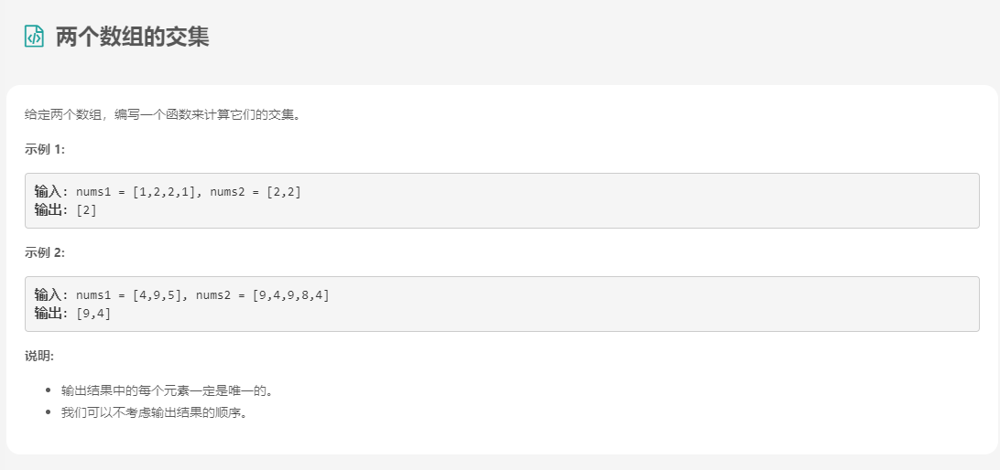

- 解法

	```java
	class Solution {
	public int[] intersection(int[] nums1, int[] nums2) {
	    HashSet<Integer> set1 = new HashSet<Integer>();//如果数据量大，应当考虑TreeSet
	    for (Integer n : nums1) set1.add(n);
	    List<Integer> list = new ArrayList<Integer>();
	    for (Integer n : nums2) {
	        if(set1.contains(n)){
	            list.add(n);
	            set1.remove(n);
	        }
	    }
	    int[] output =new int[list.size()];
	    for(int i=0;i<list.size();i++){
	         output[i]=list.get(i);
	    }
	    return output;
	  }
	}
	```

### 2.6 快乐数

- 题目描述

	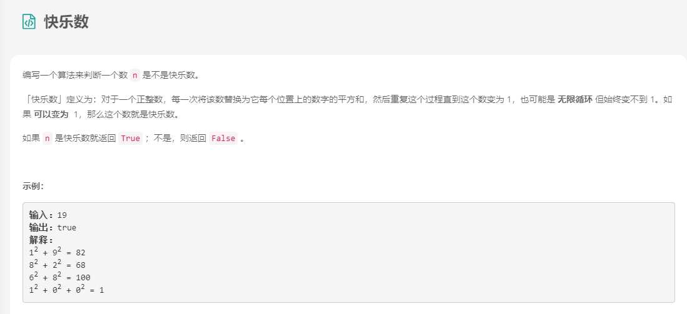

- 解法

	```java
	class Solution {
	
	    private int getNext(int n) {
	        int totalSum = 0;
	        while (n > 0) {
	            int d = n % 10;
	            n = n / 10;
	            totalSum += d * d;
	        }
	        return totalSum;
	    }
	
	    public boolean isHappy(int n) {
	        Set<Integer> seen = new HashSet<>();
	        while (n != 1 && !seen.contains(n)) {
	            seen.add(n);
	            n = getNext(n);
	        }
	        return n == 1;
	    }
	}
	```

## 3. 实际应用-哈希映射

### 3.1 哈希映射-用法

- 定义

	​	**哈希映射**是用于存储 **(key, value) 键值对**的一种实现。

- 示例

	```java
	// "static void main" must be defined in a public class.
	public class Main {
	    public static void main(String[] args) {
	        // 1. initialize a hash map
	        Map<Integer, Integer> hashmap = new HashMap<>();
	        // 2. insert a new (key, value) pair
	        hashmap.putIfAbsent(0, 0);
	        hashmap.putIfAbsent(2, 3);
	        // 3. insert a new (key, value) pair or update the value of existed key
	        hashmap.put(1, 1);
	        hashmap.put(1, 2);
	        // 4. get the value of specific key
	        System.out.println("The value of key 1 is: " + hashmap.get(1));
	        // 5. delete a key
	        hashmap.remove(2);
	        // 6. check if a key is in the hash map
	        if (!hashmap.containsKey(2)) {
	            System.out.println("Key 2 is not in the hash map.");
	        }
	        // 7. get the size of the hash map
	        System.out.println("The size of hash map is: " + hashmap.size()); 
	        // 8. iterate the hash map
	        for (Map.Entry<Integer, Integer> entry : hashmap.entrySet()) {
	            System.out.print("(" + entry.getKey() + "," + entry.getValue() + ") ");
	        }
	        System.out.println("are in the hash map.");
	        // 9. clear the hash map
	        hashmap.clear();
	        // 10. check if the hash map is empty
	        if (hashmap.isEmpty()) {
	            System.out.println("hash map is empty now!");
	        }
	    }
	}
	```

### 3.2 场景①-提供更多信息

​		需要更多的信息，而不仅仅是键。然后通过哈希映射建立密钥与信息之间的映射关系。

- 示例

	​		给定一个整数数组，返回两个数字的**索引**，使它们相加得到特定目标。

	​		在这个例子中，如果我们只想在有解决方案时返回 true，我们可以使用哈希集合来存储迭代数组时的所有值，并检查 target - current_value 是否在哈希集合中。

	​		但是，我们被要求返回更多信息，这意味着我们不仅关心值，还关心索引。我们不仅需要存储数字作为键，还需要存储索引作为值。因此，我们应该使用哈希映射而不是哈希集合。

- 模板

	```java
	/*
	 * Template for using hash map to find duplicates.
	 * Replace ReturnType with the actual type of your return value.
	 */
	ReturnType aggregateByKey_hashmap(List<Type>& keys) {
	    // Replace Type and InfoType with actual type of your key and value
	    Map<Type, InfoType> hashmap = new HashMap<>();
	    for (Type key : keys) {
	        if (hashmap.containsKey(key)) {
	            if (hashmap.get(key) satisfies the requirement) {
	                return needed_information;
	            }
	        }
	        // Value can be any information you needed (e.g. index)
	        hashmap.put(key, value);    
	    }
	    return needed_information;
	}
	```

### 3.3 两数之和

### 3.4 同构字符串

- 题目描述

	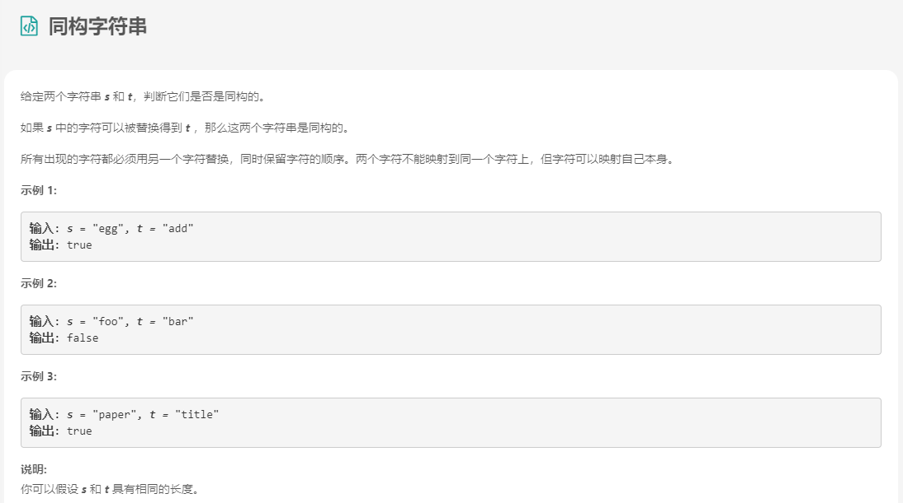

- 解法

	```java
	class Solution {
	public boolean isIsomorphic(String s, String t) {
	        return canMap(s, t) && canMap(t, s);
	    }
	
	    private boolean canMap(String s, String t){
	        int[] map = new int[128]; // ascii 128个字符
	        char[] chars1 = s.toCharArray();
	        char[] chars2 = t.toCharArray();
	        for(int i = 0; i < chars1.length; i++){
	            if(map[chars1[i]] == 0)
	                map[chars1[i]] = chars2[i];
	            else {
	                if(map[chars1[i]] != chars2[i])
	                    return false;
	            }
	        }
	        return true;
	    }
	
	}
	```

### 3.5 两个列表的最小索引总和

- 题目描述

	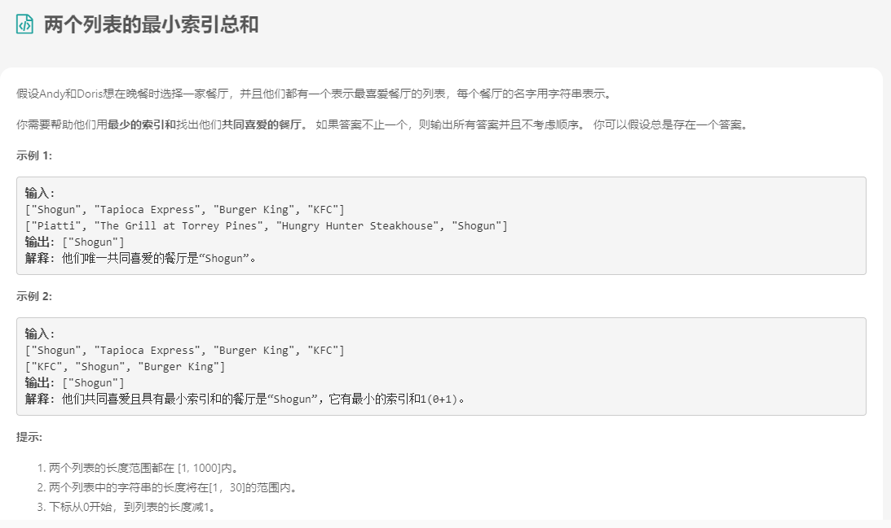

- 解法

	```java
	public class Solution {
	    public String[] findRestaurant(String[] list1, String[] list2) {
	        HashMap < String, Integer > map = new HashMap < String, Integer > ();
	        for (int i = 0; i < list1.length; i++)
	            map.put(list1[i], i);
	        List < String > res = new ArrayList < > ();
	        int min_sum = Integer.MAX_VALUE, sum;
	        for (int j = 0; j < list2.length && j <= min_sum; j++) {
	            if (map.containsKey(list2[j])) {
	                sum = j + map.get(list2[j]);
	                if (sum < min_sum) {
	                    res.clear();
	                    res.add(list2[j]);
	                    min_sum = sum;
	                } else if (sum == min_sum)
	                    res.add(list2[j]);
	            }
	        }
	        return res.toArray(new String[res.size()]);
	    }
	}
	```

### 3.6 场景②-按键聚合

​		另一个常见的场景是按键聚合所有信息。我们也可以使用哈希映射来实现这一目标。

- 示例

	> 给定一个字符串，找到它中的第一个非重复字符并返回它的索引。如果它不存在，则返回 -1。

	​		解决此问题的一种简单方法是首先计算每个字符的出现次数。然后通过结果找出第一个与众不同的角色。

	因此，我们可以维护一个哈希映射，其键是字符，而值是相应字符的计数器。每次迭代一个字符时，我们只需将相应的值加 1。

- 模板

	```java
	/*
	 * Template for using hash map to find duplicates.
	 * Replace ReturnType with the actual type of your return value.
	 */
	ReturnType aggregateByKey_hashmap(List<Type>& keys) {
	    // Replace Type and InfoType with actual type of your key and value
	    Map<Type, InfoType> hashmap = new HashMap<>();
	    for (Type key : keys) {
	        if (hashmap.containsKey(key)) {
	            hashmap.put(key, updated_information);
	        }
	        // Value can be any information you needed (e.g. index)
	        hashmap.put(key, value);    
	    }
	    return needed_information;
	}
	```

### 3.7 字符串中的第一个唯一字符

### 3.8 两个数组的交集②

### 3.9 存在重复元素②

- 题目描述

	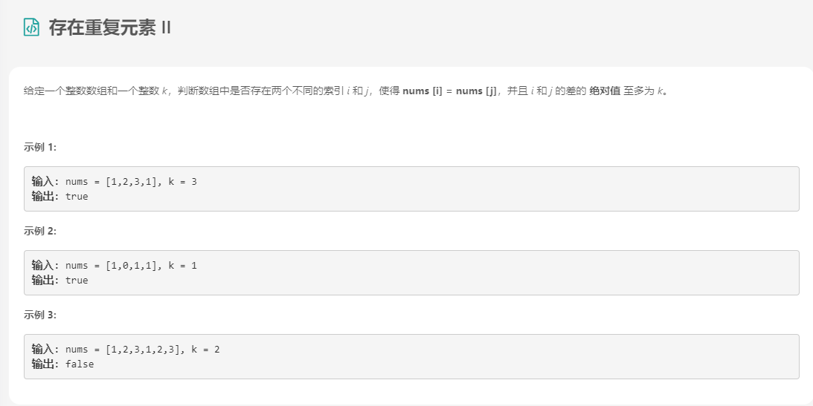

- 解法

	```java
	class Solution {
	 public boolean containsNearbyDuplicate(int[] nums, int k) {
	    Set<Integer> set = new HashSet<>();
	    for (int i = 0; i < nums.length; ++i) {
	        if (set.contains(nums[i])) return true;
	        set.add(nums[i]);
	        if (set.size() > k) {
	            set.remove(nums[i - k]);
	        }
	    }
	    return false;
	    }
	}
	```

## 4. 实际应用-设计键

​		在以前的问题中，键的选择相对简单。不幸的是，有时你必须考虑在使用哈希表时设计合适的键。

- 示例

	我们来看一个例子：

	> 给定一组字符串，将字母异位词组合在一起。

​        众所周知，哈希映射可以很好地按键分组信息。但是我们不能直接使用原始字符串作为键。我们必须设计一个合适的键来呈现字母异位词的类型。例如，有字符串 “eat” 和 “ate” 应该在同一组中。但是 “eat” 和 “act” 不应该组合在一起。

- 解决方案

	实际上，设计关键是在原始信息和哈希映射使用的实际键之间建立映射关系。设计键时，需要保证：

	> 1. 属于同一组的所有值都将映射到同一组中。
	>
	> 2. 需要分成不同组的值不会映射到同一组。

​         此过程类似于设计哈希函数，但这是一个本质区别。哈希函数满足第一个规则但可能不满足第二个规则。但是你的映射函数应该满足它们。在上面的示例中，我们的映射策略可以是：对字符串进行排序并使用排序后的字符串作为键。也就是说，“eat” 和 “ate” 都将映射到 “aet”。

### 4.1 字母异位词分组

- 题目描述

	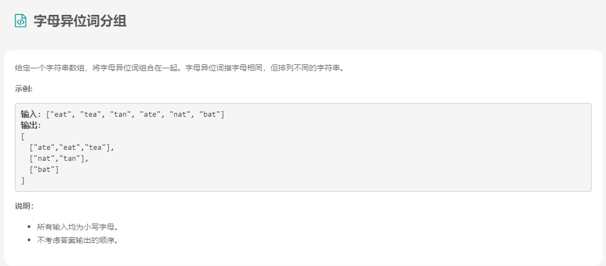

- 解法

	```java
	class Solution {
	    public List<List<String>> groupAnagrams(String[] strs) {
        if (strs.length == 0) return new ArrayList();
	        Map<String, List> ans = new HashMap<String, List>();
	        for (String s : strs) {
	            char[] ca = s.toCharArray();
	            Arrays.sort(ca);
	            String key = String.valueOf(ca);
	            if (!ans.containsKey(key)) ans.put(key, new ArrayList());
	            ans.get(key).add(s);
	        }
	        return new ArrayList(ans.values());
	    }
	}
	```
	
	```java
	class Solution {
	    public List<List<String>> groupAnagrams(String[] strs) {
	        if (strs.length == 0) return new ArrayList();
	        Map<String, List> ans = new HashMap<String, List>();
	        int[] count = new int[26];
	        for (String s : strs) {
	            Arrays.fill(count, 0);
	            for (char c : s.toCharArray()) count[c - 'a']++;
	
	            StringBuilder sb = new StringBuilder("");
	            for (int i = 0; i < 26; i++) {
	                sb.append('#');
	                sb.append(count[i]);
	            }
	            String key = sb.toString();
	            if (!ans.containsKey(key)) ans.put(key, new ArrayList());
	            ans.get(key).add(s);
	        }
	        return new ArrayList(ans.values());
	    }
	}
	```

### 4.2 有效的数独

### 4.3 寻找重复的子树

- 题目描述

	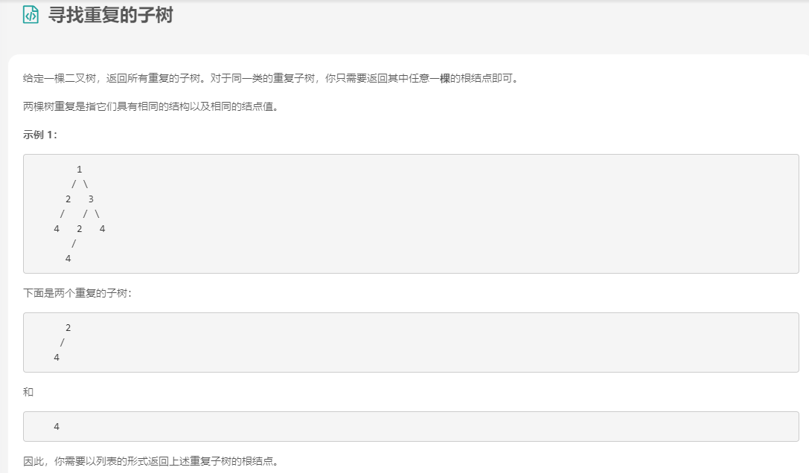

- 解法

	```java
	//序列化子树
	/**
	 * Definition for a binary tree node.
	 * public class TreeNode {
	 *     int val;
	 *     TreeNode left;
	 *     TreeNode right;
	 *     TreeNode(int x) { val = x; }
	 * }
	 */
	class Solution {
	    Map<String, Integer> count;
	    List<TreeNode> ans;
	    public List<TreeNode> findDuplicateSubtrees(TreeNode root) {
	        count = new HashMap();
	        ans = new ArrayList();
	        collect(root);
	        return ans;
	    }
	
	    public String collect(TreeNode node) {
	        if (node == null) return "#";
	        String serial = node.val + "," + collect(node.left) + "," + collect(node.right);
	        count.put(serial, count.getOrDefault(serial, 0) + 1);
	        if (count.get(serial) == 2)
	            ans.add(node);
	        return serial;
	    }
	}
	```

	```java
	//唯一标识符
	/**
	 * Definition for a binary tree node.
	 * public class TreeNode {
	 *     int val;
	 *     TreeNode left;
	 *     TreeNode right;
	 *     TreeNode(int x) { val = x; }
	 * }
	 */
	class Solution {
	    int t;
	    Map<String, Integer> trees;
	    Map<Integer, Integer> count;
	    List<TreeNode> ans;
	
	    public List<TreeNode> findDuplicateSubtrees(TreeNode root) {
	        t = 1;
	        trees = new HashMap();
	        count = new HashMap();
	        ans = new ArrayList();
	        lookup(root);
	        return ans;
	    }
	
	    public int lookup(TreeNode node) {
	        if (node == null) return 0;
	        String serial = node.val + "," + lookup(node.left) + "," + lookup(node.right);
	        int uid = trees.computeIfAbsent(serial, x-> t++);
	        count.put(uid, count.getOrDefault(uid, 0) + 1);
	        if (count.get(uid) == 2)
	            ans.add(node);
	        return uid;
	    }
	}
	```

### 4.4 设计键-总结

​		这里有一些为你准备的关于如何设计键的建议。

1. 当字符串 / 数组中每个元素的顺序不重要时，可以使用排序后的字符串 / 数组作为键。

2. 如果只关心每个值的偏移量，通常是第一个值的偏移量，则可以使用**偏移量**作为键。

3. 在树中，你有时可能会希望直接使用 TreeNode 作为键。 但在大多数情况下，采用子树的序列化表述可能是一个更好的主意。

	

4. 在矩阵中，你可能希望使用**行索引**或**列索引**作为键。

5. 在数独中，可以将行索引和列索引组合来标识此元素属于哪个块。

6. 有时，在矩阵中，您可能希望将值聚合在**同一对角线**中。

## 5. 小结

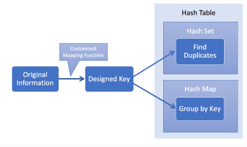

### 5.1 宝石与石头

- 题目描述

	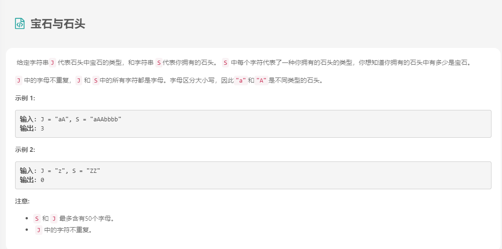

- 解法

	```java
	class Solution {
	    public int numJewelsInStones(String J, String S) {
	        Set<Character> Jset = new HashSet();
	        for (char j: J.toCharArray())
	            Jset.add(j);
	
	        int ans = 0;
	        for (char s: S.toCharArray())
	            if (Jset.contains(s))
	                ans++;
	        return ans;
	    }
	}
	```

### 5.2 无重复字符的最长子串

- 题目描述

	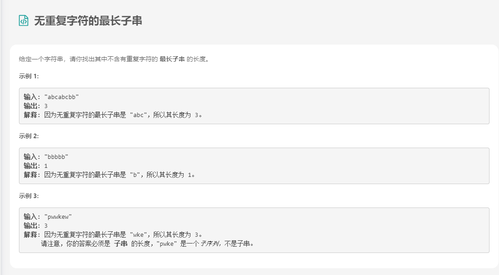

- 解法

	```java
	public class Solution {
	    public int lengthOfLongestSubstring(String s) {
	        int n = s.length();
	        Set<Character> set = new HashSet<>();
	        int ans = 0, i = 0, j = 0;
	        while (i < n && j < n) {
	            // try to extend the range [i, j]
	            if (!set.contains(s.charAt(j))){
	                set.add(s.charAt(j++));
	                ans = Math.max(ans, j - i);
	            }
	            else {
	                set.remove(s.charAt(i++));
	            }
	        }
	        return ans;
	    }
	}
	```

### 5.3 四数相加②

- 题目描述

	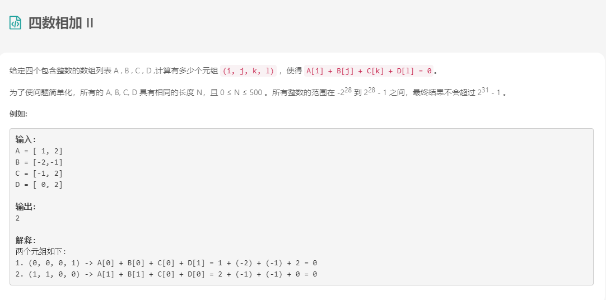

- 解法

	```java
	/*
	一.采用分为两组，HashMap存一组，另一组和HashMap进行比对。
	二.这样的话情况就可以分为三种：
	1.HashMap存一个数组，如A。然后计算三个数组之和，如BCD。时间复杂度为：O(n)+O(n^3),得到O(n^3).
	2.HashMap存三个数组之和，如ABC。然后计算一个数组，如D。时间复杂度为：O(n^3)+O(n),得到O(n^3).
	3.HashMap存两个数组之和，如AB。然后计算两个数组之和，如CD。时间复杂度为：O(n^2)+O(n^2),得到O(n^2).
	三.根据第二点我们可以得出要存两个数组算两个数组。
	四.我们以存AB两数组之和为例。首先求出A和B任意两数之和sumAB，以sumAB为key，sumAB出现的次数为value，存入hashmap中。
	然后计算C和D中任意两数之和的相反数sumCD，在hashmap中查找是否存在key为sumCD。
	算法时间复杂度为O(n2)。
	*/
	class Solution {
	    public int fourSumCount(int[] A, int[] B, int[] C, int[] D) {
	        Map<Integer, Integer> map = new HashMap<>();
	        //Map<Integer, Integer> map = new HashMap<>();
	        int res = 0;
	        for(int i = 0;i<A.length;i++){
	            for(int j= 0;j<B.length;j++){
	                int sumAB = A[i]+B[j];
	                map.put(sumAB,map.getOrDefault(sumAB, 0) + 1);
	            }
	        }
	
	        for(int i = 0;i<C.length;i++){
	            for(int j = 0;j<D.length;j++){
	                int sumCD = -(C[i]+D[j]);
	                if(map.containsKey(sumCD)) res += map.get(sumCD);
	            }
	        }
	        return res;
	    }
	}
	```

### 5.4 前K个高频元素

- 题目描述

	

- 解法

	```java
	class Solution {
	    public List<Integer> topKFrequent(int[] nums, int k) {
	        // 使用字典，统计每个元素出现的次数，元素为键，元素出现的次数为值
	        HashMap<Integer,Integer> map = new HashMap();
	        for(int num : nums){
	            if (map.containsKey(num)) {
	               map.put(num, map.get(num) + 1);
	             } else {
	                map.put(num, 1);
	             }
	        }
	        // 遍历map，用最小堆保存频率最大的k个元素
	        PriorityQueue<Integer> pq = new PriorityQueue<>(new Comparator<Integer>() {
	            @Override
	            public int compare(Integer a, Integer b) {
	                return map.get(a) - map.get(b);
	            }
	        });
	        for (Integer key : map.keySet()) {
	            if (pq.size() < k) {
	                pq.add(key);
	            } else if (map.get(key) > map.get(pq.peek())) {
	                pq.remove();
	                pq.add(key);
	            }
	        }
	        // 取出最小堆中的元素
	        List<Integer> res = new ArrayList<>();
	        while (!pq.isEmpty()) {
	            res.add(pq.remove());
	        }
	        return res;
	    }
	}
	```

### 5.5 常数时间插入、删除和获取随机元素

- 题目描述

	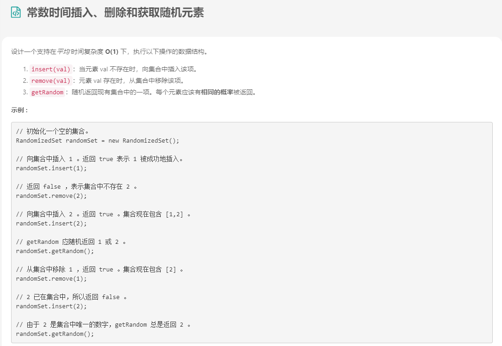

- 解法

	```java
	class RandomizedSet {
	  Map<Integer, Integer> dict;
	  List<Integer> list;
	  Random rand = new Random();
	
	  /** Initialize your data structure here. */
	  public RandomizedSet() {
	    dict = new HashMap();
	    list = new ArrayList();
	  }
	
	  /** Inserts a value to the set. Returns true if the set did not already contain the specified element. */
	  public boolean insert(int val) {
	    if (dict.containsKey(val)) return false;
	
	    dict.put(val, list.size());
	    list.add(list.size(), val);
	    return true;
	  }
	
	  /** Removes a value from the set. Returns true if the set contained the specified element. */
	  public boolean remove(int val) {
	    if (! dict.containsKey(val)) return false;
	
	    // move the last element to the place idx of the element to delete
	    int lastElement = list.get(list.size() - 1);
	    int idx = dict.get(val);
	    list.set(idx, lastElement);
	    dict.put(lastElement, idx);
	    // delete the last element
	    list.remove(list.size() - 1);
	    dict.remove(val);
	    return true;
	  }
	
	  /** Get a random element from the set. */
	  public int getRandom() {
	    return list.get(rand.nextInt(list.size()));
	  }
	}
	
	
	/**
	 * Your RandomizedSet object will be instantiated and called as such:
	 * RandomizedSet obj = new RandomizedSet();
	 * boolean param_1 = obj.insert(val);
	 * boolean param_2 = obj.remove(val);
	 * int param_3 = obj.getRandom();
	 */
	```

	