# 数组和字符串

## 1. 数组简介

### 1.1 数组

```java
// "static void main" must be defined in a public class.
public class Main {
    public static void main(String[] args) {
        // 1. Initialize
        int[] a0 = new int[5];
        int[] a1 = {1, 2, 3};
        // 2. Get Length
        System.out.println("The size of a1 is: " + a1.length);
        // 3. Access Element
        System.out.println("The first element is: " + a1[0]);
        // 4. Iterate all Elements
        System.out.print("[Version 1] The contents of a1 are:");
        for (int i = 0; i < a1.length; ++i) {
            System.out.print(" " + a1[i]);
        }
        System.out.println();
        System.out.print("[Version 2] The contents of a1 are:");
        for (int item: a1) {
            System.out.print(" " + item);
        }
        System.out.println();
        // 5. Modify Element
        a1[0] = 4;
        // 6. Sort
        Arrays.sort(a1);
    }
}
```

### 1.2 动态数组

```java
// "static void main" must be defined in a public class.
public class Main {
    public static void main(String[] args) {
        // 1. initialize
        List<Integer> v0 = new ArrayList<>();
        List<Integer> v1;                           // v1 == null
        // 2. cast an array to a vector
        Integer[] a = {0, 1, 2, 3, 4};
        v1 = new ArrayList<>(Arrays.asList(a));
        // 3. make a copy
        List<Integer> v2 = v1;                      // another reference to v1
        List<Integer> v3 = new ArrayList<>(v1);     // make an actual copy of v1
        // 3. get length
        System.out.println("The size of v1 is: " + v1.size());;
        // 4. access element
        System.out.println("The first element in v1 is: " + v1.get(0));
        // 5. iterate the vector
        System.out.print("[Version 1] The contents of v1 are:");
        for (int i = 0; i < v1.size(); ++i) {
            System.out.print(" " + v1.get(i));
        }
        System.out.println();
        System.out.print("[Version 2] The contents of v1 are:");
        for (int item : v1) {
            System.out.print(" " + item);
        }
        System.out.println();
        // 6. modify element
        v2.set(0, 5);       // modify v2 will actually modify v1
        System.out.println("The first element in v1 is: " + v1.get(0));
        v3.set(0, -1);
        System.out.println("The first element in v1 is: " + v1.get(0));
        // 7. sort
        Collections.sort(v1);
        // 8. add new element at the end of the vector
        v1.add(-1);
        v1.add(1, 6);
        // 9. delete the last element
        v1.remove(v1.size() - 1);
    }
}
```

### 1.3 寻找数组的中心索引

- 题目描述

	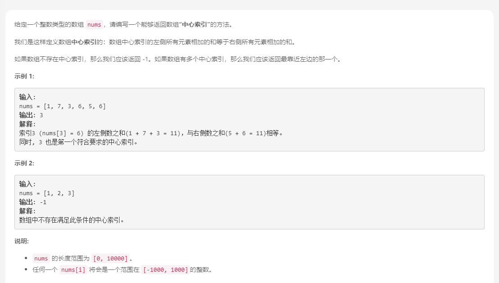

- 解法

	```java
	class Solution {
	    public int pivotIndex(int[] nums) {
	        int sum = 0, leftsum = 0;
	        for (int x: nums) sum += x;
	        for (int i = 0; i < nums.length; ++i) {
	            if (leftsum == sum - leftsum - nums[i]) return i;
	            leftsum += nums[i];
	        }
	        return -1;
	    }
	}
	```

### 1.4 至少是其他数字两倍的最大数

- 题目描述

	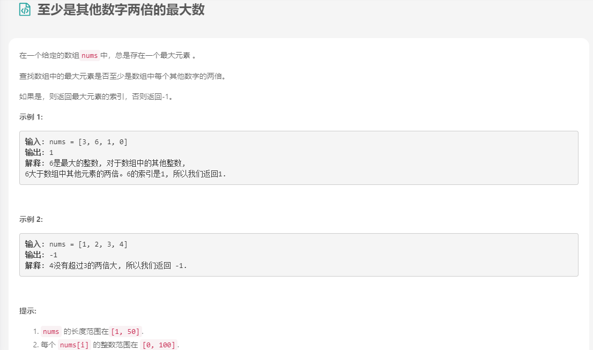

- 解法

	```java
	class Solution {
	    public int dominantIndex(int[] nums) {
	        int maxIndex = 0;
	        for (int i = 0; i < nums.length; ++i) {
	            if (nums[i] > nums[maxIndex])
	                maxIndex = i;
	        }
	        for (int i = 0; i < nums.length; ++i) {
	            if (maxIndex != i && nums[maxIndex] < 2 * nums[i])
	                return -1;
	        }
	        return maxIndex;
	    }
	}
	```

### 1.5 加一

### 1.6 搜索插入位置

- 题目描述

	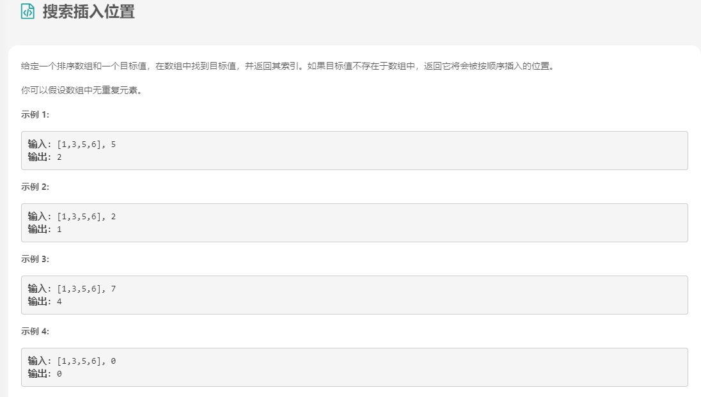

- 解法

	```java
	class Solution {
	    public int searchInsert(int[] nums, int target) {
	        int left = 0, right = nums.length - 1;
	        while(left <= right) {
	            int mid = (left + right) / 2;
	            if(nums[mid] == target) {
	                return mid;
	            } else if(nums[mid] < target) {
	                left = mid + 1;
	            } else {
	                right = mid - 1;
	            }
	        }
	        return left;
	    }
	}
	```

### 1.7 合并区间

- 题目描述

	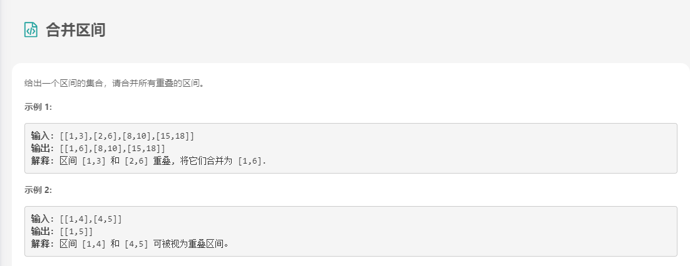

- 解法

	```java
	class Solution {
	    public int[][] merge(int[][] intervals) {
	        // 先按照区间起始位置排序
	        Arrays.sort(intervals, (v1, v2) -> v1[0] - v2[0]);
	        // 遍历区间
	        int[][] res = new int[intervals.length][2];
	        int idx = -1;
	        for (int[] interval: intervals) {
	            // 如果结果数组是空的，或者当前区间的起始位置 > 结果数组中最后区间的终止位置，
	            // 则不合并，直接将当前区间加入结果数组。
	            if (idx == -1 || interval[0] > res[idx][1]) {
	                res[++idx] = interval;
	            } else {
	                // 反之将当前区间合并至结果数组的最后区间
	                res[idx][1] = Math.max(res[idx][1], interval[1]);
	            }
	        }
	        return Arrays.copyOf(res, idx + 1);
	    }
	}
	```

## 2. 二维数组

### 2.1 二维数组简介

```java
// "static void main" must be defined in a public class.
public class Main {
    private static void printArray(int[][] a) {
        for (int i = 0; i < a.length; ++i) {
            System.out.println(a[i]);
        }
        for (int i = 0; i < a.length; ++i) {
            for (int j = 0; a[i] != null && j < a[i].length; ++j) {
                System.out.print(a[i][j] + " ");
            }
            System.out.println();
        }
    }
    public static void main(String[] args) {
        System.out.println("Example I:");
        int[][] a = new int[2][5];
        printArray(a);
        System.out.println("Example II:");
        int[][] b = new int[2][];
        printArray(b);
        System.out.println("Example III:");
        b[0] = new int[3];
        b[1] = new int[5];
        printArray(b);
    }
}
```

### 2.2 对角线遍历

- 题目描述

	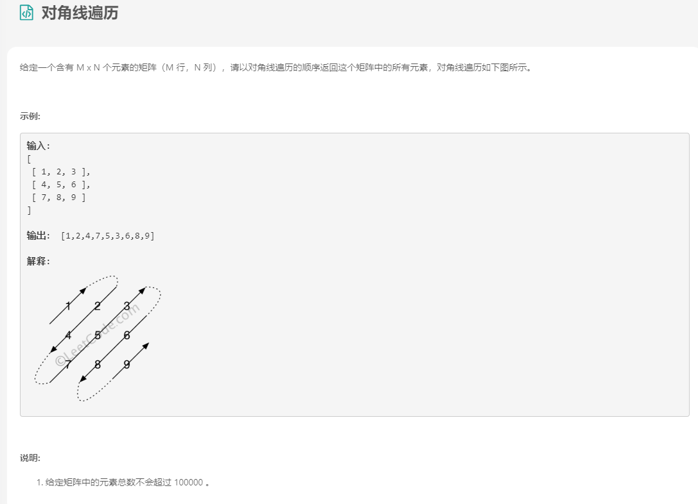

- 解法

	```java
	class Solution {
	    public int[] findDiagonalOrder(int[][] matrix) {
	        if(matrix.length == 0)
	            return new int[0];
	        int size = matrix.length * matrix[0].length;
	        int index = 0;
	        int[] result = new int[size];
	        int maxK = matrix.length + matrix[0].length;
	        
	        for(int k = 0; k < maxK; k++)
	        {
	            int m = 0, n = 0;
	            
	            if(k % 2 == 0) //偶数部分
	            {
	                if(k < matrix.length)
	                {
	                    m = k;
	                    n = 0;
	                }
	                else
	                {
	                    m = matrix.length - 1;
	                    n = k - m;
	                }
	                while(m >= 0 && n < matrix[0].length) //n到达边界为止
	                {
	                    result[index++] = matrix[m][n];
	                    m--;
	                    n++;
	                }
	            }
	            else //奇数部分
	            {
	                if(k < matrix[0].length)
	                {
	                    m = 0;
	                    n = k;
	                }
	                else
	                {
	                    n = matrix[0].length - 1;
	                    m = k - n;
	                }
	                while(m < matrix.length && n >= 0) //m到达边界为止
	                {
	                    result[index++] = matrix[m][n];
	                    m++;
	                    n--;
	                }
	            }
	        }
	        
	        return result;
	    }
	}
	```

### 2.3 螺旋矩阵

- 题目描述

	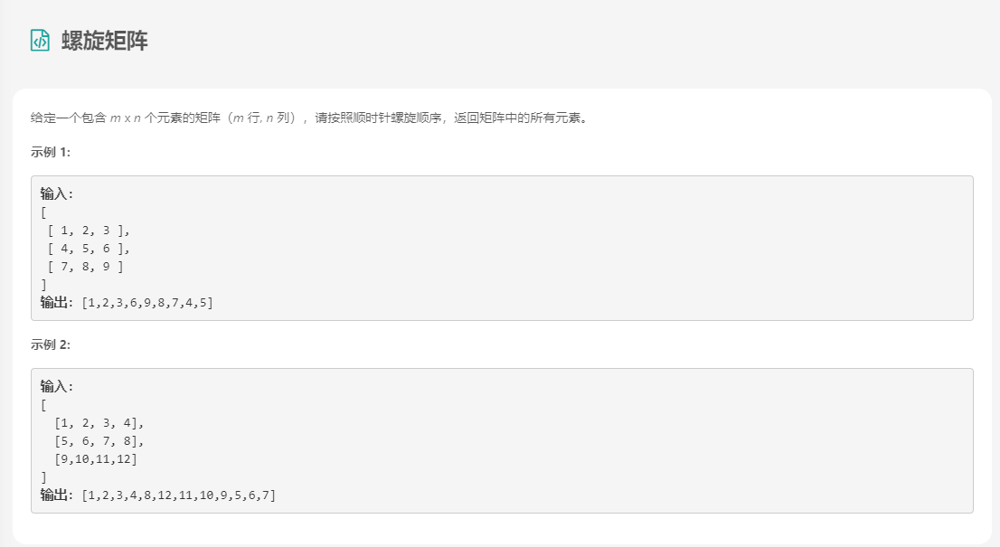

- 解法

	```java
	class Solution {
	    public List<Integer> spiralOrder(int[][] matrix) {
	        List ans = new ArrayList();
	        if (matrix.length == 0) return ans;
	        int R = matrix.length, C = matrix[0].length;
	        boolean[][] seen = new boolean[R][C];
	        int[] dr = {0, 1, 0, -1};
	        int[] dc = {1, 0, -1, 0};
	        int r = 0, c = 0, di = 0;
	        for (int i = 0; i < R * C; i++) {
	            ans.add(matrix[r][c]);
	            seen[r][c] = true;
	            int cr = r + dr[di];
	            int cc = c + dc[di];
	            if (0 <= cr && cr < R && 0 <= cc && cc < C && !seen[cr][cc]){
	                r = cr;
	                c = cc;
	            } else {
	                di = (di + 1) % 4;
	                r += dr[di];
	                c += dc[di];
	            }
	        }
	        return ans;
	    }
	}
	```

	```java
	class Solution {
	    public List < Integer > spiralOrder(int[][] matrix) {
	        List ans = new ArrayList();
	        if (matrix.length == 0)
	            return ans;
	        int r1 = 0, r2 = matrix.length - 1;
	        int c1 = 0, c2 = matrix[0].length - 1;
	        while (r1 <= r2 && c1 <= c2) {
	            for (int c = c1; c <= c2; c++) ans.add(matrix[r1][c]);
	            for (int r = r1 + 1; r <= r2; r++) ans.add(matrix[r][c2]);
	            if (r1 < r2 && c1 < c2) {
	                for (int c = c2 - 1; c > c1; c--) ans.add(matrix[r2][c]);
	                for (int r = r2; r > r1; r--) ans.add(matrix[r][c1]);
	            }
	            r1++;
	            r2--;
	            c1++;
	            c2--;
	        }
	        return ans;
	    }
	}
	```

### 2.4 旋转矩阵

- 题目描述

	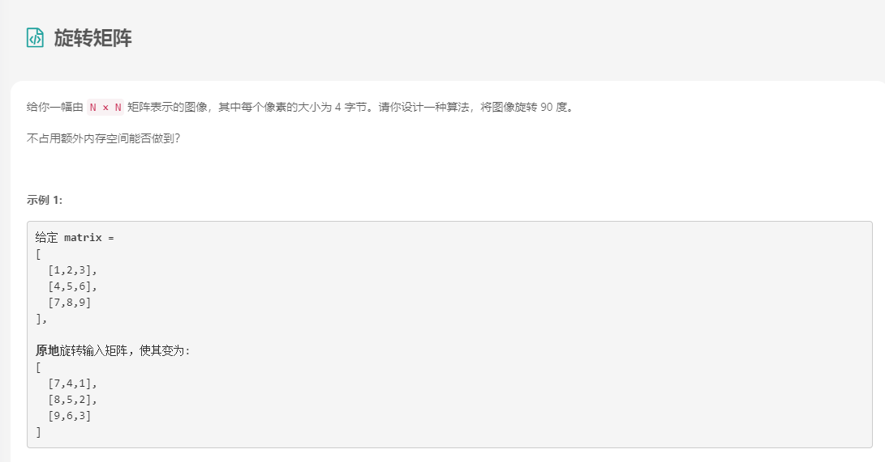

- 解法

	```java
	class Solution {
	    public void rotate(int[][] matrix) {
	        int n = matrix.length;
	        // 先以对角线（左上-右下）为轴进行翻转
	        for (int i = 0; i < n - 1; i++) {
	            for (int j = i + 1; j < n; j++) {
	                int tmp = matrix[i][j];
	                matrix[i][j] = matrix[j][i];
	                matrix[j][i] = tmp;
	            }
	        }
	        // 再对每一行以中点进行翻转
	        int mid = n >> 1;
	        for (int i = 0; i < n; i++) {
	            for (int j = 0; j < mid; j++) {
	                int tmp = matrix[i][j];
	                matrix[i][j] = matrix[i][n - 1 - j];
	                matrix[i][n - 1 - j] = tmp;
	            }
	        }
	    }
	}
	```

### 2.5 零矩阵

- 题目描述

	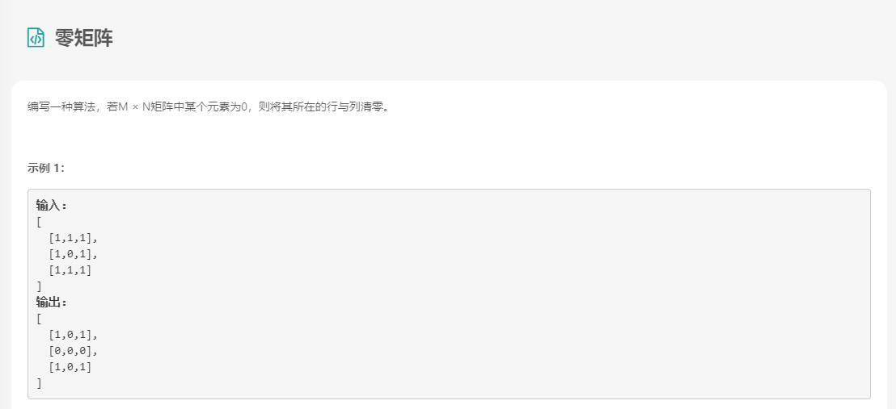

- 解法

	```java
	class Solution {
	    public void setZeroes(int[][] matrix) {
	        boolean shu = false;
	        boolean hen = false;
	        for (int i = 0; i < matrix.length; i++) {
	            for (int j = 0; j < matrix[0].length; j++) {
	                if (matrix[i][j] == 0) {
	                    if (i == 0) {
	                        hen = true;
	                    }
	                    if (j == 0) {
	                        shu = true;
	                    }
	                    matrix[i][0] = 0;
	                    matrix[0][j] = 0;
	                }
	            }
	        }
	        
	        for (int i = 1; i < matrix.length; i++) {
	            if (matrix[i][0] == 0) {
	                for (int j = 1; j < matrix[0].length; j++) {
	                    matrix[i][j] = 0;
	                }
	            }
	        }
	
	        for (int i = 1; i < matrix[0].length; i++) {
	            if (matrix[0][i] == 0) {
	                for (int j = 1; j < matrix.length; j++) {
	                    matrix[j][i] = 0;
	                }
	            }
	        }
	
	        if (shu) {
	            for (int i = 0; i < matrix.length; i++) {
	                matrix[i][0] = 0;
	            }
	        }
	        if (hen) {
	            for (int i = 0; i < matrix[0].length; i++) {
	                matrix[0][i] = 0;
	            }
	        }
	    }
	}
	
	```

## 3. 字符串

### 3.1 二进制求和

- 题目描述

	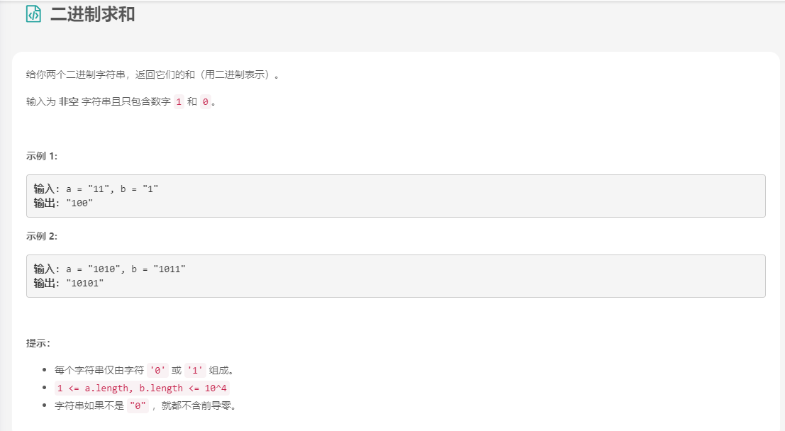

- 解法

	```
	
	```

### 3.2 最长公共前缀

### 3.3 最长回文子串

- 题目描述

	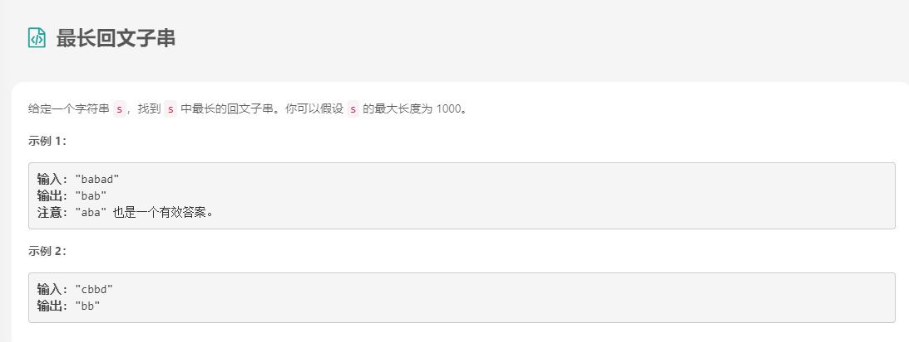

- 解法

	```java
	class Solution {
	    public String longestPalindrome(String s) {
	        if (s == null || s.length() < 1) return "";
	        int start = 0, end = 0;
	        for (int i = 0; i < s.length(); i++) {
	            int len1 = expandAroundCenter(s, i, i);
	            int len2 = expandAroundCenter(s, i, i + 1);
	            int len = Math.max(len1, len2);
	            if (len > end - start) {
	                start = i - (len - 1) / 2;
	                end = i + len / 2;
	            }
	        }
	        return s.substring(start, end + 1);
	    }
	
	    private int expandAroundCenter(String s, int left, int right) {
	        int L = left, R = right;
	        while (L >= 0 && R < s.length() && s.charAt(L) == s.charAt(R)) {
	            L--;
	            R++;
	        }
	        return R - L - 1;
	    }
	}
	```

### 3.4 翻转字符串里的单词

- 题目描述

	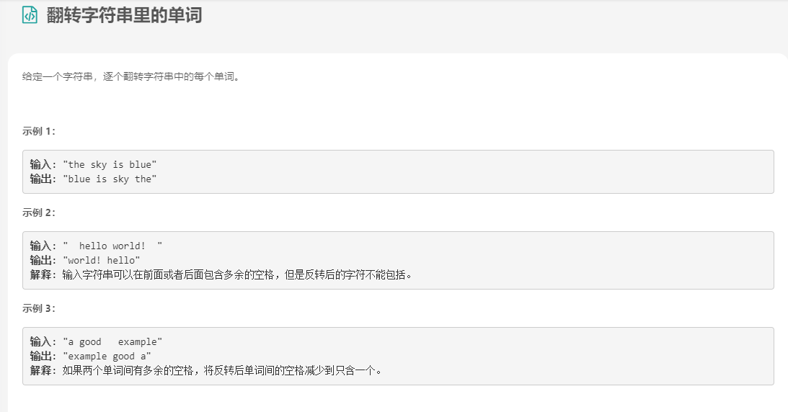

	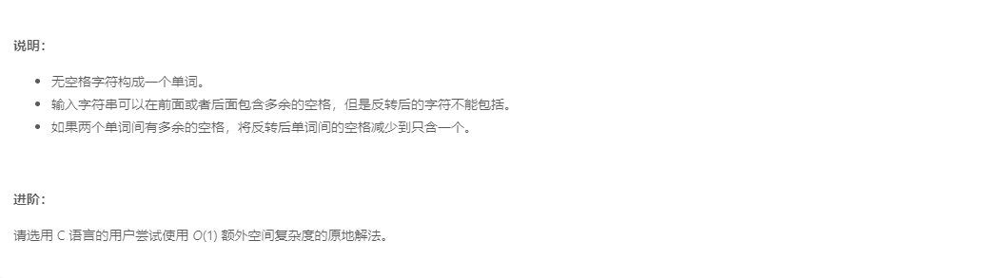

- 解法

	```java
	class Solution {
	    public String reverseWords(String s) {
	        // 除去开头和末尾的空白字符
	        s = s.trim();
	        // 正则匹配连续的空白字符作为分隔符分割
	        List<String> wordList = Arrays.asList(s.split("\\s+"));
	        Collections.reverse(wordList);
	        return String.join(" ", wordList);
	    }
	}
	```

	```java
	class Solution {
	    public StringBuilder trimSpaces(String s) {
	        int left = 0, right = s.length() - 1;
	        // 去掉字符串开头的空白字符
	        while (left <= right && s.charAt(left) == ' ') ++left;
	
	        // 去掉字符串末尾的空白字符
	        while (left <= right && s.charAt(right) == ' ') --right;
	
	        // 将字符串间多余的空白字符去除
	        StringBuilder sb = new StringBuilder();
	        while (left <= right) {
	            char c = s.charAt(left);
	
	            if (c != ' ') sb.append(c);
	            else if (sb.charAt(sb.length() - 1) != ' ') sb.append(c);
	
	            ++left;
	        }
	        return sb;
	    }
	
	    public void reverse(StringBuilder sb, int left, int right) {
	        while (left < right) {
	            char tmp = sb.charAt(left);
	            sb.setCharAt(left++, sb.charAt(right));
	            sb.setCharAt(right--, tmp);
	        }
	    }
	
	    public void reverseEachWord(StringBuilder sb) {
	        int n = sb.length();
	        int start = 0, end = 0;
	
	        while (start < n) {
	            // 循环至单词的末尾
	            while (end < n && sb.charAt(end) != ' ') ++end;
	            // 翻转单词
	            reverse(sb, start, end - 1);
	            // 更新start，去找下一个单词
	            start = end + 1;
	            ++end;
	        }
	    }
	
	    public String reverseWords(String s) {
	        StringBuilder sb = trimSpaces(s);
	
	        // 翻转字符串
	        reverse(sb, 0, sb.length() - 1);
	
	        // 翻转每个单词
	        reverseEachWord(sb);
	
	        return sb.toString();
	    }
	}
	```

	```java
	//双端队列
	class Solution {
	    public String reverseWords(String s) {
	        int left = 0, right = s.length() - 1;
	        // 去掉字符串开头的空白字符
	        while (left <= right && s.charAt(left) == ' ') ++left;
	
	        // 去掉字符串末尾的空白字符
	        while (left <= right && s.charAt(right) == ' ') --right;
	
	        Deque<String> d = new ArrayDeque();
	        StringBuilder word = new StringBuilder();
	        
	        while (left <= right) {
	            char c = s.charAt(left);
	            if ((word.length() != 0) && (c == ' ')) {
	                // 将单词 push 到队列的头部
	                d.offerFirst(word.toString());
	                word.setLength(0);
	            } else if (c != ' ') {
	                word.append(c);
	            }
	            ++left;
	        }
	        d.offerFirst(word.toString());
	
	        return String.join(" ", d);
	    }
	}
	```

### 3.5 实现strStr()

## 4. 双指针技巧

### 4.1 情景一

​		从两端向中间迭代数组。

### 4.2 反转字符串

### 4.3 数组拆分①

- 题目描述

	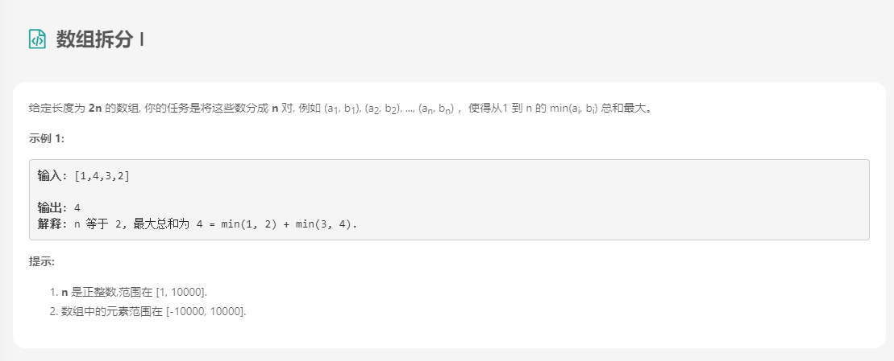

- 解法

	```java
	public class Solution {
	    public int arrayPairSum(int[] nums) {
	        Arrays.sort(nums);
	        int sum = 0;
	        for (int i = 0; i < nums.length; i += 2) {
	            sum += nums[i];
	        }
	        return sum;
	    }
	}
	```

	```java
	public class Solution {
	    public int arrayPairSum(int[] nums) {
	        int[] arr = new int[20001];
	        int lim = 10000;
	        for (int num: nums)
	            arr[num + lim]++;
	        int d = 0, sum = 0;
	        for (int i = -10000; i <= 10000; i++) {
	            sum += (arr[i + lim] + 1 - d) / 2 * i;
	            d = (2 + arr[i + lim] - d) % 2;
	        }
	        return sum;
	    }
	} 
	```

### 4.4 两数之和②-输入有序数组

- 题目描述

	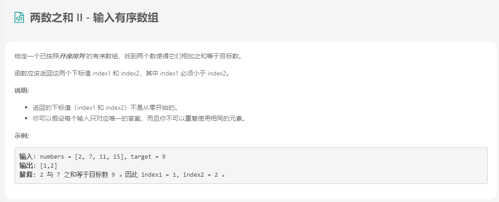

- 解法

	```java
	class Solution {
	    public int[] twoSum(int[] numbers, int target) {
	        int low=0;
	        int high=numbers.length-1;
	        while(numbers[low]+numbers[high]!=target){
	            if(numbers[low]+numbers[high]<target){
	                low++;
	            }
	            else if(numbers[low]+numbers[high]>target){
	                high--;
	            }
	        }
	        return new int[]{low+1,high+1};
	
	    }
	}
	```

### 4.5 情景二

​	同向移动

### 4.6 移除元素

- 题目描述

	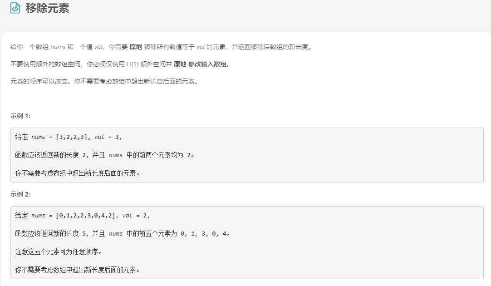

- 解法

	```java
	class Solution {
	  public int removeElement(int[] nums, int val) {
	    int i = 0;
	    for (int j = 0; j < nums.length; j++) {
	        if (nums[j] != val) {
	            nums[i] = nums[j];
	            i++;
	        }
	    }
	    return i;
	    }
	}
	```

	```java
	class Solution {
	  public int removeElement(int[] nums, int val) {
	    int i = 0;
	    int n = nums.length;
	    while (i < n) {
	        if (nums[i] == val) {
	            nums[i] = nums[n - 1];
	            // reduce array size by one
	            n--;
	        } else {
	            i++;
	        }
	    }
	    return n;
	    }
	}
	```

### 4.7 最大连续1的个数

- 题目描述

	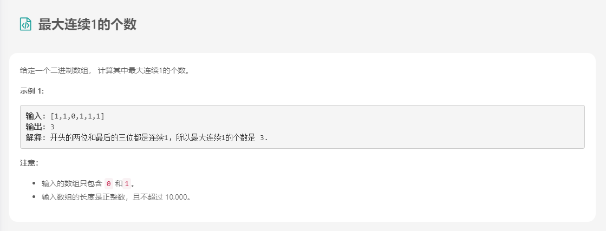

- 解法

	```java
	class Solution {
	  public int findMaxConsecutiveOnes(int[] nums) {
	        int i = -1, j = 0, max = 0;
	        while (j < nums.length) {
	            if (nums[j] == 1) {
	                if (i == -1) i = j;
	            } else {
	                if (i != -1 && max < j - i) max = j - i;
	                i = -1;
	            }
	            j++;
	        }
	        if (i != -1 && max < j - i) max = j - i;
	        return max;
	    }
	}
	```

### 4.8 长度最小的子数组

- 题目描述

	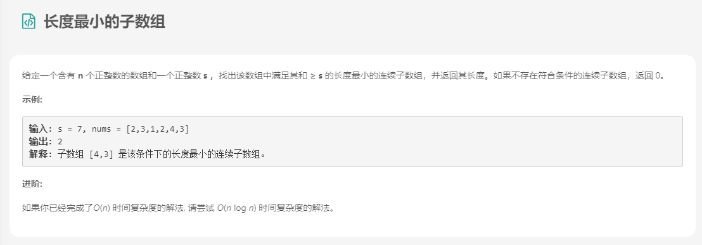

- 解法

	```java
	class Solution {
	    public int minSubArrayLen(int s, int[] nums) {
	        if(nums==null ||nums.length==0){
	            return 0;
	        }
	
	        int result = Integer.MAX_VALUE;
	        for(int i=0;i<nums.length;i++){
	            int  sum=0;
	            for(int j=i;j<nums.length;j++){
	                sum += nums[j];
	                if(sum >= s){
	                    result = Math.min(result,j-i+1);
	                }
	            }
	        }
	        return result==Integer.MAX_VALUE?0:result;
	    }
	}
	```

## 5. 小结

### 5.1 数组相关

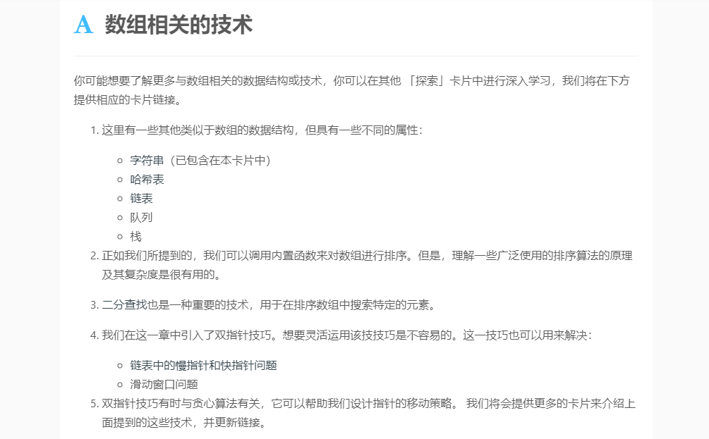

### 5.2 杨辉三角

### 5.3 杨辉三角②

- 题目描述

	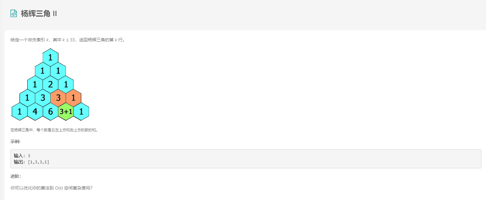

- 解法

	```java
	class Solution {
	 public List<Integer> getRow(int rowIndex) {
	    int pre = 1;
	    List<Integer> cur = new ArrayList<>();
	    cur.add(1);
	    for (int i = 1; i <= rowIndex; i++) {
	        for (int j = i - 1; j > 0; j--) {
	            cur.set(j, cur.get(j - 1) + cur.get(j));
	        }
	        cur.add(1);//补上每层的最后一个 1 
	    }
	    return cur;
	    }
	}
	```

### 5.4 反转字符串中的单词③

- 题目描述

	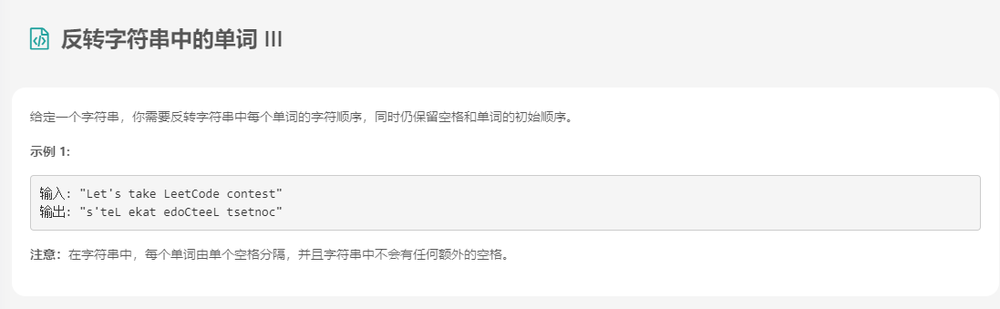

- 解法

	```java
	public class Solution {
	    public String reverseWords(String s) {
	        String words[] = s.split(" ");
	        StringBuilder res=new StringBuilder();
	        for (String word: words)
	            res.append(new StringBuffer(word).reverse().toString() + " ");
	        return res.toString().trim();
	    }
	}
	```

### 5.5 寻找旋转排序数组中的最小值

- 题目描述

	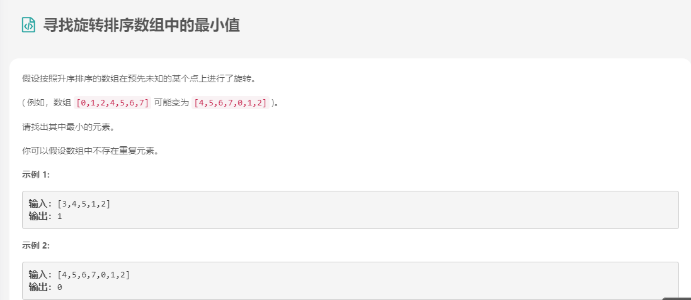

- 解法

	```java
	class Solution {
	public int findMin(int[] nums) {
	    int left = 0, right = nums.length - 1;
	    while (left < right) {
	        int middle = (left + right) / 2;
	        if (nums[middle] < nums[right]) {
	            // middle可能是最小值
	            right = middle;
	        } else {
	            // middle肯定不是最小值
	            left = middle + 1;
	        }
	    }
	    return nums[left];
	    }
	}
	```


